# 1、css介绍

## css概述

为了让网页元素的样式更加丰富，也为了让网页的内容和样式能拆分开，CSS由此思想而诞生，CSS是 Cascading Style Sheets 的首字母缩写，意思是层叠样式表。有了CSS，html中大部分表现样式的标签就废弃不用了，html只负责文档的结构和内容，表现形式完全交给CSS，html文档变得更加简洁。

## css基本语法

css的定义方法是：
选择器 { 属性：值； 属性：值； 属性：值；}
选择器是将样式和页面元素关联起来的名称，属性是希望设置的样式属性，每个属性有一个或多个值。属性和值之间用冒号，一个属性和值与下一个属性和值之间用分号，最后一个分号可以省略，代码示例：

```
div{ 
    width:100px; 
    height:100px; 
    background:gold; 
}
```

# 2、css引入方式

css引入页面的方式有三种：
1、内联式
通过标签的style属性，在标签上直接写样式

```
<div style="width:100px; height:100px; background:red ">......</div>
```

2、嵌入式
通过style标签，在网页上创建嵌入的样式表。

```
<style type="text/css">
    div{ width:100px; height:100px; background:red }
    ......
</style>
```

3、外链式
通过link标签，链接外部样式文件到页面中。

```
<link rel="stylesheet" type="text/css" href="css/main.css">
```

# 3、css常用选择器一

## 标签选择器

标签选择器，此种选择器影响范围大，一般用来做一些通用设置，或用在层级选择器中。
举例：

```
div{color:red} 
......
<div>这是第一个div</div>   <!-- 对应以上样式 -->
<div>这是第二个div</div>   <!-- 对应以上样式 -->
```

## 类选择器

通过类名来选择元素，一个类可应用于多个元素，一个元素上也可以使用多个类，应用灵活，可复用，是css中应用最多的一种选择器。
举例：

```
.blue{color:blue}
.big{font-size:20px}
.box{width:100px;height:100px;background:gold} 
......
<div class="blue">....</div>
<h3 class="blue big box">....</h3>
<p class="blue box">....</p>
```

## 层级选择器

主要应用在标签嵌套的结构中，层级选择器，是结合上面的两种选择器来写的选择器,它可与标签选择器结合使用，减少命名，同时也可以通过层级，限制样式的作用范围。
举例：

```
.con{width:300px;height:80px;background:green}
.con span{color:red}
.con .pink{color:pink}
.con .gold{color:gold}
......
<div class="con">
    <span>....</span>
    <a href="#" class="pink">....</a>
    <a href="#" class="gold">...</a>
</div>
<span>....</span>
<a href="#" class="pink">....</a>
```

# 4、css属性入门

## 布局常用样式属性：

- width 设置元素(标签)的宽度，如：width:100px;
- height 设置元素(标签)的高度，如：height:200px;
- background 设置元素背景色或者背景图片，如：background:gold; 设置元素背景色为金色
- border 设置元素四周的边框，如：border:1px solid black; 设置元素四周边框是1像素宽的黑色实线
	以上也可以拆分成四个边的写法，分别设置四个边的：
- border-top 设置顶边边框，如：border-top:10px solid red;
- border-left 设置左边边框，如：border-left:10px solid blue;
- border-right 设置右边边框，如：border-right:10px solid green;
- border-bottom 设置底边边框，如：border-bottom:10px solid pink;
- padding 设置元素包含的内容和元素边框的距离，也叫内边距，如padding:20px;padding是同时设置4个边的，也可以像border一样拆分成分别设置四个边:padding-top、padding-left、padding-right、padding-bottom。
- margin 设置元素和外界的距离，也叫外边距，如margin:20px;margin是同时设置4个边的，也可以像border一样拆分成分别设置四个边:margin-top、margin-left、margin-right、margin-bottom。
- float 设置元素浮动，浮动可以让块元素排列在一行，浮动分为左浮动：float:left; 右浮动：float:right;

## 文本常用样式属性一：

- color 设置文字的颜色，如： color:red;
- font-size 设置文字的大小，如：font-size:12px;
- font-family 设置文字的字体，如：font-family:'微软雅黑';为了避免中文字不兼容，一般写成：font-family:'Microsoft Yahei';
- font-weight 设置文字是否加粗，如：font-weight:bold; 设置加粗 font-weight:normal 设置不加粗
- line-height 设置文字的行高，如：line-height:24px; 表示文字高度加上文字上下的间距是24px，也就是每一行占有的高度是24px
- text-decoration 设置文字的下划线，如：text-decoration:none; 将文字下划线去掉

## 样式中的注释

```
/* 设置头部的样式 */
.header{
    width:960px;
    height:80px;
    background:gold;
}
```

# 5、相对地址与绝对地址

网页上引入或链接到外部文件，需要定义文件的地址，常见引入或链接外部文件包括以下几种：

```
<!-- 引入外部图片   -->


<!-- 链接到另外一个网页   -->
<a href="002.html">链接到网页2</a>

<!-- 外链一个css文件   -->
<link rel="stylesheet" type="text/css" href="css/main.css" />

<!-- 外链一个js文件   -->
<script type="text/javascript" src="js/jquery.js"></script>
```

这些地址分为相对地址和绝对地址:
**相对地址**
相对于引用文件本身去定位被引用的文件地址，以上的例子都是相对地址，相对地址的定义技巧：

- “ ./ ” 表示当前文件所在目录下，比如：“./pic.jpg” 表示当前目录下的pic.jpg的图片，这个使用时可以省略。
- “ ../ ” 表示当前文件所在目录下的上一级目录，比如：“../images/pic.jpg” 表示当前目录下的上一级目录下的images文件夹中的pic.jpg的图片。
	**绝对地址**
	相对于磁盘的位置去定位文件的地址，比如： 绝对地址在整体文件迁移时会因为磁盘和顶层目录的改变而找不到文件，相对地址就没有这个问题。

# 6、html标签提高

## 无序列表标签

无序列表一般应用在布局中的新闻标题列表和文章标题列表，它是含有语义的，标签结构如下：

```
<ul>
    <li>列表标题一</li>
    <li>列表标题二</li>
    <li>列表标题三</li>
</ul>
```

列表的内容一般是可以链接的，点击链接到新闻或者文章的具体内容，所以具体结构一般是这样的：

```
<ul>
    <li><a href="#">列表标题一</a></li>
    <li><a href="#">列表标题二</a></li>
    <li><a href="#">列表标题三</a></li>
</ul>
```

# 7、css常用选择器二

## 1、id选择器

通过id名来选择元素，元素的id名称不能重复，所以一个样式设置项只能对应于页面上一个元素，不能复用，id名一般给程序使用，所以不推荐使用id作为选择器。
举例：

```
#box{color:red} 
......
<p id="box">这是一个段落标签</p>   <!-- 对应以上一条样式，其它元素不允许应用此样式 -->
<p>这是第二个段落标签</p> <!-- 无法应用以上样式，每个标签只能有唯一的id名 -->
<p>这是第三个段落标签</p> <!-- 无法应用以上样式，每个标签只能有唯一的id名  -->
```

## 2、组选择器

多个选择器，如果有同样的样式设置，可以使用组选择器。
举例：

```
.box1,.box2,.box3{width:100px;height:100px}
.box1{background:red}
.box2{background:pink}
.box2{background:gold}
<div class="box1">....</div>
<div class="box2">....</div>
<div class="box3">....</div>
```

## 3、伪类及伪元素选择器

常用的伪类选择器有hover，表示鼠标悬浮在元素上时的状态，伪元素选择器有before和after,它们可以通过样式在元素中插入内容。

```
.box1:hover{color:red}
.box2:before{content:'行首文字';}
.box3:after{content:'行尾文字';}
<div class="box1">....</div>
<div class="box2">....</div>
<div class="box3">....</div>
```

# 8、css属性提高

## 文本常用样式属性二：

- text-align 设置文字水平对齐方式，如text-align:center 设置文字水平居中
- text-indent 设置文字首行缩进，如：text-indent:24px; 设置文字首行缩进24px
- font-style 设置字体是否倾斜，如：font-style:'normal'; 设置不倾斜，font-style:'italic';设置文字倾斜
- font 同时设置文字的几个属性，写的顺序有兼容问题，建议按照如下顺序写： font：是否加粗 字号/行高 字体；如： font:normal 12px/36px '微软雅黑';

## 其他常用样式属性：

- list-style 设置无序列表中的小圆点，一般把它设为"无"，如：list-style:none

## css元素溢出

当子元素的尺寸超过父元素的尺寸时，需要设置父元素显示溢出的子元素的方式，设置的方法是通过overflow属性来设置。
**overflow的设置项：**
1、visible 默认值。内容不会被修剪，会呈现在元素框之外。
2、hidden 内容会被修剪，并且其余内容是不可见的，此属性还有清除浮动、清除margin-top塌陷的功能。
3、scroll 内容会被修剪，但是浏览器会显示滚动条以便查看其余的内容。
4、auto 如果内容被修剪，则浏览器会显示滚动条以便查看其余的内容。

# 9、CSS盒子模型

**盒子模型解释**
元素在页面中显示成一个方块，类似一个盒子，CSS盒子模型就是使用现实中盒子来做比喻，帮助我们设置元素对应的样式。盒子模型示意图如下：

把元素叫做盒子，设置对应的样式分别为：盒子的宽度(width)、盒子的高度(height)、盒子的边框(border)、盒子内的内容和边框之间的间距(padding)、盒子与盒子之间的间距(margin)。
**设置宽高**

```
width:200px;  /* 设置盒子的宽度，此宽度是指盒子内容的宽度，不是盒子整体宽度(难点) */ 
height:200px; /* 设置盒子的高度，此高度是指盒子内容的高度，不是盒子整体高度(难点) */
```

**设置边框**
设置一边的边框，比如顶部边框，可以按如下设置：

```
border-top:10px solid red;
```

其中10px表示线框的粗细；solid表示线性，常用的有：solid(实线) 、dashed(虚线)dotted(点线)；red表示线的颜色是红色。
设置其它三个边的方法和上面一样，把上面的'top'换成'left'就是设置左边，换成'right'就是设置右边，换成'bottom'就是设置底边。

四个边如果设置一样，可以将四个边的设置合并成一句：

```
border:10px solid red;
```

**设置内间距padding**
设置盒子四边的内间距，可设置如下：

```
padding-top：20px;     /* 设置顶部内间距20px */ 
padding-left:30px;     /* 设置左边内间距30px */ 
padding-right:40px;    /* 设置右边内间距40px */ 
padding-bottom:50px;   /* 设置底部内间距50px */
```

上面的设置可以简写如下：

```
padding：20px 40px 50px 30px; /* 四个值按照顺时针方向，分别设置的是 上 右 下 左  
四个方向的内边距值。 */
```

padding后面还可以跟3个值，2个值和1个值，它们分别设置的项目如下：

```
padding：20px 40px 50px; /* 设置顶部内边距为20px，左右内边距为40px，底部内边距为50px */ 
padding：20px 40px; /* 设置上下内边距为20px，左右内边距为40px*/ 
padding：20px; /* 设置四边内边距为20px */
```

**设置外间距margin**
外边距的设置方法和padding的设置方法相同，将上面设置项中的'padding'换成'margin'就是外边距设置方法。
**盒子的真实尺寸(难点)**
盒子的width和height值固定时，如果盒子增加border和padding，盒子整体的尺寸会变大，所以盒子的真实尺寸为：

- 盒子宽度 = width + padding左右 + border左右
- 盒子高度 = height + padding上下 + border上下

**理解练习**
通过盒子模型的原理，制作下面的盒子：


**chrome开发者工具**
chrome开发者工具可以辅助开发，可以迅速查看元素的结构，样式，以及盒子模型结构和尺寸。

# 10、盒模型使用技巧及相关问题

**margin相关技巧**
1、设置不浮动的元素相对于父级水平居中： margin:x auto;
2、margin负值让元素位移及边框合并
**垂直外边距合并**
垂直外边距合并指的是，当两个不浮动的元素，它们的垂直外边距相遇时，它们将形成一个外边距。合并后的外边距的高度等于两个发生合并的外边距的高度中的较大者，实际开发中一般只设置margin-top来避开这种合并的问题，或者将元素浮动，也可以避开这种问题。
**margin-top 塌陷**
在两个不浮动的盒子嵌套时候，内部的盒子设置的margin-top会加到外边的盒子上，导致内部的盒子margin-top设置失败，解决方法如下：
1、外部盒子设置一个边框
2、外部盒子设置 overflow:hidden
3、使用伪元素类：

```
.clearfix:before{
    content: '';
    display:table;
}
```

# 11、常用图片格式

图片是网页制作中很重要的素材，图片有不同的格式，每种格式都有自己的特性，了解这些特效，可以方便我们在制作网页时选取适合的图片格式，图片格式及特性如下：
**1、psd**
photoshop的专用格式。
优点：完整保存图像的信息，包括未压缩的图像数据、图层、透明等信息，方便图像的编辑。
缺点：应用范围窄，图片容量相对比较大。
**2、jpg**
网页制作及日常使用最普遍的图像格式。
优点：图像压缩效率高，图像容量相对最小。
缺点：有损压缩，图像会丢失数据而失真，不支持透明背景，不能制作成动画。
**3、gif**
制作网页小动画的常用图像格式。
优点：无损压缩，图像容量小、可以制作成动画、支持透明背景。
缺点：图像色彩范围最多只有256色，不能保存色彩丰富的图像，不支持半透明，透明图像边缘有锯齿。
**4、png**
网页制作及日常使用比较普遍的图像格式。
优点：无损压缩，图像容量小、支持透明背景和半透明色彩、透明图像的边缘光滑。
缺点：不能制作成动画
**总结**
在网页制作中，如何选择合适的图片格式呢？
1、使用大幅面图片时，如果要使用不透明背景的图片，就使用jpg图片；如果要使用透明或者半透明背景的图片，就使用png图片；
2、使用小幅面图片或者图标图片时，使用png图片；如果图片是动画，可以使用gif。

# 12、html表单

表单用于搜集不同类型的用户输入，表单由不同类型的标签组成，相关标签及属性用法如下：
1、<form>标签 定义整体的表单区域

- action属性 定义表单数据提交地址
- method属性 定义表单提交的方式，一般有“get”方式和“post”方式
	2、<label>标签 为表单元素定义文字标注
	3、<input>标签 定义通用的表单元素
- type属性
	- type="text" 定义单行文本输入框
	- type="password" 定义密码输入框
	- type="radio" 定义单选框
	- type="checkbox" 定义复选框
	- type="file" 定义上传文件
	- type="submit" 定义提交按钮
	- type="reset" 定义重置按钮
	- type="button" 定义一个普通按钮
- value属性 定义表单元素的值
- name属性 定义表单元素的名称，此名称是提交数据时的键名
	4、<textarea>标签 定义多行文本输入框
	5、<select>标签 定义下拉表单元素
	6、<option>标签 与<select>标签配合，定义下拉表单元素中的选项
	**注册表单实例：**

```
<form action="http://www..." method="get">
<p>
<label>姓名：</label><input type="text" name="username" />
</p>
<p>
<label>密码：</label><input type="password" name="password" />
</p>
<p>
<label>性别：</label>
<input type="radio" name="gender" value="0" /> 男
<input type="radio" name="gender" value="1" /> 女
</p>
<p>
<label>爱好：</label>
<input type="checkbox" name="like" value="sing" /> 唱歌
<input type="checkbox" name="like" value="run" /> 跑步
<input type="checkbox" name="like" value="swiming" /> 游泳
</p>
<p>
<label>照片：</label>
<input type="file" name="person_pic">
</p>
<p>
<label>个人描述：</label>
<textarea name="about"></textarea>
</p>
<p>
<label>籍贯：</label>
<select name="site">
    <option value="0">北京</option>
    <option value="1">上海</option>
    <option value="2">广州</option>
    <option value="3">深圳</option>
</select>
</p>
<p>
<input type="submit" name="" value="提交">
<input type="reset" name="" value="重置">
</p>
</form>
```

**表单常用样式、属性及示例**

- outline 设置input框获得焦点时，是否显示凸显的框线，一般设置为没有,比如：outline:none;
- placeholder 设置input输入框的默认提示文字。
	**表单布局实例**
	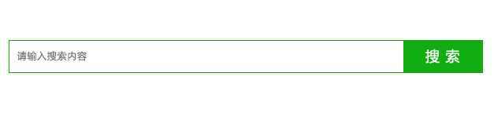

# 13、块元素类型及特性

## 块元素特性

块元素，也可以称为行元素，布局中常用的标签如：div、p、ul、li、h1~h6等等都是块元素，它在布局中的行为：

- 支持全部的样式
- 如果没有设置宽度，默认的宽度为父级宽度100%
- 盒子占据一行、即使设置了宽度

## 包含默认样式的块元素

上面讲的块标签中，有些标签是包含默认的样式的，这个含默认样式的有

- p标签：含有默认外边距
- ul：含有默认外边距和内边距，以及条目符号
- h1~h6标签：含有默认的外边距和字体大小
- body标签：含有默认的外边距
	实际开发中，我们会把这些默认的样式在样式定义开头清除掉，清除掉这些默认样式，方便我们写自己的定义的样式，这种做法叫样式重置。

```
/* 清除标签默认的外边和内边距 */
body,p,h1,h2,h3,h4,h5,h6,ul{
    margin:0px;
    padding:0px;
}
/* 清除标签默认条目符号 */
ul{
    list-style:none;
}
/* 将h标签的文字大小设置为默认大小 */
h1,h2,h3,h4,h5,h6{
    font-size:100%;
    /* 根据实际需求来加   */
    font-weight:normal;
}
```

# 14、内联元素类型及特性

## 内联元素特性

内联元素，也可以称为行内元素，布局中常用的标签如：a、span等等都是内联元素，它们在布局中的行为：

- 不支持宽、高、margin上下、padding上下
- 宽高由内容决定
- 盒子并在一行
- 代码换行，盒子之间会产生间距
- 子元素是内联元素，父元素可以用text-align属性设置子元素水平对齐方式

## 解决内联元素间隙的方法

1、去掉内联元素之间的换行
2、将内联元素的父级设置font-size为0，内联元素自身再设置font-size

## 其他内联元素

1、<em> 标签 行内元素，表示语气中的强调词
2、<i> 标签 行内元素，表示专业词汇
3、<b> 标签 行内元素，表示文档中的关键字或者产品名
4、<strong> 标签 行内元素，表示非常重要的内容

## 包含默认样式的内联元素

- a标签：含有的下划线以及文字颜色
- em、i标签：文字默认为斜体
- b、strong标签：文字默认加粗
	实际开发中，对这些标签进行样式重置。

```
/* 去掉a标签默认的下划线 */
a{
    text-decoration:none;
}
/* 去掉标签默认的文字倾斜 */
em,i{
    font-style:normal;
}
/* 去掉标签默认的文字加粗(按实际需求) */
b,strong{
    font-weight:normal;
}
```

**内联元素布局实例**
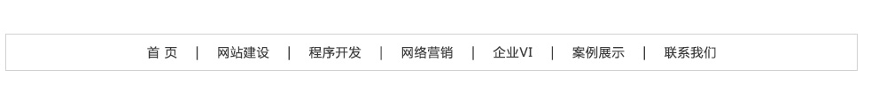

# 15、内联块元素类型及特性、元素转换

## 内联块元素

内联块元素，也叫行内块元素，是新增的元素类型，现有元素没有归于此类别的，img和input元素的行为类似这种元素，但是也归类于内联元素，我们可以用display属性将块元素或者内联元素转化成这种元素。它们在布局中表现的行为：

- 支持全部样式
- 如果没有设置宽高，宽高由内容决定
- 盒子并在一行
- 代码换行，盒子会产生间距
- 子元素是内联块元素，父元素可以用text-align属性设置子元素水平对齐方式。
	这三种元素，可以通过display属性来相互转化：

## display属性

display属性是用来设置元素的类型及隐藏的，常用的属性有：
1、none 元素隐藏且不占位置
2、block 元素以块元素显示
3、inline 元素以内联元素显示
4、inline-block 元素以内联块元素显示
**内联块元素布局实例**
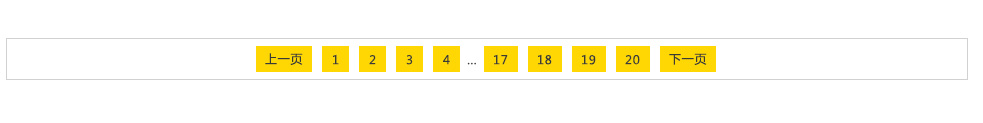

# 16浮动

**浮动特性**
1、浮动元素有左浮动(float:left)和右浮动(float:right)两种
2、浮动的元素会向左或向右浮动，碰到父元素边界、其他元素才停下来
3、相邻浮动的块元素可以并在一行，超出父级宽度就换行
4、浮动让行内元素或块元素转化为有浮动特性的行内块元素(此时不会有行内块元素间隙问题)
5、父元素如果没有设置尺寸(一般是高度不设置)，父元素内整体浮动的子元素无法撑开父元素，父元素需要清除浮动
**清除浮动**

- 父级上增加属性overflow：hidden

- 在最后一个子元素的后面加一个空的div，给它样式属性 clear:both（不推荐）

- 使用成熟的清浮动样式类，clearfix

	```
	.clearfix:after,.clearfix:before{ content: "";display: table;}
	.clearfix:after{ clear:both;}
	.clearfix{zoom:1;}
	```

	清除浮动的使用方法：

	```
	.con2{... overflow:hidden}
	或者
	<div class="con2 clearfix">
	```

# 17、定位

**文档流**
文档流，是指盒子按照html标签编写的顺序依次从上到下，从左到右排列，块元素占一行，行内元素在一行之内从左到右排列，先写的先排列，后写的排在后面，每个盒子都占据自己的位置。
**关于定位**
我们可以使用css的position属性来设置元素的定位类型，postion的设置项如下：

- relative 生成相对定位元素，元素所占据的文档流的位置保留，元素本身相对自身原位置进行偏移。
- absolute 生成绝对定位元素，元素脱离文档流，不占据文档流的位置，可以理解为漂浮在文档流的上方，相对于上一个设置了定位的父级元素来进行定位，如果找不到，则相对于body元素进行定位。
- fixed 生成固定定位元素，元素脱离文档流，不占据文档流的位置，可以理解为漂浮在文档流的上方，相对于浏览器窗口进行定位。
- static 默认值，没有定位，元素出现在正常的文档流中，相当于取消定位属性或者不设置定位属性。
	**定位元素的偏移**
	定位的元素还需要用left、right、top或者bottom来设置相对于参照元素的偏移值。
	**定位元素层级**
	定位元素是浮动的正常的文档流之上的，可以用z-index属性来设置元素的层级
	伪代码如下:

```
.box01{
    ......
    position:absolute;  /* 设置了绝对定位 */
    left:200px;            /* 相对于参照元素左边向右偏移200px */
    top:100px;          /* 相对于参照元素顶部向下偏移100px */
    z-index:10          /* 将元素层级设置为10 */
}
```

**定位元素特性**
绝对定位和固定定位的块元素和行内元素会自动转化为行内块元素
**理解练习**
1、制作如下布局：
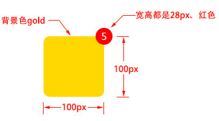
2、水平垂直居中的弹框
**新增相关样式属性**

```
/* 设置元素圆角,将元素四个角设置4px半径的圆角 */
border-radius:4px;
/* 设置元素透明度,将元素透明度设置为0.3，此属性需要加一个兼容IE的写法 */
opacity:0.3;
/* 兼容IE */
filter:alpha(opacity=30);
```

# 18、background属性

**属性解释**
background属性是css中应用比较多，且比较重要的一个属性，它是负责给盒子设置背景图片和背景颜色的，background是一个复合属性，它可以分解成如下几个设置项：

- background-image 设置背景图片地址
- background-position 设置背景图片的位置
- background-repeat 设置背景图片如何重复平铺
- background-color 设置背景颜色
	可以将上面的属性设置用background属性合并成一句：
	“background:url(bgimage.gif) left center no-repeat #00FF00”
	**举例：**
	下面这些例子使用下面这张图片做为背景图：
	
	1、“background:url(bg.jpg)”，默认设置一个图片地址，图片会从盒子的左上角开始将盒子铺满。
	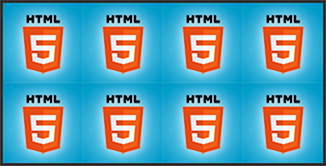
	2、“background:cyan url(bg.jpg) repeat-x”，横向平铺盒子，盒子其他部分显示背景颜色“cyan”。
	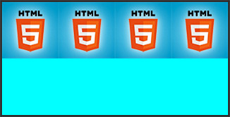
	3、“background:cyan url(bg.jpg) repeat-y”，纵向平铺盒子，盒子其他部分显示背景颜色“cyan”。
	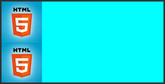
	4、“background:cyan url(bg.jpg) no-repeat”，背景不重复，背景和盒子左上角对齐，盒子其他部分显示背景颜色“cyan”。
	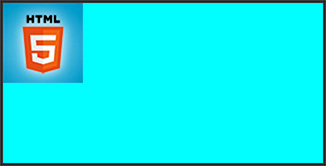
	5、“background:cyan url(bg.jpg) no-repeat left center”，背景不重复，背景和盒子左中对齐，盒子其他部分显示背景颜色“cyan”。
	
	6、“background:cyan url(bg.jpg) no-repeat right center”，背景不重复，背景和盒子右中对齐，也就是背景图片的右边对齐盒子的右边，盒子其他部分显示背景颜色“cyan”。
	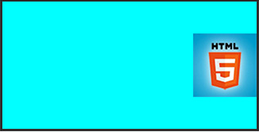
	例子说明：
	background-position的设置，可以在水平方向设置“left”、“center”、“right”，在垂直方向设置“top”、“center”、“bottom”，除了设置这些方位词之外，还可以设置具体的数值。
	比如说，我们想把下边的盒子用右边的图片作为背景，并且让背景显示图片中靠近底部的那朵花：
	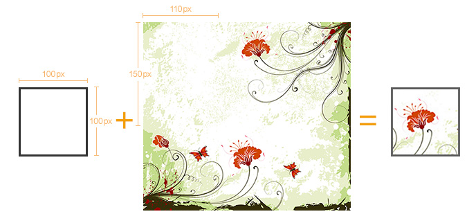
	用上面中间那张图片作为左边那个比它尺寸小的盒子的背景，上面右边的实现效果设置为：“background:url(location_bg.jpg) -110px -150px”，第一个数值表示背景图相对于自己的左上角向左偏移110px，负值向左，正值向右，第二个数值表示背景图相对于自己的左上角向上偏移150px，负值向上，正值向下。
	实现原理示意图：
	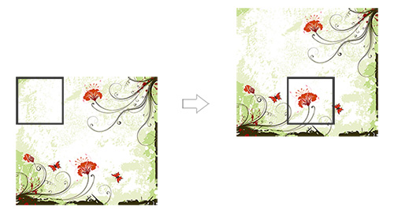
	理解练习：
	通过雪碧图制作如下布局：
	

# 19、CSS权重

CSS权重指的是样式的优先级，有两条或多条样式作用于一个元素，权重高的那条样式对元素起作用,权重相同的，后写的样式会覆盖前面写的样式。

## 权重的等级

可以把样式的应用方式分为几个等级，按照等级来计算权重
1、!important，加在样式属性值后，权重值为 10000
2、内联样式，如：style=””，权重值为1000
3、ID选择器，如：#content，权重值为100
4、类，伪类，如：.content、:hover 权重值为10
5、标签选择器，如：div、p 权重值为1

## 权重的计算实例

1、实例一：

```
<style type="text/css">
    div{
        color:red !important;
    }        
</style>
......
<div style="color:blue">这是一个div元素</div>
<!-- 
两条样式同时作用一个div，上面的样式权重值为10000+1，下面的行间样式的权重值为1000，
所以文字的最终颜色为red 
-->
```

2、实例二：

```css
<style type="text/css">
    #content div.main_content h2{
        color:red;    
    }
    #content .main_content h2{
        color:blue;
    }
</style>
......
<div id="content">
    <div class="main_content">
        <h2>这是一个h2标题</h2>
    </div>
</div>
<!-- 
第一条样式的权重计算： 100+1+10+1，结果为112；
第二条样式的权重计算： 100+10+1，结果为111；
h2标题的最终颜色为red
-->
```

# 20、表格元素及相关样式

1、<table>标签：声明一个表格
2、<tr>标签：定义表格中的一行
3、<td>和<th>标签：定义一行中的一个单元格，td代表普通单元格，th表示表头单元格，它们的常用属性如下：

- colspan 设置单元格水平合并，设置值是数值
- rowspan 设置单元格垂直合并，设置值是数值
	表格制作练习：
	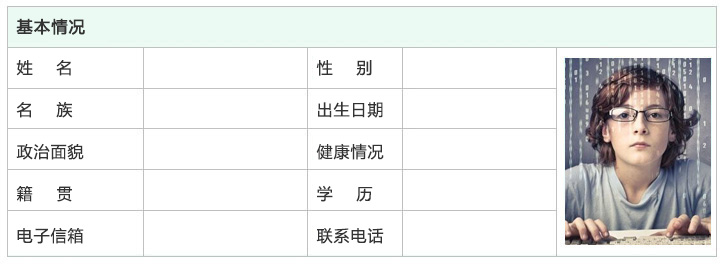

表格相关样式属性

- border-collapse 设置表格的边线合并，如：border-collapse:collapse;