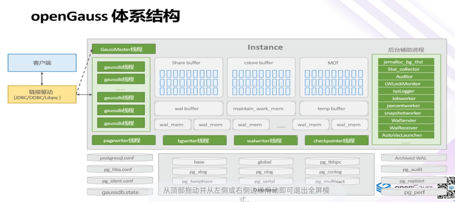

# 一、数据库管理系统

数据定义功能:DBMS提供数据定义语言(DataDefinition Language，DDL)，用户通过它可以方便地对数据库中的数据对象进行定义
数据操纵功能:DBMS还提供数据操纵语言(DataManipulationLanguage，DML)，用户可以使用DML操作数据，实现对数据库的基本操作，如查询、插入、删除和修改等
数据库的运行管理:数据库在建立、运用和维护时由数据库管理系统统一管理、统一控制，以保证数据的安全性、完整性、多用户对数据的并发使用及发生故障后的系统恢复。
提供方便、有效地存取数据库信息的接口和工具:编程人员可通过编程语言与数据库之间的接口进行数据库应用程序的开发。数据库管理员(Database Administrator，DBA)可通过提供的工具对数据库进行管理
数据库的建立和维护功能:数据库功能包括数据库初始数据的输入、转换功能，数据库的转储、恢复功能，数据库的重组织功能和性能监控、分析功能等。这些功能通常是由一些程序来完成
# 二、为什么要使用数据库?
使用数据库可以高效且条理分明地存储数据它使人们能够更加迅速和方便地管理数据，主要体现在以下几个方面：
- 数据库可结构化存储大量的数据信息，方便用户进行有效的检索和访问
- 数据库可有效地保持数据信息的一致性、完整性、降低数据冗余
- 数据库可满足应用的共享和安全方面的要求把数据放在数据库中在很多情况下也是出于安全的考虑
- 数据库技术能够方便智能化地分析，产生新的有用信息
# 三、数据库管理系统（DBMS)
## 1、层次模型


```
有且只有一个节点没有双亲
该节点被称为根节点(root)
根节点以外的其他节点有且只有一个节点
```
## 2、网状模型

```
允许一个以上的节点无双亲
一个节点可以有多于一个的双亲
```
## 3、关系模型

```
建立在严格的数据概念基础上
关系必须是规范化的
关系的分量必须是一个不可分的数据项
```
# 四、关系型数据库应用场景

#### a.联机事务处理 OLTP
```
On-Line Transaction Processing

OLTP是传统的关系型数据库的主要应用，事务性非常高的系统，一般都是高可用的在线系统，以小的事务以及小的查询为主，主要是基本的、日常的事务处理，例如银行交易。

OLTP 系统强调数据库内存效率，评估其系统的时候，一般看其每秒执行的Transaction以及Execute sol的数量。强调内存各种指标的命令率，强调绑定变量，强调并发操作。
```
#### b.联机分析处理 OLAP
```
On-Line Analytical Processing

OLAP是数据仓库系统的主要应用，支持复杂的分析操作，侧重决策支持并且提供直观易懂的查询结果。在这样的系统中，语句的执行量不是考核标准，因为一条语句的执行时间可能会非常长，读取的数据也非常多。

OLAP 系统则强调数据分析，考核的标准往往是磁盘子系统的吞吐量(带宽)，强调SQL执行时长，强调磁盘/0，强调分区等。
```
# 五、openGauss数据库
openGauss是一款携手伙伴共同打造全球领先的企业级开源关系型数据库，提供面向多核的极致性能、全链路的业务和数据安全、基于A1的调优和高效运维的能力。openGauss全面友好开放采用木兰宽松许可证v2发行，深度融合华为在数据库领域多年的研发经验，结合企业级场景需求持续构建竞争力特性。
```
高可靠
易运维
高性能
高安全
```



# 六、数据库内存结构
## 1、共享内存区
数据库启动时将分配一个共享内存区域，主要包括以下:shared buffers:共享缓冲区设置服务器使用的行存缓冲区的数量，控制行存缓冲区大小。对表或索引的操作都是在内存中进行的，如果访问的相关数据或者索引不在此内存区，将从持久性存储加载到此处，并直接对其进行操作。
cstore buffers:设置服务器使用的列存缓冲区的数量，控制列存缓冲区大小。wal buffers:是在写入磁盘之前WAL数据的缓冲区，在服务端出现问题的时候，确保数据不会丢失，在写到磁盘之前，walbuffers 是 wallog 的缓存区域。MOT:内存优化表(Memory-Optimized Table，MOT),是一种内存数据库行存储引擎(IMDB)，其中所有表和索引完全驻留在内存中。
## 2、本地内存区
后台服务线程除访问共享内存外，还会申请一些本地内存，以便暂存一些不需要全局存储的数据。为每个backend process分配一个本地存储area,主要包括以下:
- work mem: order by 和distinct操作对元组进行排序，通过merge-join和hash-join操作对表进行连接时使用某些维护操作(例如VACUUM，REINDEX和ALTERTABLEmaintenance work mem:ADD FOREIGN KEY)使用
- temp buffers : 临时表使用
## 3、内存参数
**cn end buffer size**: 指定数据库主节点发送数据缓存区的大小，**默认值8KB**
**data replicate buffer size**: 发送端与接收端传递数据页时，队列占用内存的大小。此参数会影响主备之间复制的缓冲大小，**默认值128MB**。
**nvm buffers**: 设置服务器使用的共享内存缓冲区的数量，**默认值0**，不限制。
**pca shared buffers**: 设置服务器使用的PCA共享内存缓冲区的数量，**默认值64KB**。
**segment buffers**:  openGauss段页式元数据页的内存大小。**默认值:8MB**，设置建议: segment buffers 用来缓存的内容，属于关键元数据信息，为了提高性能建议常用的表的段头都能缓存在buffer中，不被置换出去。
**standby shared buffers fraction**:  备实例所在服务器使用shared buffers内存缓冲区大小的比例,**默认值0.3**
**wal receiver buffer size**: 备机接收Xlog存放到内存缓冲区的大小，**默认值64MB**
**max process memory**: 设置一个数据库节点可用的最大物理内存
**bulk write_ring size**: 数据并行导入使用的环形缓冲区大小，单位KB。**最小16384KB，默认2GB** 该参数主要影响入库性能，建议导入压力大的场景增加DN上的该参数配置
# 七、数据库逻辑结构
openGauss的数据库节点负责存储数据，其存储介质也是磁盘，下面主要从逻辑视角介绍数据库节点都有哪些对象，以及这些对象之间的关系。
**Tablespace**： 即表空间，是一个目录，可以存在多个里面存储的是它所包含的数据库的各种物理文件。每个表空间可以对应多个Database。
**Database**： 即数据库，用于管理各类数据对象，各数据库间相互隔离。数据库管理的对象可分布在多个Tablespace上
**Datafile Segment**：即数据文件，通常每张表只对应一个数据文件。如果某张表的数据大于1GB，则会分为多个数据文件存储。
**Table**：即表，每张表只能属于一个数据库，也只能对应到一个Tablespace。每张表对应的数据文件必须在同一个Tablespace中。
**Block**：即数据块，是数据库管理的基本单位，**默认大小为8KB**
# 八、数据库目录结构
数据库的文件默认保存在initdb时创建的数据目录中。在数据目录中有很多类型、功能不同的目录和文件，除了数据文件之外，还有参数文件、控制文件、数据库运行日志及预写日志等。
| 目录/文件                     | 父目录               | 用途                                                         |
| ----------------------------- | -------------------- | ------------------------------------------------------------ |
| bin                           | -                    | 存放数据库二进制文件的目录                                   |
| lib                           | -                    | 存放数据库的库文件的目录                                     |
| share                         | -                    | 存放数据库运行所需要的公共文件，如配置文件模板               |
| data(数据库节点/数据库主节点) | -                    | DBnode实例的数据目录，其中主实例的目录名为“data dnxxx”备实例的为data dnSxxx。xxx代表DBnode编号 |
| base                          | 实例数据目录         | 包含每个数据库对应的子目录                                   |
| global                        | 实例数据目录         | 包含集簇范围表的子目录                                       |
| pg_audit                      | 实例数据目录(可配置) | 数据库审计日志目录                                           |
| pg_log                        | 实例数据目录(可配置) | 保存数据库节点实例的运行日志目录                             |
| pg_xlog                       | 实例数据目录         | 保存预写日志                                                 |
| postgresql.conf               | 实例数据目录         | 参数文件                                                     |
| pg_hba.conf                   | 实例数据目录         | 客户端认证控制文件                                           |
| postmaster.opts               | 实例数据目录         | 记录服务器启动时使用的命令行参数                             |
| gs_initdb                     | bin                  | 数据库初始化工具                                             |
| gs_dump                       | bin                  | 导出数据库相关信息的工具                                     |
| gs_ctl                        | bin                  | 数据库服务控制工具                                           |
| gs_guc                        | bin                  | 应用程序可以通过调用gsguc来设置适合自己的参数                |
| gsql                          | bin                  | 在命令行下运行的数据库连接工具                               |
# 九、openGauss 
## 1.SQL命令处理流程

## 2.openGauss 执行引擎

```
关系数据库本身是对关系集合Relation的运算操作，执行引整作为运算的控制逻辑主要是围绕着关系运算来实现的，算子可以分成以下几类:

扫描算子(Scan Plan Node)
扫描节点负责从底层数据来源抽取数据，数据来源可能是来自文件系统，也可能来自网络。一般而言扫描节点都位于执行树的叶子节点，作为执行的数据输入来源，典型代表SeqScan、IndexScan、SubQueryscan
关键特征:输入数据、叶子节点、表达式过滤

控制算子(Control Plan Node)
控制算子一般不映射代数运算符，是为了执行器完成一些特殊的流程引入的算子，例如Limit、RecursiveUnion、Union
关键特征:用于控制数据流程

物化算子(Materialize Plan Node)物化算子一般指算法要求，在做算子逻辑处理的时候，要求把下层的数据进行缓存处理，因为对于下层算子返回的数据量不可提前预知，因此需要在算法上考虑数据无法全部放置到内存的情况，例如Agg、Sort
关键特征:需要扫描所有数据之后才返回

连接算子(Join Plan Node)过类算子是为了应对数据库中最常见的关联操作，根据处理算法和数据输入源的不同分成MergeJoin,Sortoin,HashJoin
关键特征:多个输入
```
# 十、安装
## 1.流程
| 流程           | 说明                                                         |
| -------------- | ------------------------------------------------------------ |
| 安装前准备     | openGauss安装前需要准备相应的软硬件环境以及完成相关配置。本章节提供了openGauss安装所需的最低要求，实际安装中，请用户根据实际情况进行规划。 |
| 获取安装包     | 安装包需要在openGauss开源社区下载并且对安装包内容进行检查    |
| 配置XML文件    | 安装openGauss前需要创建XML文件。XML文件包含部署openGauss的服务器信息安装路径、IP地址以及端口号等。用于告知openGauss如何部署。用户需根据不同场景配置对应的XML文件。 |
| 初始化安装环境 | 安装环境的初始化包含上传安装包和XML文件、解压安装包、使用gs_preinstall准备好安装环境。 |
| 执行安装       | 使用gs install安装openGauss。                                |
| 设置备机可读   | 可选操作。在开启备机可读之后，备机将支持读操作，并满足数据一致性要求。 |
## 2.命令（单机）

```
1.安装前提
curl -o /etc/yum.repos.d/CentOS-Base.repo http://mirrors.aliyun.com/repo/Centos-7.repo
yum clean all
yum makecache
yum update -y
yum install -y net-tools

yum install tar -y
yum install bzip2 -y
yum install vim -y
yum install yum install net-tools.x86_64 -y


Another app is currently holding the yum lock; waiting for it to exit... The other application is: yum Memory : 24 M RSS (419 MB VSZ) Started: Sat Oct 12 13:00:33 2024 - 10:16 ago State : Traced/Stopped, pid: 20397
：rm -rf /var/run/yum.pid 来强行解除锁定，然后就可以正常使用你的yum了


2.普通用户可以执行root
vim /etc/sudoers
omm     ALL=(ALL)       ALL


3.防火墙和SELINUX关闭
systemctl stop firewalld
systemctl status firewalld
systemctl disable firewalld
vi /etc/selinux/config
SELINUX=enforcing         修改为"SELINUX=disabled"


4.创建omm用户及用户组
# 创建用户组dbgroup
groupadd dbgroup
# 创建用户组dbgroup下的普通用户omm，并设置普通用户omm的密码，密码建议设置为欧拉操作系统root密码
useradd -g dbgroup omm
passwd omm


5.授权omm安装目录（该步骤使用root用户操作）
mkdir -p /opt/software/openGauss
chown 755 -R /opt/software
chown -R omm /opt/software/openGauss


6.安装（该步骤使用omm使用户操作）
tar -xzvf openGauss-5.0.1-CentOS-64bit-all.tar.gz
tar -jxf openGauss-5.0.1-CentOS-64bit.tar.bz2 -C /opt/software/openGauss
# 假定解压包的路径为/opt/software/openGauss,进入解压后目录下的simpleInstall。
cd /opt/software/openGauss/simpleInstall
# 执行install.sh脚本安装openGauss。-w是指初始化数据库密码（gs_initdb指定），安全需要必须设置。（密码建议设置为欧拉操作系统root密码）
sh install.sh  -w password


7.注意
SEMMNI过小（需要登录root用户输入）：
sysctl -w kernel.sem="250 85000 250 330"


8.验证是否安装成功
[omm@localhost simpleInstall]$ ps ux | grep gaussdb
omm       65779  1.2  5.0 6102832 812832 ?      Ssl  21:47   0:02 /opt/software/openGauss/bin/gaussdb -D /opt/software/openGauss/data/single_node
omm       76907  0.0  0.0 112812   976 pts/2    S+   21:51   0:00 grep --color=auto gaussdb


9.配置gc_ctl命令
[omm@localhost simpleInstall]$ gs_ctl
-bash: gs_ctl: command not found
在~/.bashrc加入以下命令：
export PATH=/opt/software/openGauss/bin:$PATH
重新加载配置文件：
source ~/.bashrc


10.配置远程访问
1).修改pg_hba.conf
vi /opt/software/openGauss/data/single_node/pg_hba.conf
host all all 192.168.206.1/32 md5
host all all 0.0.0.0/0   md5

2).修改postgresql.conf内容
listen_addresses = '*'
password_encryption_type = 0


11.重启
gs_ctl restart -D /opt/software/openGauss/data/single_node -Z single_node


12.创建用户及数据库
gsql -d postgres -p 5432
create user my_root identified by 'my_root@123';
alter user my_root sysadmin;
\q


13.启动/停止/重启命令
启动数据库实例
gs_ctl start -D $GAUSSHOME/data/single_node -Z single_node

停止数据库实例
gs_ctl stop -D $GAUSSHOME/data/single_node -Z single_node

重启数据库实例
gs_ctl restart -D $GAUSSHOME/data/single_node -Z single_node
```
# 十一、gsql

gsql是openus;提供的在命令行下运行的数据库连接工具。此工具除了具备操作数据库的基本功能，还提供了若干高级特性，便于用户使用。缺省情况下，客户端连接数据库后处于空闲状态时会根据参数session_timeout的默认值自动断开连接。如果要关闭超时设置，设置参数session_timeout为0即可。
```gsql
gsql -h master01 -p 15400 -d postgres -U gsname -W'gsname@123' -r
```
| 参数 | 说明                                                  |
| ---- | ----------------------------------------------------- |
| -h   | 后面的地址(master01)是数据库所在的IP地址或者是主机名  |
| -p   | 后面的端口(15400)是数据库的监听端口，默认的端口是5432 |
| -d   | 后面的参数(postgres)是创建的数据库名称                |
| -U   | 后面的参数(gsname)是创建的用户名                      |
| -W   | 后面的参数(gsname@123)是omm用户的密码                 |
| -r   | 开启在客户端操作中可以进行编辑的模式                  |
| -c   | 字符串作为输入                                        |
| -f   | 文件作为输入                                          |
# 十二、元命令
| 参数    | 说明                                                         |
| ------- | ------------------------------------------------------------ |
| \?      | 帮助信息                                                     |
| \d      | 列出当前模式下所有的表、视图和序列                           |
| \dE     | 外部表                                                       |
| \di     | 索引                                                         |
| \dv     | 视图                                                         |
| \du     | 列出所有数据库角色                                           |
| \c      | 切换数据库                                                   |
| \db [+] | 列出所有可用的表空间                                         |
| \I [+]  | 列出服务器上所有数据库的名称、所有者、字符集编码以及使用权限 |