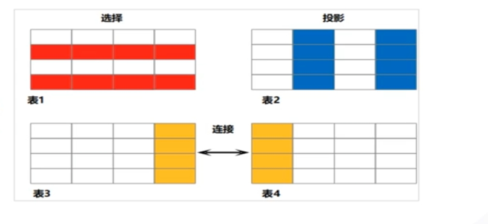

# 一、操作

## 1.数据库

### 1).创建

```sql
CREATE DATABASE [IF NOT EXISTS] database_name
[ [ WITH ] { OWNER [=] user_name | TEMPLATE [=] template } ]
[ ENCODING [=] encoding ]
[ LC_COLLATE [=] collate ]
[ LC_CTYPE [=] ctype ]
[ DBCOMPATIBILITY [=] compatibility_type ]
[ TABLESPACE [=] tablespace_name ]
[ CONNECTION LIMIT [=] connlimit ]


database_name: 要创建的数据库的名称。

OWNER [=] user_name: 指定数据库的所有者，即拥有该数据库权限的用户。如果省略了等号和用户名，则默认为当前用户

TEMPLATE [=] template: 指定一个模板数据库，用于复制其结构和权限设置到新创建的数据库中。如果省略了等号和模板名称，则不使用模板

ENCODING [=] encoding: 指定数据库的字符编码。例如，UTF8、GBK等。如果省略了等号和编码名称，则使用默认编码

LC_COLLATE [=] collate: 指定数据库的排序规则。例如，en_US.UTF8、zh_CN.UTF8等。如果省略了等号和排序规则名称，则使用默认排序规则

LC_CTYPE [=] ctype: 指定数据库的字符分类规则。例如，en_US.UTF8、zh_CN.UTF8等。如果省略了等号和字符分类规则名称，则使用默认字符分类规则

DBCOMPATIBILITY [=] compatibility_type: 指定数据库的兼容性类型。可以是ANY（兼容所有版本）、DEFAULT（兼容当前版本的默认设置）或CURRENT（兼容当前版本的特定设置）。如果省略了等号和兼容性类型名称，则使用默认兼容性类型。

TABLESPACE [=] tablespace_name: 指定数据库使用的表空间。如果省略了等号和表空间名称，则使用默认表空间

CONNECTION LIMIT [=] connlimit: 指定数据库的最大并发连接数。如果省略了等号和连接限制值，则使用默认连接限制。
```

### 2).修改

```
ALTER DATABASE 旧数据库名称 RENAME TO 新数据库名称;

ALTER DATABASE 旧数据库所有者 OWNER TO 新数据库所有者;
```

### 3).删除

```
drop database [if exists] 数据库名称;
```

### 4).查看

```
\I

\c

select dataname from pg_database;
```

## 2.用户

### 1).创建

```
CREATE USER [IF NOT EXISTS] user_name [WITH option [..]]
[ENCRYPTED | UNENCRYPTED] (PASSWORD | IDENTIFIED BY) 'password'
[EXPIRED | DISABLE];


IF NOT EXISTS 是可选的，用于检查用户是否已经存在。如果用户不存在，则创建新用户；如果用户已存在，则不执行任何操作

user_name 是要创建的用户的名称

WITH option [..] 是可选的，用于指定用户的特定选项。例如，可以设置用户的默认表空间、临时表空间等

ENCRYPTED | UNENCRYPTED 是可选的，用于指定密码加密方式。ENCRYPTED 表示加密密码，UNENCRYPTED 表示不加密密码。如果不指定，默认为加密

(PASSWORD | IDENTIFIED BY) 是必需的，用于指定用户的密码。可以使用 PASSWORD 关键字或 IDENTIFIED BY 关键字

'password' 是要为用户设置的密码

EXPIRED | DISABLE 是可选的，用于设置用户的账户状态。EXPIRED 表示账户已过期，DISABLE 表示禁用账户。如果不指定，默认为启用账户。
```

### 2).修改

```
alter user 旧用户 rename to 新用户;
```

### 3).删除

```
drop user [if exists] user_name;
```

### 4).查看

```
\du

select * from pg_user;
```

# 二、SQL

## 1.SQL简介

```
SQl(Structured Query Language，结构性查询语言)是一种特定目的编程语言，用于管理关系数据库管理系统，或在关系流数据管理系统中进行流处理。

SQL基于关系代数和元组关系演算，包括一个数据定义语言和数据操作语言。SQL的范围包括数据插入、查询、更新和删除，数据库模式创建和修改，以及数据访问控制。
```

## 2.分类

```
DDL(Data Definition Language)数据定义语言
·用于定义或修改数据库中的对象。如:表、索引、视图、数据库、序列、用户、角色、表空间.
存储过程等。


DML(Data Manipulation Language)数据操纵语言
。用于对数据库表中的数据进行操作，如插入，更新和删除。


DCL(Data ControlLanguage)数据控制语言
。用来设置或更改数据库事务、授权操作(用户或角色授权，权限回收，创建角色，删除角色等)、锁表(支持SHARE和EXCLUSIVE两种锁表模式)、停机等。


DQL(Data Query Language)数据查询语言
”用来查询数据库内的数据，如查询数据、合并多个select语句的结果集，
```

# 三、查询

## 1.概念

```
数据库中的数据存储在表中，这些表一般由行(Tuple)和列(Column)组成，列构成表的结构，行组成表的数据。
SELECT语句可以从数据库表中查询所需的信息，但不会改变数据库表中的数据，它只是将数据从数据库表中提取并显示出来。

SELECT语句的关键要素
选择:查询符合条件的行，过滤掉不符合条件的行。
投影:查询符合条件的列，过滤掉不符合条件的列。
连接:从多个表中查询数据。连接是关系型数据库的核心，把数据放在不同的表里，通过连接查询获得完整信
```



```sql
SELECT [/*+ plan_hint */] [ ALL | DISTINCT [ ON ( expression [, ...] ) ]]{*|{expression[[AS ]output name ]} [, ...] }
[ FROM FROM item [, ...]]
[WHERE condition ]
[ GROUP BY grouping_element l, ...]]
[HAVING condition [, ...]]
[ ORDER BY (expression [ [Asc | DEsc | usiNG operator ] | nlssort_expression_clause ] [ NULLS { FIRST | LAST } }} . .. 
[ LIMIT { [offset,] count | ALL } ]
[OFFSET start[ ROW I ROWS ]]
[,...]


/*+ plan_hint */: 这是一个注释，用于指定查询优化器的提示信息。这些提示可以帮助数据库优化器选择最佳的执行计划。

ALL: 这是一个可选的关键字，表示返回所有满足条件的行，包括重复的行
                                                                                       
DISTINCT`: 这是一个可选的关键字，用于去除结果集中的重复行。可以使用`ON (expression [, ...])`来指定去重的列

{*|{expression[[AS ]output name ]} [, ...]}: 这是要选择的列或表达式列表。可以使用`AS output name`给输出列指定别名
                                                                                       
FROM item [, ...]: 这是要从中检索数据的表或视图的名称。可以指定多个表或视图，用逗号分隔
                                                                                       
WHERE condition: 这是筛选条件，用于限制返回的行。只有满足条件的行才会被包含在结果集中
                                                                                       
GROUP BY grouping_element l, ...: 这是分组依据，用于将结果集按照指定的列进行分组。

HAVING condition [, ...]: 这是对分组后的结果集进行筛选的条件，类似于`WHERE`子句，但作用于分组后的结果集。

ORDER BY (expression [ [Asc | DEsc | usiNG operator ] | nlssort_expression_clause ] [ NULLS { FIRST | LAST } }} . ..: 这是排序依据，用于对结果集进行排序。可以使用`ASC`（升序）或`DESC`（降序）来指定排序顺序。还可以使用`NULLS FIRST`或`NULLS LAST`来指定空值的处理方式
                                                                                     
LIMIT { [offset,] count | ALL }: 这是限制返回结果集的数量。可以使用`offset`来指定起始位置，`count`来指定返回的最大行数。也可以使用`ALL`来返回所有符合条件的行。

OFFSET start[ ROW I ROWS ]: 这是可选的关键字，用于指定从哪一行开始返回结果集。  
```

