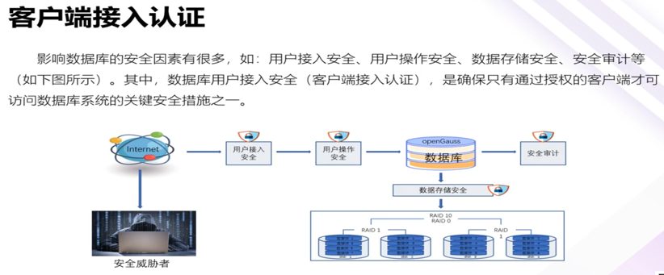
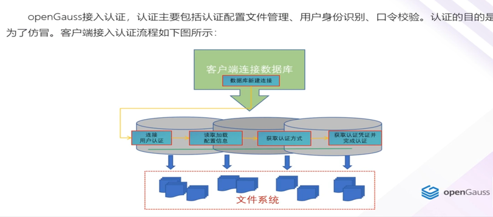
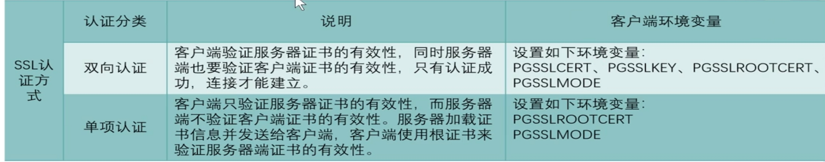
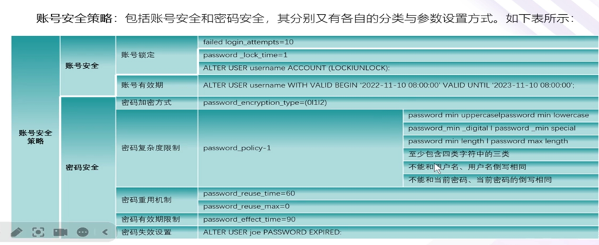
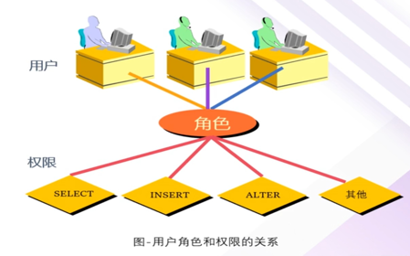
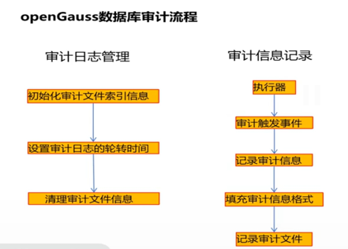
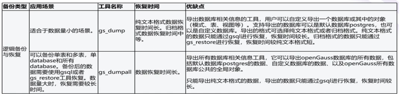
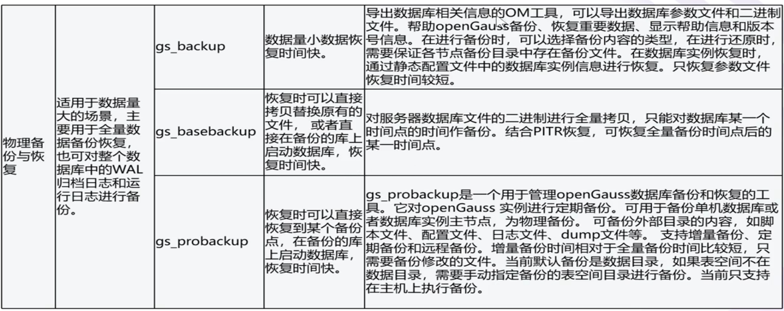
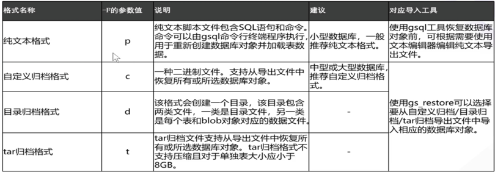

# 一、配置文件前提
## 1.pg hba.conf
openGauss接入认证配置
**pg_hba.conf**置文件的格式是一行写一条信息，表示一个认证规则，空白和注释(以#开头)被忽略。每个认证规则是由若干空格、/或制表符分隔的字段组成。如果字段用引号包围，则它可以包含空白一条记录不能跨行存在。pg_hba.coní已置文件的格式如下图所示。客户端接入数据库时，通常采用如下表的认证方式
| 认证方式 | 说明                                                         |
| -------- | ------------------------------------------------------------ |
| sha256   | 一种密码学哈希函数，它将输入数据转换为256位(32字节)的散列值  |
| md5      | 一种常见的哈希函数，用于将输入数据转换为128位(16字节的散列值 |
| gSSAPI   | 基于gssAPI的kerberos认证。一种通用的安全服务应用程序接口，用于提供身份验证和安全通信服务 |
| cert     | 数字证书，通常采用一种基于非对称加密的算法来生成和验证       |
| reject   | 无条件地拒绝连接，可阻塞一个特定的主机连接                   |
| trust    | 一组计算或推断信任度、可信性或信用度的方法和技术             |
## 2.SSL
openGauss支持SSL标准协议(TLS1.2)，可用SSL进行安全的TCP/IP连接。SSL协议是安全性更高的协议标准
它加入了数字签名和数字证书来实现客户端和服务器的双向身份验证，保证了通信双方更加安全的数据传输。

注意事项:
- 当用户远程连接到数据库主节点时，需要使用sha256的认证方式。
- 当内部服务器之间连接时，需要使用trust的认证方式，支持IP白名单认证。
- SSL证书需要提前从CA认证中心申请正式的服务器证书、客户端证书和密钥。
## 3.认证
### 1).客户端接入认证
#### a.搭建CA环境
假设用户为omm已存在,搭建CA的路径为/root/test
```
mkdir /root/test

cd /etc/pki/tls

cp openssl.cnf 

cd ~/test

mkdir ./demoCA ./demoCA/newcerts ./demoCA/privatedemoCA/private/cakey.pem-out demoCA/careq.pem

chmod 777 ./demoCA/private--创建serial文件,写入01

echo 01'>./demoCA/serial

--创建文件index.txt
touch ./demoCA/index.txt

--修改openssl.cnf配置文件中的参数
vi~/test/openssl.cnf
dir=/demoCA
default md=sha256
```
#### b.创建CA自签发证书
```
--生成CA私钥
openssl genrsa -aes256 -outdemoCA/private/cakey.pem 2048

--生成CA根证书申请文件
openssl req -config openssl.cnf -new -key
注意:填写CA信息时CommonName请填写主机名

--生成CA自签发根证书
vi openssl.cnf
basicConstraints=CA:TRUE    ##需要修改多个
ca -config openssl.cnf -outdemoCA/cacert.pem -keyfile
demoCA/private/cakey.pem -selfsign -infilesdemoCA/careq.pem
--至此CA根证书自签发亮成
根证书demoCA/cacert.pem
```
### 2).SSL连接配置(创建Server证书)
```
1.生成服务器私钥文件server.key
openssl genrsa -aes256 -out server.key 2048

2.生成服务端证书请求文件server.req
openssl req *config openssl.cnf-new -key server.key -out server.reg   ##注意:填写的信息与创建CA时的信息一致

3.生成服务端证书server.crt
vi openssl.cnf
basicConstraintsCA:FALSE

vi democA/index.txt.attr
unique subject = no

openssl ca -config openssl.cnf -in server.reg -out server.crt -days 365o -md sha256

4.去掉私钥密码保护
openssl rsa -in server,key -out server.key

-如果不去掉服务器私钥的密码保护需要使用gs_guc工具对存储密码进行加密保护
gs_guc encrypt -M server -K Test@123 -D ./ 
## gs_8uc加密后会生成server,key.cipher,server,key.rand两个私钥密码保护文件
```
### 3).客户端证书配置
```
1.拷贝证书至客户端并修改权限
cp-r~/test/* /gauss/app/share/sslcert/om/

chmod o6oo /gauss/app/share/sslcert/om/client.crt

chmod o6oo /gauss/app/share/sslcert/om/client.key

cp ca* /gauss/data/db1/

chmod o6oo /gauss/app/share/sslcert/om/ca*

[omm@db1 ~]$ cd /gauss/app/share/sslcert/om

cp demoCA/cacert.pem.

chown omm:dbgrp -R/gauss/app/share/sslcert/om/

ll total 88
-rw-------1omm dbgrp 4391Aug 26 14:34 cacert.pem
-rw-------1omm dbgrp 1062 Aug 26 14:34 careq.pem
-rw-r--r--1 omm dbgrp 1062 Aug 26 14:33 server.reg
```
```
2.拷贝CA证书和server证书至$PG DATA目录
cp server.* /gauss/data/db1/
chown omm:dbgrp -R /gauss/data/db1/server.*
chown omm:dbgrp -R /gauss/data/db1/ca*
chmod 0600/gauss/data/db1/server.
chmod 0600/gauss/data/db1/ca*
```
```
3.客户端证书配置与连接测试
[omm@client ~]$ mkdir ~/.ssl

[omm@client ~]$mv client.*cacert.pem ~/.ssl/##将client证书和ca证书copy至客户端目录

[omm@client ~]$ vi ~/.bash profile
export SSLCERT HOME=/home/omm/.ssl
export PGSSLCERT=$SSLCERT HOME/client.crtexport PGSSLKEY=$SSLCERT HOME/client.key
export PGSSLMODE="verify-ca"
export PGSSLROOTCERT=$SSLCERT HOME/cacert.pem

[omm@client ~]$source ~/.bash profile

[omm@client ~]$ gsql -d tpcc -p 26000 -U user1 -h 192.168.0.225
gsql ((openGauss 1.0.0 build 0bd0ce80) compiled at 2020-06-30 18:19:27 commit 0 last mr )SSL connection(cipher:DHE-RSA-AES256-GCM-SHA384, bits: 256)"helo" for helD.
```

# 二、用户及角色
**数据库用户**: 是指被授权访问和管理数据库系统的实体，即使用和管理数据库资源的人。每个数据库管理系统(DBMS)都有自己的用户管理策略，用于管理数据库用户的访问权限、角色和功能。
**数据库角色**: 是一种用于管理和组织数据库用户权限的重要概念。角色允许数据库管理员将一组权限分配给一个角色，然后将该角色分配给一个或多个数据库用户。这样可以简化权限管理，提高安全性和可维护性。
**数据库权限**: 是指在数据库管理系统中控制用户或角色对数据库对象(如表格、视图、存储过程等)执行特定操作的能力。数据库权限是确保数据库安全性和数据保护的重要组成部分。数据库权限又分为系统权限和对象权限。

**管理员用户**
- **初始用户**: openGauss安装过程中自动生成的帐户(与安装时使用的操作系统用户同名)称为初始用户。初始用户拥有系统的最高权限，可以绕过所有权限检查，能够执行所有的操作。该用户一般仅作为DBA管理使用，在第一次登录数据库后，建议及时修改初始用户的密码
- **系统管理员**: 系统管理员是指具有SYSADMIN属性的帐户，默认安装情况下具有与对象所有者相同的权限，但不包括dbe perf模式的对象权限。创建系统管理员可以使用初始用户或者系统管理员用户身份连接数据库，并使用带SYSADMIN选项的CREATEUSER语句或 ALTER USER语句进行设置
## 1.创建用户
```sql
create user::=
CREATE USER username
[
	[ WITH ]
	{
		PASSWORD 'password'
		| ROLE rolename [, ... ]
		| DEFAULT TABLESPACE tablespace name
		| VALID UNTIL 'abstime'
	}[...]
];
username(用户名)
password(用户口令)
rolename(用户角色)
tablespace_name(该用户创建的全部模式对象都将位于该 tablespace中)
abstime(用户口令有效期，省略该参数时用户口令永远有效)
```
```
示例:创建一个有口令用户,其帐号在2049年12月31日23 点 59 分 59 秒 后过期
CREATE USER app user3 WITH PASSWORD 'Sz oscar 55' VALID UNTIL '2049-12-31 23:59:59'
```
## 2.创建用户
```
create role::=
	CREATE ROLE rolename
	[
		[ WITH ]
		{
			user username[,...]
		}
	 ];
	 
参数:
rolename(角色名);
username(属于该角色的用户列表，用户必须已经存在，包含在列表中的用户将具有该角色的权限)。
```
**注意:**
CREATEROLE 在当前连接数据库中增加一个新角色，创建者必须是 DBA。例如，DBA 可以创建一个对表具有查看插入权限的角色。在创建用户时，对用户赋予此角色，用户将自动具有此角色拥有的查看、插入权限而不用对每个用户单独赋权限。

```
示例:
1、创建角色(包含用户)CREATE ROLE role2 WITH USER user2, user3;

2、创建角色并授权--创建角色
CREATE ROLE role3,
为角色授权
GRANT SELECT ON tab3 TO ROLE role3:
```
## 3.三权分立
在实际业务管理中，为了避免系统管理员拥有过度集中的权利带来高风险，可以设置三权分立。将系统管理员的部分权限分立给安全管理员和审计管理员，形成系统管理员、安全管理员和审计管理员三权分立。
| 角色                  | 说明                                                         |
| --------------------- | ------------------------------------------------------------ |
| 数据库系统管理员(DBA) | 负责管理和维护数据库系统，包括数据库的创建、配置、维护、备份和恢复。DBA通常具有最高的权限，可以访问和修改数据库的所有数据和结构 |
| 安全管理员            | 负责数据库安全管理和维护。主要职责和任务包括:访问控制、身份验证和授权、漏洞管理等以确保数据库系统中存储的敏感信息受到保护，防止未经授权的访问、数据泄露和其他潜在的安全威胁 |
| 审计管理员            | 负责规划、实施和维护数据库审计策略。主要职责和任务:审计策略制定、审计设置、审计日志管理、审计事件监测、审计数据分析等。有助于及时发现和应对潜在的数据库安全威胁 |

授权与权限回收使用GRANT语句将系统权限，对象权限与权限授予该用户，执行授权的用户本身也必须具有该项权限。使用REVOKE语句可以回收已经授予用户(或角色)的系统权限，对象权限与角色，执行回收权
限操作的用户必须具有授予改权限的能力。

**GRANT**: 对角色和用户进行授权操作。使用GRANT命令进行用户授权包括三种场景:(1)将系统权限(例如sysadmin、CREATEDB、CREATEROLE等)授权给角色或用户;将角色或用户的权限授权给其他角色或用户;将数据库对象授权给角色或用户。

**REVOKE**: 使用REVOKE命令进行权限回收包括:撤销角色或用户的系统权限(例如sysadmin、CREATEDB、CREATEROLE等);回收角色上的权限;回收数据库对象上的权限;回收表上指定字段权限;回收指定数据库上权限;回收指定模式上权限;回收指定表空间上权限等
```
授权与权限回收示例:
1.数据库授权
grant all privileges on database mydb to user3;

2.表空间授权
grant all privileges on tablespace tbs1 to user3;

3.schema授权
grant usage on schema sch1 to user3;

4.函数授权
grant execute on function func add sql(int,int) to user3;
grant execute on function proc emp(var empno int, OUT v name varchar, OUT v job varchar) to user3;

5.表授权
grant select (empno,ename,sal),update (comm) on emp TO user3;
grant select,insert,update,delete on all tables in schema sch1 to user3;
grant all privileges on emp to user3 with grant option;

6.授权jack角色给user1用户，且user1用户可授权其他用户
grant jack to user1 with admin option:

7.权限回收
revoke jack from user1;
```
## 4.行级访问控制
数据库行级访问控制是一种安全机制，用于限制数据库用户对数据行的访问权限。这种访问控制允许数据库管理员或系统管理员定义哪些用户可以查看、修改或删除特定数据行，从而增强了数据库的安全性和隐私性。
```
--创建测试数据
create user alice password"gauss@123';
create table all data(id int,role varchar(100),data varchar(100));
insertintoall data values(1,'alice','alice data');·bob"，'bob data');
insertintoall data values(2,insert intoall data values(3,'peter','peter data');

--创建行级安全策略
grant selectonalldatato alice;alter table all data enable row level security;
create row level security policy all data_rls on all _data using(role = current_user);

--用户alice访问测试
\c - alice
select *from all data;
explain select * from public.all data;			--仅能看到指定用户的数据，系统管理员不受行访问控制影响
```
## 5.数据库审计

```
1).审计机制
主要包括审计日志的创建和管理以及数据库的各类管理活动和业务活动的审计追溯

2).审计日志管理
包括新创建审计日志、审计日志轮转、审计日志清理

3).审计日志追溯
包括活动发生时的日志记录以及审计信息查询接口
```
openGauss审计项
| 审计项                              | 描述                                                         |
| ----------------------------------- | ------------------------------------------------------------ |
| 用户登录、注销                      | 参数:audit_login_logout 默认值为7，表示开启用户登录、退出的审计功能。设置为0表示关闭用户登录、退出的审计功能。不推荐设置除0和7之外的值 |
| 数据库启动、停止、恢复和切换        | 参数:audit_database_process 默认值为1，表示开启数据库启动、停止、恢复和切换的审计功能 |
| 用户锁定和解锁                      | 参数:audit_user_locked 默认值为1，表示开启审计用户锁定和解锁功能 |
| 用户访问越权                        | 参数:audit user_violation 默认值为0，表示关闭用户越权操作审计功能 |
| 授权和回收权限                      | 参数:audit_grant_revoke 默认值为1，表示开启审计用户权限授予和回收功能 |
| 数据库对象的CREATE，ALTER，DROP操作 | 参数:audit _system_object 默认值为12295，表示只对DATABASE、SCHEMA、USER、DATASOURCE这四类。数据库对象的CREATE、ALTER、DROP操作进行审计。12295换算成2进制为:00000011000000000111(0/1/2/12/13这5位为1) |
| 数据表的INSERT、UPDATE和DELETE操作  | 参数:audit_dml_state 默认值为0，表示关闭具体表的DML操作(SELECT除外)审计功能 |
| SELECT操作                          | 参数:audit_dml_state_select 默认值为0，表示关闭SELECT操作审计功能 |
| COPY操作                            | 参数:audit_copy_exec 默认值为0，表示关闭copy操作审计功能     |
| 存储过程和自定义函数的执行          | audit_function_exec 默认值为0，表示不记录存储过程和自定义函数的执行审计日志参数 |
| SET操作                             | 参数:audit_set_parameter默认值为1，表示记录set操作审计日志   |
```
openGauss审计示例
1.开启数据库审计
gs_guc set -N all -l all -c"audit enabled=on"
gs_guc reload -N all-lall -c"audit system object=12295"  --审计对象包括:数据库、模式、用户、DataSource

2.查看审计相关参数
postgres=#select name,setting,short desc
from pg settings
where name like'%audit%';

3.查询审计信息
postgres=# SELECT time,type,result,username,database,object name,detail infoFROM pg query audit('2021-06-18 08:00:00','2021-06-18 15:30:00');

4.清空审计日志
postgres=# SELECT pg delete audit('2021-06-18 08:00:00','2021-06-18 15:30:00');
```
## 4).审计踪迹管理
审计踪迹根据有效的审计配置记录在数据库上进行的操作情况。openGauss数据库中，审计踪迹主要是记录在系统表中。通过分析审计踪迹，可以帮助定位数据库中可疑操作的来源。审计踪迹管理包括查看审计踪迹、清理审计踪迹。
```
1、查看审计踪迹:只有审计管理员才有权查看审计踪迹。可以直接查询系统表，记录了执行的命令、执行命的用户时间和命令执行结果等信息

2、清理审计踪迹:当对数据库的可疑操作来源明确以后，相应的审计踪迹就不再具有存在的意义
```
利用审计调查可疑操作
假设发现数据库中有如下四个可疑操作，可配置并开启审计功能进行审计:
```
1、不合法的SELECT操作，本来在表上无SELECT权限的用户现在可以对其进行SELECT

2、用户的密码被非法修改

3、对表中数据的非法更新

4、数据库浏览操作变得缓慢，某些表上的索引被删除
```
# 三、备份恢复管理
openGauss数据库支持多种备份恢复类型，以及多种备份恢复方案，备份和恢复过程中提供数据的可靠性保障机制。
备份与恢复类型可分为逻辑备份与恢复、物理备份与恢复
逻辑备份与恢复:通过逻辑导出对数据进行备份，逻辑备份只能基于备份时刻进行数据转储，所以恢复时也只能恢复到备份时保存的数据。
物理备份与恢复:通过物理文件拷贝的方式对数据库进行备份，以磁盘块为基本单位将数据从主机
复制到备机。
以下为openGauss支持的数据备份恢复方案，备份方案也决定了当异常发生时该如何恢复。


## 1).逻辑备份与恢复
### 1.gs_dump
是openGauss用于导出数据库相关信息的工具，用户可以自定义导出一个数据库或其中的对象(模式、表、视图等)，回收站对象除外。支持导出的数据库可以是默认数据库postgres，也可以是自定义数据库
```
gs_dump工具由操作系统用户omm执行。

gs_dump工具在进行数据导出时，其他用户可以访问openGauss数据库(读或写)

gs_dump工具支持导出完整一致的数据。例如，T1时刻启动

gs_dump导出A数据库，那么导出数据结果将会是T1时刻A数据库的数据状态，T1时刻之后对A数据库的修改不会被导出。

gs_dump 时生成列不会被转储

gs_ dump 支持导出兼容v1版本数据库的文本格式文件
```
导出文件格式:

```
示例:
gs_dump--导出postgres数据库全量信息
gs_dump -U omm -Womm_123 -fbackup/MPPDB backup.sql -p 15432 postgres -F p

gs_dump -n参数导出指定schema(模式)
gs dump -U omm -W omm 123 -f backup/test usel backup.sgl -p 5432 postgres -n test use1 -F p

gs_dump -t 参数 导出指定的表
gs dump -U omm -W omm_ 123 -f backup/test use1 backup.sql -p 5432 postgres -ttest usel.ora alter table -F p

gs_dump-s只导出表定义，不导出数据
gs_dump -U omm -W omm 123 -f backup/test use1 backup.sql -p 5432 postgres -ttest usel.ora alter table-s-Fp
```
### 2.gs_dumpall
```
gs_dumpall是openGauss用于导出所有数据库相关信息工具，它可以导出openGauss数据库的所有数据，包括默认数据库postqres的数据、自定义数据库的数据以及openGauss所有数据库公共的全局对象

gs_dumpall工具由操作系统用户omm执行

gs dumpall工具在进行数据导出时，其他用户可以访问openGauss数据库(读或写)。gs_dumpall工具支持导出完整一致的数据。例如，T1时刻启动gs dumpall导出openGauss数据库那么导出数据结果将会是T1时刻该openGauss数据库的数据状态，T1时刻之后对openGauss的修改不会被导出

gs dumpall时生成列不会被转储。
```
**语法:与gs_dump 基本相同**
```
导入PUBLIC模式下的table1
gs_restore -h host _name -p port_number -d postgres -t table1 backup/MPPDB_backup.tar

导入test1模式下的test1和test2模式下test2
gs_restore -h host_name -p port_number -d postgres -n testl -t test1 -n test2 -t test2backup/MPPDB backup.tar

导入PUBLIC模式下的table1和test1模式下table1
gs_restore -h host _name -p port number -d postgres -n PUBliC -t table1 -n test1 -t table1backup/MPPDB backup.tar
```
## 2).物理备份与恢复
### 1.gs_backup
gs_backup 用于备份配置文件，帮助openGauss备份、恢复重要数据、显示帮助信息和版本号信息。
**前提条件**
```
1.可以正常连接openGauss数据库
2.在进行还原时，需要保证各节点备份目录中存在备份文件
3.需以操作系统用户omm执行gsbackup命令
```
**示例:**
```sql
1.使用gs_backup脚本备份数据库主机。
gs_backup -t backup --backup-dir=/opt/software/gaussdb/backup dir -h plat1 --parameter

2.使用gs backup脚本恢复数据库主机。
gs_backup -t restore --backup-dir=/opt/software/gaussdb/backup dir -h plat1 --parameter
```
### 2.gs_basebackupgs
gs_basebackupgs的实现目标是对服务器数据库文件的二进制进行拷贝，其实现原理使用了复制协议。远程执行gs basebackup时，需要使用系统管理员账户。gs_basebackup当前支持热备份模式和压缩格式备份。
**说明:**
```
1.gs_basebackup仅支持主机和备机的全量备份，不支持增量。
2.gs_basebackup当前支持热备份模式和压缩格式备份。
3.gs_basebackup在备份包含绝对路径的表空间时，如果在同一台机器上进行备份，可以通过tablespace-mapping重定向表空间路径，或使用归档模式进行备份。
```
若打开增量检测点功能且打开双写，gsbasebackup也会备份双写文件。
若pg_xlog目录为软链接，备份时将不会建立软链接，会直接将数据备份到目的路径的pgxlog目录下
备份过程中收回用户备份权限，可能导致备份失败或者备份数据不可用。
如果因为网络临时故障等原因导致Server端无应答，gs basebackup将在最长等待120秒后退出

前提条件:
```
1.可以正常连接openGauss数据库
2.备份过程中用户权限没有被回收
3.pg_hba.conf中需要配置允许复制链接，且该连接必须由一个系统管理员建立
4.如果xlog传输模式为stream模式，需要配置max wal senders的数量，至少有一个可用
5.如果xlog传输模式为fetch模式，有必要把wal keep segments参数设置得足够高，这样在备份末尾之前日志不会被移除
6.在进行还原时，需要保证各节点备份目录中存在备份文件，若备份文件丢失，则需要从其他节点进行拷贝
```
```
示例:
gs_basebackup -D /home/test/trunk/install/data/backup -h 127.0.0.1 -p 21233
INFO: The starting position of the xlog copy of the full build is: 0/1B800000. The slot minimum LSN is.0/1B800000.
```
从备份文件恢复数据
```
当数据库发生故障时需要从备份文件进行恢复。因为gsbasebackup是对数据库按二进制进行备份因此恢复时可以直接拷贝替换原有的文件，或者直接在备份的库上启动数据库。
```
说明:
```
若当前数据库实例正在运行，直接从备份文件启动数据库可能会存在端口冲突，这时需要修改配置文件的port参数，或者在启动数据库时指定一下端口。
若当前备份文件为主备数据库，可能需要修改一下主备之间的复制连接。即配置文件中的postgre.conf中的replconninfo1、replconninfo2等。
若配置文件postgresql.conf的参数data directory打开且有配置，当使用备份目录启动数据库时候，data_directory和备份目录不同会导致启动失败。可以修改data_directory的值为新的数据目录，或者注释掉该参数。
```
若要在原库的地方恢复数据库，参考步骤如下:
```
1.停止数据库服务器
2.将原数据库和所有表空间复制到另外一个位置，以备后面需要
3.清理原库中的所有或部分文件。
4.使用数据库系统用户权限从备份中还原需要的数据库文件。
5.若数据库中存在链接文件，需要修改使其链接到正确的文件。
6.重启数据库服务器，并检查数据库内容，确保数据库已经恢复到所需的状态。
```
### 3.gs_probackup
gs_probackup是一个用于管理openGauss数据库备份和恢复的工具。它对openGauss实例进行定期备份、以便在数据库出现故障时能够恢复服务器。
- 可用于备份单机数据库，也可对主机或者主节点数据库备机进行备份，为物理备份。
- 可备份外部目录的内容，如脚本文件、配置文件、日志文件、dump文件等。
- 支持增量备份、定期备份和远程备份。
- 可设置备份的留存策略。
前提条件:
- 可以正常连接openGauss数据库。
- 若要使用PTRACK增量备份，需在postqresgl.conf中手动添加参数“enable cbm tracking =on”
- 为了防止xog在传输结束前被清理，请适当调高postqresgl.conf文件中wal keep seqments的值
限制说明:
```
1.备份必须由运行数据库服务器的用户执行
2.备份和恢复的数据库服务器的主版本号必须相同
3.如果要通过ssh在远程模式下备份数据库，需要在本地和远程主机安装相同主版本的数据库，并通过ssh-copy-id remote user@remote host命令设置本地主机备份用户和远程主机数据库用户的无密码ssh连接
4.远程模式下只能执行add-instance、backup、restore子命令
5.使用restore子命令前，应先停止gaussdb进程
6.当存在用户自定义表空间时，备份的时候要加上--external-mapping 参数，否则，该表空间不会被备份
```
```
当备份的规模比较大时，为了防止备份过程中timeout发生，请适当调整postgresql.conf文件的参数 session timeout、wal sender _timeout。并且在备份的命令行参数中适当调整参数-rw-timeout的值。

恢复时，使用-T选项把备份中的外部目录重定向到新目录时，请同时指定参数-external-mapping。

增量备份恢复后，之前创建的逻辑复制槽不可用，需删除重建。

当使用远程备份时，请确保远程机器和备份机器的时钟同步，以防止使用-recovery-target-time恢
复的场合,启动qaussdb时有可能会失败。

当远程备份有效时(remote-proto=ssh)，请确保-h和-remote-host指定的是同一台机器。当远程备份无效时，如果指定了-h选项，请确保-h指定的是本机地址或本机主机名。

当前暂不支持备份逻辑复制槽。
```
备份流程
```
1.初始化备份目录。在指定的目录下创建backups/和wal/子目录，分别用于存放备份文件和WAL文件gs_probackup init -B backup dir

2.添加一个新的备份实例。gs_probackup可以在同一个备份目录下存放多个数据库实例的备份。
gs probackup add-instance -B backup dir -D data dir --instance in$tance name

3.创建指定实例的备份。在进行增量备份之前，必须至少创建一次全量备份。
gs probackup backup -B backup dir --instance instance name -b backup mode

4.从指定实例的备份中恢复数据
gs probackup restore -B backup dir --instance instance_name -D pgdata-path -i backup id
```