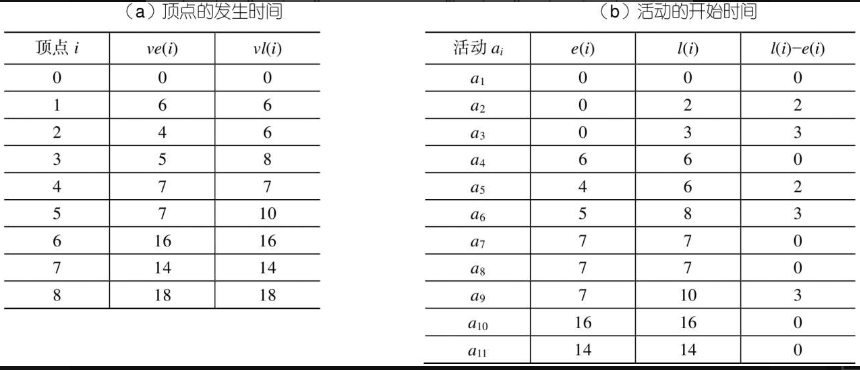
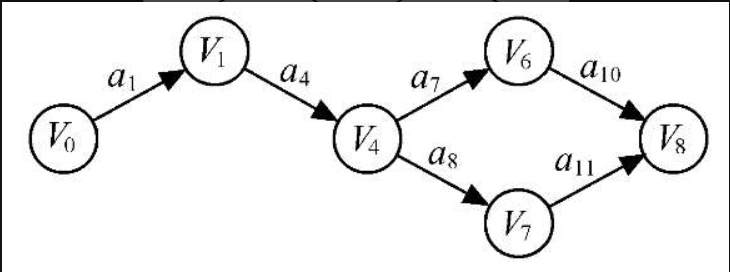

#  一、图的定义和基本术语

## 1.图的定义

**图**（Graph）G由两个集合V和E组成，记为G=(V,E)，其中V是顶点的有穷非空集合，E是V中顶点偶对的有穷集合，这些顶点偶对称为边。V(G)和E(G)通常分别表示图G的顶点集合和边集合，E(G)可以为空集。若E(G)为空，则图G只有顶点而没有边。

对于图G，若边集E(G)为有向边的集合，则称该图为有向图；若边集E(G)为无向边的集合，则称该图为无向图。

在有向图中，顶点对<x，y>是有序的，它称为从顶点x到顶点y的一条有向边。因此，<x，y>与<y，x>是不同的两条边。顶点对用一对尖括号括起来，x是有向边的始点，y是有向边的终点。<x，y>也称作一条弧，则x为弧尾，y为弧头。

在无向图中，顶点对(x, y)是无序的，它称为与顶点x和顶点y相关联的一条边。这条边没有特定的方向，(x, y)与(y, x)是同一条边。为了有别于有向图，无向图的顶点对用一对圆括号括起来。图6.1分别给出了有向图和无向图的示例。


## 2.图的基本术语

用n表示图中顶点数目，用e表示边的数目，下面介绍图结构中的一些基本术语。
（1）子图：假设有两个图G=(V, E)和G′=(V′, E′)，如果V′′V且E′′ E，则称G′为G的子图。例如，图6.2所示为图6.1中G1和G2子图的一些例子。

​					图6.2 子图示例

（2）无向完全图和有向完全图：对于无向图，若具有n(n−1)/2条边，则称为无向完全图。对于有向图，若具有n(n−1)条弧，则称为有向完全图。

（3）稀疏图和稠密图：有很少条边或弧（如e<nlog2n）的图称为稀疏图，反之称为稠密图。

（4）权和网：在实际应用中，每条边可以标上具有某种含义的数值，该数值称为该边上的权。这些权可以表示从一个顶点到另一个顶点的距离或耗费。这种带权的图通常称为网。

（5）邻接点：对于无向图G，如果图的边(v,v′)∈E，则称顶点v和v′互为邻接点，即v和v′相邻接。边(v, v′)依附于顶点v和v′，或者说边(v, v′)与顶点v和v′相关联。

（6）度、入度和出度：顶点v的度是指和v相关联的边的数目，记为TD(v)。例如，图6.1（b）中G2的顶点v3的度是3。对于有向图，顶点v的度分为入度和出度。入度是以顶点v为头的弧的数目，记为ID(v)；出度是以顶点v为尾的弧的数目，记为OD(v)。顶点v的度为TD(v)=ID(v)+OD(v)。例如，图6.1中G1的顶点v1的入度ID(v1)=1，出度OD(v1)=2，度TD(v1)=ID(v1)+OD(v1)=3。一般地，如果顶点vi的度记为TD(vi)，那么一个有n个顶点，e条边的图，满足如下关系


（7）路径和路径长度：在无向图G中，从顶点v到顶点v′的路径是一个顶点序列(v=vi,0, vi,1,…,vi,m=v′)，其中(vi,j−1, vi,j)∈E，1≤j≤m。如果G是有向图，则路径也是有向的，顶点序列应满足<vi,j−1,vi,j>∈E, 1≤j≤m。路径长度是一条路径上经过的边或弧的数目。

（8）回路或环：第一个顶点和最后一个顶点相同的路径称为回路或环。

（9）简单路径、简单回路或简单环：序列中顶点不重复出现的路径称为简单路径。除了第一个顶点和最后一个顶点之外，其余顶点不重复出现的回路，称为简单回路或简单环。

（10）连通、连通图和连通分量：在无向图G中，如果从顶点v到顶点v′有路径，则称v和v′是连通的。如果对于图中任意两个顶点vi、vj∈V，vi和vj都是连通的，则称G是连通图。图6.1（b）中的G2就是一个连通图，而图6.3（a）中的G3则是非连通图，但G3有3个连通分量，如图6.3（b）所示。所谓连通分量，指的是无向图中的极大连通子图。

（11）强连通图和强连通分量：在有向图G中，如果对于每一对vi,vj∈V, vi≠vj，从vi到vj和从vj到vi都存在路径，则称G是强连通图。有向图中的极大强连通子图称作有向图的强连通分量。例如图6.1（a）中的G1不是强连通图，但它有两个强连通分量，如图6.4所示。

​						图6.4 G1的两个强连通分量

（12）连通图的生成树：一个极小连通子图，它含有图中全部顶点，但只有足以构成一棵树的n−1条边，这样的连通子图称为连通图的生成树。图6.5所示为G3中最大连通分量的一棵生成树。一棵有n个顶点的生成树有且仅有n−1条边。如果在一棵生成树上添加一条边，必定构成一个环，因为这条边使得它依附的那两个顶点之间有了第二条路径。

							图6.5 G3的最大连通分量的一棵生成树
一棵有n个顶点的生成树有且仅有n−1条边。如果一个图有n个顶点和小于n−1条边，则是非连通图。如果它多于n−1条边，则一定有环。但是，有n−1条边的图不一定是生成树。

（13）有向树和生成森林：有一个顶点的入度为0，其余顶点的入度均为1的有向图称为有向树。一个有向图的生成森林是由若干棵有向树组成，含有图中全部顶点，但只有足以构成若干棵不相交的有向树的弧。图6.6所示为其一例。

​				图6.6 一个有向图及其生成森林

# 二、图的类型定义
图是一种数据结构，加上一组基本操作，就构成了抽象数据类型。抽象数据类型图的定义如下：
```c
ADT Graph{
  数据对象：V是具有相同特性的数据元素的集合，称为顶点集。
  数据关系：
      R = {VR}  
      VR = {<v, w>|v，w∈V且P（v, w）<v, w>表示从v到w的弧， 
      谓词P（v, w）定义了弧<v, w>的意义或信息}  
  基本操作：
    CreateGraph(&G,V,VR)  
      初始条件：V是图的顶点集，VR是图中弧的集合。  
      操作结果：按V和VR的定义构造图G。  
    DestroyGraph(&G)  
      初始条件：图G存在。  
      操作结果：销毁图G。  
    LocateVex(G,u)  
      初始条件：图G存在，u和G中顶点有相同特征。  
      操作结果：若G中存在顶点u，则返回该顶点在图中的位置；否则返回其他信息。  
    GetVex(G,v)  
      初始条件：图G存在，v是G中某个顶点。  
      操作结果：返回v的值。  
    PutVex(&G,v,value);  
      初始条件：图G存在，v是G中某个顶点。  
      操作结果：对v赋值value。  
    FirstAdjVex(G,v)  
      初始条件：图G存在，v是G中某个顶点。  
      操作结果：返回 v的第一个邻接顶点。若v在G中没有邻接顶点，则返回“空”。  
    NextAdjVex(G,v,w)  
      初始条件：图G存在，v是G中某个顶点，w是v的邻接顶点。  
      操作结果：返回v的（相对于w的）下一个邻接顶点。若w是v的最后一个邻接点，则返回“空”。
    InsertVex(&G,v)  
      初始条件：图G存在，v和图中顶点有相同特征。  
      操作结果：在图G中增添新顶点v。  
    DeleteVex(&G,v)  
      初始条件：图G存在，v是G中某个顶点。  
      操作结果：删除G中顶点v及其相关的弧。  
    InsertArc(&G,v,w)  
      初始条件：图G存在，v和w是G中两个顶点。  
      操作结果：在G中增添弧<v, w>，若G是无向图，则还增添对称弧<w, v>。  
    DeleteArc(&G,v,w)  
      初始条件：图G存在，v和w是G中两个顶点。  
      操作结果：在G中删除弧<v, w>，若G是无向图，则还删除对称弧<w, v>。  
    DFSTraverse(G)  
      初始条件：图G存在。  
      操作结果：对图进行深度优先遍历，在遍历过程中对每个顶点访问一次。  
    BFSTraverse(G)  
      初始条件：图G存在。  
      操作结果：对图进行广度优先遍历，在遍历过程中对每个顶点访问一次。  
}ADT Graph
```

# 三、图的存储结构

由于图的结构比较复杂，任意两个顶点之间都可能存在联系，因此无法以数据元素在存储区中的物理位置来表示元素之间的关系，即图没有顺序存储结构，但可以借助二维数组来表示元素之间的关系，即邻接矩阵表示法。另一方面，由于图的任意两个顶点间都可能存在关系，因此，用链式存储表示图是很自然的事，图的链式存储有多种，有邻接表、十字链表和邻接多重表，应根据实际需要的不同选择不同的存储结构。

### 1).邻接矩阵

邻接矩阵（Adjacency Matrix）是表示顶点之间相邻关系的矩阵。设G(V, E)是具有n个顶点的图，则G的邻接矩阵是具有如下性质的n阶方阵


例如，图6.1中所示的G1和G2的邻接矩阵如图6.9所示。


​					图6.9 图的邻接矩阵

若G是网，则邻接矩阵可以定义为


其中，wi, j表示边上的权值；表示计算机允许的、大于所有边上权值的数。例如，图6.10所示为一个有向网和它的邻接矩阵。


​					图6.10 网及其邻接矩阵

用邻接矩阵表示法表示图，除了一个用于存储邻接矩阵的二维数组外，还需要用一个一维数组来存储顶点信息。其形式说明如下：

```c
//-----图的邻接矩阵存储表示-----
#define MaxInt 32767                    //表示极大值，即∞
#define MVNum 100                       //最大顶点数
typedef char VerTexType;                //假设顶点的数据类型为字符型
typedef int ArcType;                    //假设边的权值类型为整型
typedef struct
{
   VerTexType vexs[MVNum];              //顶点表
   ArcType arcs[MVNum][MVNum];          //邻接矩阵
   int vexnum,arcnum;                   //图的当前点数和边数
}AMGraph;
```

#### 1．采用邻接矩阵表示法创建无向网

已知一个图的点和边，使用邻接矩阵表示法来创建此图的方法比较简单，下面以一个无向网为例来说明创建图的算法。

**算法6.1 采用邻接矩阵表示法创建无向网**

###### 【算法步骤】

① 输入总顶点数和总边数。
② 依次输入点的信息存入顶点表中。
③ 初始化邻接矩阵，使每个权值初始化为极大值。
④ 构造邻接矩阵。依次输入每条边依附的顶点和其权值，确定两个顶点在图中的位置之后，使相应边赋予相应的权值，同时使其对称边赋予相同的权值。

###### 【算法描述】

```c
Status CreateUDN(AMGraph &G)
{//采用邻接矩阵表示法，创建无向网G 
   cin>>G.vexnum>>G.arcnum;                //输入总顶点数，总边数  
   for(i=0;i<G.vexnum;++i)                 //依次输入点的信息 
      cin>>G.vexs[i];       
   for(i=0;i<G.vexnum;++i)                 //初始化邻接矩阵，边的权值均置为极大值MaxInt  
      for(j=0;j<G.vexnum;++j)    
         G.arcs[i][j]=MaxInt;    
   for(k=0;k<G.arcnum;++k)                 //构造邻接矩阵 
   {             
      cin>>v1>>v2>>w;                      //输入一条边依附的顶点及权值  
      i=LocateVex(G,v1);j=LocateVex(G,v2); //确定v1和v2在G中的位置，即顶点数组的下标  
      G.arcs[i][j]=w;                     //边<v1, v2>的权值置为w  
      G.arcs[j][i]=G.arcs[i][j];          //置<v1, v2>的对称边<v2, v1>的权值为w  
   }                                      //for  
   return OK;  
}
```

###### 【算法分析】

```
该算法的时间复杂度是O(n2)。

若要建立无向图，只需对上述算法做两处小的改动：一是初始化邻接矩阵时，将边的权值均初始化为0；二是构造邻接矩阵时，将权值w改为常量值1即可。同样，将该算法稍做修改即可建立一个有向网或有向图。
```

#### 2.邻接矩阵表示法的优缺点

##### a.优点

① 便于判断两个顶点之间是否有边，即根据A[i][j]=0或1来判断。

② 便于计算各个顶点的度。对于无向图，邻接矩阵第i行元素之和就是顶点i的度；对于有向图，第i行元素之和就是顶点i的出度，第i列元素之和就是顶点i的入度。

##### b.缺点

① 不便于增加和删除顶点。

② 不便于统计边的数目，需要扫描邻接矩阵所有元素才能统计完毕，时间复杂度为O(n2)。

③ 空间复杂度高。如果是有向图，n个顶点需要n2个单元存储边。如果是无向图，因其邻接矩阵是对称的，所以对规模较大的邻接矩阵可以采用压缩存储的方法，仅存储下三角（或上三角）的元素，这样需要n(n−1)/2个单元即可。但无论以何种方式存储，邻接矩阵表示法的空间复杂度均为O(n2)，这对于稀疏图而言尤其浪费空间。

下面介绍的邻接表将邻接矩阵的n行改成n个单链表，适合表示稀疏图。

## 2).邻接表

### 1．邻接表表示法

邻接表（Adjacency List）是图的一种链式存储结构。在邻接表中，对图中每个顶点vi建立一个单链表，把与vi相邻接的顶点放在这个链表中。邻接表中每个单链表的第一个结点存放有关顶点的信息，把这一结点看成链表的表头，其余结点存放有关边的信息，这样邻接表便由两部分组成：表头结点表和边表。

#### a.表头结点表

由所有表头结点以顺序结构的形式存储，以便可以随机访问任一顶点的边链表。表头结点包括数据域（data）和链域（firstarc）两部分，如图6.11（a）所示。其中，数据域用于存储顶点vi的名称或其他有关信息；链域用于指向链表中第一个结点（即与顶点vi邻接的第一个邻接点）。

#### b.边表

由表示图中顶点间关系的2n个边链表组成。边链表中边结点包括邻接点域（adjvex）、数据域（info）和链域（nextarc）三部分，如图6.11（b）所示。其中，邻接点域指示与顶点vi邻接的点在图中的位置；数据域存储和边相关的信息，如权值等；链域指示与顶点vi邻接的下一条边的结点。


​				图6.11 表头结点和边结点

例如，图6.12（a）和（b）所示分别为图6.1中G1和G2的邻接表。

在无向图的邻接表中，顶点vi的度恰为第i个链表中的结点数；而在有向图中，第i个链表中的结点个数只是顶点vi的出度，为求入度，必须遍历整个邻接表。在所有链表中，其邻接点域的值为i的结点的个数是顶点vi的入度。有时，为了便于确定顶点的入度，可以建立一个有向图的逆邻接表，即对每个顶点vi建立一个链接所有进入vi的边的表，例如，图6.12（c）所示为有向图G1的逆邻接表。


​				图6.12 邻接表和逆邻接表

根据上述讨论，要定义一个邻接表，需要先定义其存放顶点的头结点和表示边的边结点。图的邻接表存储结构说明如下：

```c
//- - - - -图的邻接表存储表示- - - - -
#define MVNum 100                         //最大顶点数  
typedef struct ArcNode                    //边结点 
{                   
   int adjvex;                           //该边所指向的顶点的位置  
   struct ArcNode * nextarc;             //指向下一条边的指针  
   OtherInfo info;                       //和边相关的信息  
}ArcNode;  
typedef struct VNode                     //顶点信息 
{  
   VerTexType data;    
   ArcNode *firstarc;                   //指向第一条依附该顶点的边的指针  
}VNode,AdjList[MVNum];                  //AdjList表示邻接表类型  
typedef struct                          //邻接表 
{  
    AdjList vertices;                    
    int vexnum,arcnum;                 //图的当前顶点数和边数  
}ALGraph;
```

### 2．采用邻接表表示法创建无向图

基于上述的邻接表表示法，要创建一个图则需要创建其相应的顶点表和边表。下面以一个无向图为例来说明采用邻接表表示法创建无向图的算法。

**算法6.2 采用邻接表表示法创建无向图**

###### 【算法步骤】

① 输入总顶点数和总边数。

② 依次输入点的信息存入顶点表中，使每个表头结点的指针域初始化为NULL。

③ 创建邻接表。依次输入每条边依附的两个顶点，确定这两个顶点的序号i和j之后，将此边结点分别插入vi和vj对应的两个边链表的头部。

###### 【算法描述】

```c
Status CreateUDG(ALGraph &G)
{//采用邻接表表示法，创建无向图G 
   cin>>G.vexnum>>G.arcnum;               //输入总顶点数，总边数  
   for(i=0;i<G.vexnum;++i)                //输入各点，构造表头结点表 
   {            
      cin>> G.vertices[i].data;           //输入顶点值  
      G.vertices[i].firstarc=NULL;       //初始化表头结点的指针域为NULL  
   }         //for  
   for(k=0;k<G.arcnum;++k)               //输入各边，构造邻接表 
   {            
      cin>>v1>>v2;                       //输入一条边依附的两个顶点  
      i=LocateVex(G,v1); j=LocateVex(G,v2);     
      //确定v1和v2在G中位置，即顶点在G.vertices中的序号  
      p1=new ArcNode;                    //生成一个新的边结点*p1  
      p1->adjvex=j;                     //邻接点序号为j  
      p1->nextarc=G.vertices[i].firstarc; G.vertices[i].firstarc=p1;   
      //将新结点*p1插入顶点vi的边表头部  
      p2=new ArcNode;                   //生成另一个对称的新的边结点*p2  
      p2->adjvex=i;                     //邻接点序号为i  
      p2->nextarc=G.vertices[j].firstarc; G.vertices[j].firstarc=p2;   
      //将新结点*p2插入顶点vj的边表头部  
   }                                    //for  
   return OK;  
}
```

###### 【算法分析】

```
该算法的时间复杂度是O(n+e)。

建立有向图的邻接表与此类似，只是更加简单，每读入一个顶点对序号<i, j>，仅需生成一个邻接点序号为j的边表结点，并将其插入到vi的边链表头部即可。若要创建网的邻接表，可以将边的权值存储在info域中。
```

**注意**

```
值得注意的是，一个图的邻接矩阵表示是唯一的，但其邻接表表示不唯一，这是因为邻接表表示中，各边表结点的链接次序取决于建立邻接表的算法，以及边的输入次序。
```

邻接矩阵和邻接表是图的两种最常用的存储结构，它们各有所长。与邻接矩阵相比，邻接表有其自己的优缺点。

### 3．邻接表表示法的优缺点

#### a.优点

① 便于增加和删除顶点。

② 便于统计边的数目，按顶点表顺序扫描所有边表可得到边的数目，时间复杂度为O(n+e)。

③ 空间效率高。对于一个具有n个顶点e条边的图G，若G是无向图，则在其邻接表表示中有n个顶点表结点和2e个边表结点；若G是有向图，则在它的邻接表表示或逆邻接表表示中均有n个顶点表结点和e个边表结点。因此，邻接表或逆邻接表表示的空间复杂度为O(n+e)，适合表示稀疏图。对于稠密图，考虑到邻接表中要附加链域，因此常采取邻接矩阵表示法。

#### b.缺点

① 不便于判断顶点之间是否有边，要判定vi和vj之间是否有边，就需扫描第i个边表，最坏情况下要耗费O(n)时间。

② 不便于计算有向图各个顶点的度。对于无向图，在邻接表表示中顶点vi的度是第i个边表中的结点个数。在有向图的邻接表中，第i个边表上的结点个数是顶点vi的出度，但求vi的入度较困难，需遍历各顶点的边表。若有向图采用逆邻接表表示，则与邻接表表示相反，求顶点的入度容易，而求顶点的出度较难。

下面介绍的十字链表便于求得顶点的入度和出度。

## 3).十字链表

十字链表（Orthogonal List）是有向图的另一种链式存储结构。可以看成是将有向图的邻接表和逆邻接表结合起来得到一种链表。在十字链表中，对应于有向图中每一条弧有一个结点，对应于每个顶点也有一个结点。这些结点的结构如图6.13所示。

​					图6.13 弧结点和顶点结点

在弧结点中有5个域：其中尾域（tailvex）和头域（headvex）分别指示弧尾和弧头这两个顶点在图中的位置，链域hlink指向弧头相同的下一条弧，而链域tlink指向弧尾相同的下一条弧，info域指向该弧的相关信息。弧头相同的弧在同一链表上，弧尾相同的弧也在同一链表上。它们的头结点即为顶点结点，它由3个域组成：其中data域存储和顶点相关的信息，如顶点的名称等；firstin和firstout为两个链域，分别指向以该顶点为弧头或弧尾的第一个弧结点。例如，图6.14（a）中所示图的十字链表如图6.14（b）所示。若将有向图的邻接矩阵看成是稀疏矩阵的话，则十字链表也可以看成是邻接矩阵的链式存储结构，在图的十字链表中，弧结点所在的链表非循环链表，结点之间相对位置自然形成，不一定按顶点序号有序，表头结点即顶点结点，它们之间不是链接，而是顺序存储。


​					图6.14 有向图的十字链表

有向图的十字链表存储表示的形式说明如下所示：

```c
//- - - - -有向图的十字链表存储表示- - - - -
#define MAX_VERTEX_NUM  20
typedef struct ArcBox
{
   int tailvex,headvex;                 //该弧的尾和头顶点的位置
   struct ArcBox *hlink, *tlink;        //分别为弧头相同和弧尾相同的弧的链域
   InfoType *info;                      //该弧相关信息的指针
}ArcBox;
typedef struct VexNode
{
   VertexType data;
   ArcBox *firstin,*firstout;           //分别指向该顶点第一条入弧和出弧
}VexNode;
typedef struct
{
   VexNode xlist[MAX_VERTEX_NUM];       //表头向量
   int vexnum, arcnum;                  //有向图的当前顶点数和弧数
}OLGraph;
```


只要输入n个顶点的信息和e条弧的信息，便可建立该有向图的十字链表，读者可以模仿算法6.2写出采用十字链表表示法创建有向图的算法。建立十字链表的时间复杂度和建立邻接表是相同的。在十字链表中既容易找到以vi为尾的弧，也容易找到以vi为头的弧，因而容易求得顶点的出度和入度（或需要，可在建立十字链表的同时求出）。在某些有向图的应用中，十字链表是很有用的工具。

## 4).邻接多重表

邻接多重表（Adjacency Multilist）是无向图的另一种链式存储结构。虽然邻接表是无向图的一种很有效的存储结构，在邻接表中容易求得顶点和边的各种信息。但是，在邻接表中每一条边（vi，vj）有两个结点，分别在第i个和第j个链表中，这给某些图的操作带来不便。例如在某些图的应用问题中需要对边进行某种操作，如对已被搜索过的边作记号或删除一条边等，此时需要找到表示同一条边的两个结点。因此，在进行这一类操作的无向图的问题中采用邻接多重表作存储结构更为适宜。

邻接多重表的结构和十字链表类似。在邻接多重表中，每一条边用一个结点表示，它由如图6.15（a）所示的6个域组成。其中，mark为标志域，可用以标记该条边是否被搜索过；ivex和jvex为该边依附的两个顶点在图中的位置；ilink指向下一条依附于顶点ivex的边；jlink指向下一条依附于顶点jvex的边，info为指向和边相关的各种信息的指针域。

每一个顶点也用一个结点表示，它由如图6.15（b）所示的两个域组成。其中，data域存储和该顶点相关的信息，firstedge域指示第一条依附于该顶点的边。例如，图6.16所示为无向图G2的邻接多重表。在邻接多重表中，所有依附于同一顶点的边串联在同一链表中，由于每条边依附于两个顶点，则每个边结点同时链接在两个链表中。可见，对无向图而言，其邻接多重表和邻接表的差别，仅仅在于同一条边在邻接表中用两个结点表示，而在邻接多重表中只有一个结点。因此，除了在边结点中增加一个标志域外，邻接多重表所需的存储量和邻接表相同。


​					图6.15 边结点和顶点结点


​					图6.16 无向图G2的邻接多重表

在邻接多重表上，各种基本操作的实现亦和邻接表相似。邻接多重表的类型说明如下：

```c
//- - - - -无向图的邻接多重表存储表示- - - - -
#define MAX_VERTEX_NUM  20
typedef enum{unvisited,visited} VisitIf;
typedef struct EBox
{
   VisitIf mark;                                //访问标记
   int ivex, jvex;                              //该边依附的两个顶点的位置
   struct EBox *ilink, *jlink;                  //分别指向依附这两个顶点的下一条边
   InfoType *info;                              //该边信息指针
}Ebox;
typedef struct VexBox
{
   VertexType data;
   EBox *firstedge;                             //指向第一条依附该顶点的边
}VexBox;
typedef struct{
   VexBox adjmulist[MAX_VERTEX_NUM];
   int vexnum, edgenum;                         //无向图的当前顶点数和边数
}AMLGraph;
```

# 四、图的遍历

和树的遍历类似，图的遍历也是从图中某一顶点出发，按照某种方法对图中所有顶点访问且仅访问一次。图的遍历算法是求解图的连通性问题、拓扑排序和关键路径等算法的基础。

然而，图的遍历要比树的遍历复杂得多。因为图的任一顶点都可能和其余的顶点相邻接。所以在访问了某个顶点之后，可能沿着某条路径搜索之后，又回到该顶点上。例如，图6.1（b）中所示的G2，由于图中存在回路，因此在访问了v1、v2、v3、v4之后，沿着边<v4, v1>又可访问到v1。为了避免同一顶点被访问多次，在遍历图的过程中，必须记下每个已访问过的顶点。为此，设一个辅助数组visited[n]，其初始值置为“false”或者0，一旦访问了顶点vi，便置visited[i]为“true”或者1。

根据搜索路径的方向，通常有两条遍历图的路径：深度优先搜索和广度优先搜索。它们对无向图和有向图都适用。

## 1).深度优先搜索

### 1.深度优先搜索遍历的过程

深度优先搜索（Depth First Search，DFS）遍历类似于树的先序遍历，是树的先序遍历的推广。对于一个连通图，深度优先搜索遍历的过程如下。

```
（1）从图中某个顶点v出发，访问v。

（2）找出刚访问过的顶点的第一个未被访问的邻接点，访问该顶点。以该顶点为新顶点，重复此步骤，直至刚访问过的顶点没有未被访问的邻接点为止。

（3）返回前一个访问过的且仍有未被访问的邻接点的顶点，找出该顶点的下一个未被访问的邻接点，访问该顶点。

（4）重复步骤（2）和（3），直至图中所有顶点都被访问过，搜索结束。
```

以图6.17（a）中所示的无向图G4为例，深度优先搜索遍历图的过程如图6.17（b）所示。具体过程如下。

​				图6.17 遍历图的过程

（1）从顶点v1出发，访问v1。
（2）在访问了顶点v1之后，选择第一个未被访问的邻接点v2，访问v2。以v2为新顶点，重复此步，访问v4，v8、v5。在访问了v5之后，由于v5的邻接点都已被访问，此步结束。
（3）搜索从v5回到v8，由于同样的理由，搜索继续回到v4，v2直至v1，此时由于v1的另一个邻接点未被访问，则搜索又从v1到v3，再继续进行下去。由此，得到的顶点访问序列为：
```
v1→v2→v4→v8→v5→v3→v6→v7
```
图6.17（b）中所示的所有顶点加上标有实箭头的边，构成一棵以v1为根的树，称为深度优先生成树，如图6.18（a）所示。

图6.18 生成树

### 2．深度优先搜索遍历的算法实现
显然，深度优先搜索遍历连通图是一个递归的过程。为了在遍历过程中便于区分顶点是否已被访问，需附设访问标志数组visited[n]，其初值为“false”，一旦某个顶点被访问，则其相应的分量置为“true”。
**算法6.3 深度优先搜索遍历连通图**

###### 【算法步骤】

① 从图中某个顶点v出发，访问v，并置visited[v]的值为true。
② 依次检查v的所有邻接点w，如果visited[w]的值为false，再从w出发进行递归遍历，直到图中所有顶点都被访问过。

###### 【算法描述】

```c
bool visited[MVNum];                   //访问标志数组，其初值为“false”
void DFS(Graph G,int v)     
{//从第v个顶点出发递归地深度优先遍历图G             
   cout<<v;visited[v]=true;            //访问第v个顶点，并置访问标志数组相应分量值为true  
   for(w=FirstAdjVex(G,v);w>=0;w=NextAdjVex(G,v,w))   
   //依次检查v的所有邻接点w ，FirstAdjVex(G, v)表示v的第一个邻接点  
   //NextAdjVex(G,v,w)表示v相对于w的下一个邻接点，w≥0表示存在邻接点  
      if(!visited[w]) DFS(G,w);       //对v的尚未访问的邻接顶点w递归调用DFS  
}
```

若是非连通图，上述遍历过程执行之后，图中一定还有顶点未被访问，需要从图中另选一个未被访问的顶点作为起始点，重复上述深度优先搜索过程，直到图中所有顶点均被访问过为止。这样，要实现对非连通图的遍历，需要循环调用算法6.3，具体实现如算法6.4所示。

**算法6.4 深度优先搜索遍历非连通图**

###### 【算法描述】

```c
void DFSTraverse(Graph G)
{//对非连通图G做深度优先遍历
   for(v=0;v<G.vexnum;++v) visited[v]=false;         //访问标志数组初始化
   for(v=0;v<G.vexnum;++v)                           //循环调用算法6.3
   if(!visited[v]) DFS(G,v);                         //对尚未访问的顶点调用DFS
}
```

对于算法6.4，每调用一次算法6.3将遍历一个连通分量，有多少次调用，就说明图中有多少个连通分量。

在算法6.3中，对于查找邻接点的操作FirstAdjVex(G,v)及NextAdjVex(G, v, w)并没有具体展开。如果图的存储结构不同，这两个操作的实现方法不同，时间耗费也不同。下面的算法6.5、算法6.6分别用邻接矩阵和邻接表具体实现了算法6.3的功能。

**算法6.5 采用邻接矩阵表示图的深度优先搜索遍历**

###### 【算法描述】

```c
void DFS_AM(AMGraph G,int v)
{//图G为邻接矩阵类型，从第v个顶点出发深度优先搜索遍历图G
   cout<<v;visited[v]=true;                          //访问第v个顶点，并置访问标志数组相应分量值为true
   for(w=0;w<G.vexnum;w++)                           //依次检查邻接矩阵v所在的行
     if((G.arcs[v][w]!=0)&&(!visited[w])) DFS(G,w);  //G.arcs[v][w]!=0表示w是v的邻接点，如果w未访问，则递归调用DFS
}
```

**算法6.6 采用邻接表表示图的深度优先搜索遍历**

###### 【算法描述】

```c
void DFS_AL (ALGraph G,int v)
{//图G为邻接表类型，从第v个顶点出发深度优先搜索遍历图G
   cout<<v;visited[v]=true;               //访问第v个顶点，并置访问标志数组相应分量值为true
   p=G.vertices[v].firstarc;              //p指向v的边链表的第一个边结点
   while(p!=NULL)                         //边结点非空
   {
     w=p->adjvex;                         //表示w是v的邻接点
     if(!visited[w]) DFS_AL(G,w);         //如果w未访问，则递归调用DFS_AL
     p=p->nextarc;                        //p指向下一个边结点
   }                                      //while
}
```

### 3．深度优先搜索遍历的算法分析

分析上述算法，在遍历图时，对图中每个顶点至多调用一次DFS函数，因为一旦某个顶点被标志成已被访问，就不再从它出发进行搜索。因此，遍历图的过程实质上是对每个顶点查找其邻接点的过程，其耗费的时间则取决于所采用的存储结构。当用邻接矩阵表示图时，查找每个顶点的邻接点的时间复杂度为O(n2)，其中n为图中顶点数。而当以邻接表做图的存储结构时，查找邻接点的时间复杂度为O(e)，其中e为图中边数。由此，当以邻接表做存储结构时，深度优先搜索遍历图的时间复杂度为O(n+e)。

## 2).广度优先搜索

### 1．广度优先搜索遍历的过程

广度优先搜索（Breadth First Search，BFS）遍历类似于树的按层次遍历的过程。

广度优先搜索遍历的过程如下。

```
（1）从图中某个顶点v出发，访问v。

（2）依次访问v的各个未曾访问过的邻接点。

（3）分别从这些邻接点出发依次访问它们的邻接点，并使“先被访问的顶点的邻接点”先于“后被访问的顶点的邻接点”被访问。重复步骤（3），直至图中所有已被访问的顶点的邻接点都被访问到。
```

例如，对图G4进行广度优先搜索遍历的过程如图6.17（c）所示，具体过程如下。

（1）从顶点v1出发，访问v1。

（2）依次访问v1的各个未曾访问过的邻接点v2和v3。

（3）依次访问v2的邻接点v4和v5，以及v3的邻接点v6和v7，最后访问v4的邻接点v8。由于这些顶点的邻接点均已被访问，并且图中所有顶点都被访问，由此完成了图的遍历。得到的顶点访问序列为：

```
v1→v2→v3→v4→v5→v6→v7→v8
```

图6.17（c）中所示的所有顶点加上标有实箭头的边，构成一棵以v1为根的树，称为广度优先生成树，如图6.18（b）所示。

### 2．广度优先搜索遍历的算法实现

可以看出，广度优先搜索遍历的特点是：尽可能先对横向进行搜索。设x和y是两个相继被访问过的顶点，若当前是以x为出发点进行搜索，则在访问x的所有未曾被访问过的邻接点之后，紧接着是以y为出发点进行横向搜索，并对搜索到的y的邻接点中尚未被访问的顶点进行访问。也就是说，先访问的顶点其邻接点亦先被访问。为此，算法实现时需引进队列保存已被访问过的顶点。

和深度优先搜索类似，广度优先搜索在遍历的过程中也需要一个访问标志数组。

**算法6.7 广度优先搜索遍历连通图**

【算法步骤】

① 从图中某个顶点v出发，访问v，并置visited[v]的值为true，然后将v进队。

② 只要队列不空，则重复下述操作：

- 队头顶点u出队；
- 依次检查u的所有邻接点w，如果visited[w]的值为false，则访问w，并置visited[w]的值为true，然后将w进队。

###### 【算法描述】

```c
void BFS(Graph G,int v)
{//按广度优先非递归遍历连通图G  
   cout<<v;visited[v]=true;            //访问第v个顶点，并置访问标志数组相应分量值为true  
   InitQueue(Q);                       //辅助队列Q初始化，置空          
   EnQueue(Q,v);                       //v进队  
   while(!QueueEmpty(Q))               //队列非空 
   {         
      DeQueue(Q,u);                    //队头元素出队并置为u  
      for(w=FirstAdjVex(G,u);w>=0;w=NextAdjVex(G,u,w))  
      //依次检查u的所有邻接点w，FirstAdjVex(G,u)表示u的第一个邻接点  
      //NextAdjVex(G,u,w)表示u相对于w的下一个邻接点，w≥0表示存在邻接点  
         if(!visited[w])               //w为u的尚未访问的邻接顶点 
         {                  
            cout<<w; visited[w]=true; //访问w，并置访问标志数组相应分量值为true  
            EnQueue(Q,w);             //w进队  
         }                            //if  
   }                                  //while  
}
```

若是非连通图，上述遍历过程执行之后，图中一定还有顶点未被访问，需要从图中另选一个未被访问的顶点作为起始点，重复上述广度优先搜索过程，直到图中所有顶点均被访问过为止。

对于非连通图的遍历，实现算法类似于算法6.4，仅需将原算法中的DFS函数调用改为BFS函数调用

### 3．广度优先搜索遍历的算法分析

分析上述算法，每个顶点至多进一次队列。遍历图的过程实质上是通过边找邻接点的过程，因此广度优先搜索遍历图的时间复杂度和深度优先搜索遍历相同，即当用邻接矩阵存储时，时间复杂度为O(n2)；用邻接表存储时，时间复杂度为O(n+e)。两种遍历方法的不同之处仅仅在于对顶点访问的顺序不同。

# 五、图的应用

## 1.最小生成树

假设要在n个城市之间建立通信联络网，则连通n个城市只需要n−1条线路。这时，自然会考虑这样一个问题，如何在最节省经费的前提下建立这个通信网。

在每两个城市之间都可设置一条线路，相应地都要付出一定的经济代价。n个城市之间，最多可能设置n(n−1)/2条线路，那么，如何在这些可能的线路中选择n−1条，以使总的耗费最少呢？

可以用连通网来表示n个城市，以及n个城市间可能设置的通信线路，其中网的顶点表示城市，边表示两城市之间的线路，赋予边的权值表示相应的代价。对于n个顶点的连通网可以建立许多不同的生成树，每一棵生成树都可以是一个通信网。最合理的通信网应该是代价之和最小的生成树。在一个连通网的所有生成树中，各边的代价之和最小的那棵生成树称为该连通网的最小代价生成树（Minimum Cost Spanning Tree），简称为**最小生成树**。

构造最小生成树有多种算法，其中多数算法利用了最小生成树的下列一种简称为MST的性质：假设N=(V,E)是一个连通网，U是顶点集V的一个非空子集。若(u, v)是一条具有最小权值（代价）的边，其中u∈U，v∈V−U，则必存在一棵包含边(u, v)的最小生成树。

可以用反证法来证明。假设网N的任何一棵最小生成树都不包含(u, v)。设T是连通网上的一棵最小生成树，当将边(u, v)加入到T中时，由生成树的定义，T中必存在一条包含(u, v)的回路。另一方面，由于T是生成树，则在T上必存在另一条边(u′, v′)，其中u′∈U，v′∈V−U，且u和u′之间、v和v′之间均有路径相通。删去边(u′, v′)，便可消除上述回路，同时得到另一棵生成树T′。因为(u, v)的权值不高于(u′, v′)，则T′的权值亦不高于T，T′是包含(u, v)的一棵最小生成树。由此和假设矛盾。

普里姆（Prim）算法和克鲁斯卡尔（Kruskal）算法是两个利用MST性质构造最小生成树的算法。

### 1)．普里姆算法

#### a.普里姆算法的构造过程

假设N=(V, E)是连通网，TE是N上最小生成树中边的集合。

① U={u0}(u0∈V)，TE={}。

② 在所有u∈U，v∈V−U的边(u, v)∈E中找一条权值最小的边(u0, v0)并入集合TE，同时v0并入U。

③ 重复②，直至U=V为止。

此时TE中必有n−1条边，则T=(V, TE)为N的最小生成树。

图6.19所示为一个连通网G5从v1开始构造最小生成树的例子。可以看出，普里姆算法逐步增加U中的顶点，可称为“加点法”。


​		图6.19 普里姆算法构造最小生成树的过程

**注意**

每次选择最小边时，可能存在多条同样权值的边可选，此时任选其一即可。

#### b.普里姆算法的实现

假设一个无向网G以邻接矩阵形式存储，从顶点u出发构造G的最小生成树T，要求输出T的各条边。为实现这个算法需附设一个辅助数组closedge，以记录从U到V−U具有最小权值的边。对每个顶点vi∈V−U，在辅助数组中存在一个相应分量closedge[i-1]，它包括两个域：lowcost和adjvex，其中lowcost存储最小边上的权值，adjvex存储最小边在U中的那个顶点。显然，closedge[i-1].lowcost=Min{cost(u, vi)|u∈U}，其中cost(u, v)表示赋于边(u, v)的权。

```c
//辅助数组的定义，用来记录从顶点集U到V-U的权值最小的边
struct
{
   VerTexType  adjvex;          //最小边在U中的那个顶点
   ArcType    lowcost;          //最小边上的权值
}closedge[MVNum];
```

**算法6.8 普里姆算法**

###### 【算法步骤】

① 首先将初始顶点u加入U中，对其余的每一个顶点vj，将closedge[j]均初始化为到u的边信息。

② 循环n−1次，做如下处理：

- 从各组边closedge中选出最小边closedge[k]，输出此边；
- 将k加入U中；
- 更新剩余的每组最小边信息closedge[j]，对于V−U中的边，新增加了一条从k到j的边，如果新边的权值比closedge[j].lowcost小，则将closedge[j].lowcost更新为新边的权值。

###### 【算法描述】

```c
void MiniSpanTree_Prim(AMGraph G,VerTexType u)
{//无向网G以邻接矩阵形式存储，从顶点u出发构造G的最小生成树T，输出T的各条边      
   k=LocateVex(G,u);                           //k为顶点u的下标  
   for(j=0;j<G.vexnum;++j)                     //对V−U的每一个顶点vj，初始化closedge[j]  
      if(j!=k) closedge[j]={u,G.arcs[k][j]};   //{adjvex, lowcost}  
   closedge[k].lowcost=0;                      //初始，U={u}  
   for(i=1;i<G.vexnum;++i) 
   {//选择其余n-1个顶点，生成n-1条边(n=G.vexnum)  
      k=Min(closedge);        
      //求出T的下一个结点：第k个顶点，closedge[k]中存有当前最小边  
      u0=closedge[k].adjvex;                   //u0为最小边的一个顶点，u0∈U  
      v0=G.vexs[k];                            //v0为最小边的另一个顶点，v0∈V−U  
      cout<<u0<<v0;                            //输出当前的最小边(u0, v0)  
      closedge[k].lowcost=0;                   //第k个顶点并入U集  
      for(j=0;j<G.vexnum;++j)  
         if(G.arcs[k][j]<closedge[j].lowcost) //新顶点并入U后重新选择最小边  
            closedge[j]={G.vexs[k],G.arcs[k][j]};  
   }                                          //for  
}
```

###### 【算法分析】

分析算法6.8，假设网中有n个顶点，则第一个进行初始化的循环语句的频度为n，第二个循环语句的频度为n−1。其中第二个有两个内循环：其一是在closedge[v].lowcost中求最小值，其频度为n−1；其二是重新选择具有最小权值的边，其频度为n。由此，普里姆算法的时间复杂度为O(n2)，与网中的边数无关，因此适用于求稠密网的最小生成树。

【例6.1】 利用算法6.8，对图6.19（a）所示的连通网G5从顶点v1开始构造最小生成树，给出算法中各参量的变化。

各参量的变化如表6.1所示。

表6.1 图6.19构造最小生成树过程中辅助数组中各分量的值


初始状态时，由于U={v1}，则到V−U中各顶点的最小边，即为从依附于顶点v1的各条边中，找到一条权值最小的边(v1, v3)为生成树上的第一条边，同时将顶点v3并入集合U中。然后修改辅助数组中的值，首先将closedge[2].lowcost改为0，表明顶点v3已并入U。由于边(v3, v2)上的权值小于closedge[1].lowcost，则需修改closedge[1]为边(v3, v2)及其权值。同理修改closedge[4]和closedge[5]。依次类推，直到U=V。

### 2)．克鲁斯卡尔算法
#### a.克鲁斯卡尔算法的构造过程
假设连通网N=(V, E)，将N中的边按权值从小到大的顺序排列。

① 初始状态为只有n个顶点而无边的非连通图T=(V,{})，图中每个顶点自成一个连通分量。
② 在E中选择权值最小的边，若该边依附的顶点落在T中不同的连通分量上（即不形成回路），则将此边加入到T中，否则舍去此边而选择下一条权值最小的边。
③ 重复②，直至T中所有顶点都在同一连通分量上为止。

例如，对图6.19（a）所示的连通网G5，图6.20所示为依照克鲁斯卡尔算法构造一棵最小生成树的过程。权值分别为1、2、3、4的4条边由于满足上述条件，则先后被加入到T中，权值为5的两条边(v1, v4)和(v3, v4)被舍去。因为它们依附的两顶点在同一连通分量上，它们若加入T中，则会使T中产生回路，而下一条权值（=5）最小的边(v2, v3)联结两个连通分量，则可加入T。由此，构造成一棵最小生成树。

				图6.20 克鲁斯卡尔算法构造最小生成树的过程

可以看出，克鲁斯卡尔算法逐步增加生成树的边，与普里姆算法相比，可称为“加边法”。与普里姆算法一样，每次选择最小边时，可能有多条同样权值的边可选，可以任选其一。

#### b.克鲁斯卡尔算法的实现
算法的实现要引入以下辅助的数据结构。
① 结构体数组Edge：存储边的信息，包括边的两个顶点信息和权值。

```c
//辅助数组Edges的定义
struct
{
   VerTexType Head;             //边的始点
   VerTexType Tail;             //边的终点
   ArcType lowcost;             //边上的权值
}Edge[arcnum];
```

② Vexset[i]：标识各个顶点所属的连通分量。对每个顶点vi∈V，在辅助数组中存在一个相应元素Vexset[i]表示该顶点所在的连通分量。初始时Vexset[i]=i，表示各顶点自成一个连通分量。

```
//辅助数组Vexset的定义
int Vexset[MVNum];
```

算法6.9 克鲁斯卡尔算法

###### 【算法步骤】

```
1.将数组Edge中的元素按权值从小到大排序。

2.依次查看数组Edge中的边，循环执行以下操作：
	依次从排好序的数组Edge中选出一条边(U1,U2)；
	在Vexset中分别查找v1和v2所在的连通分量vs1和vs2，进行判断：
		如果vs1和vs2不等，表明所选的两个顶点分属不同的连通分量，输出此边，并合并vs1和vs2两个连通分量；
		如果vs1和vs2相等，表明所选的两个顶点属于同一个连通分量，舍去此边而选择下一条权值最小的边。
```

###### 【算法描述】

```c
void MiniSpanTree_ Kruskal(AMGraph G)
{//无向网G以邻接矩阵形式存储，构造G的最小生成树T，输出T的各条边 
   Sort(Edge);                              //将数组Edge中的元素按权值从小到大排序  
   for(i=0;i<G.vexnum;++i)                  //辅助数组，表示各顶点自成一个连通分量  
      Vexset[i]=i;        
   for(i=0;i<G.arcnum;++i)                  //依次查看数组Edge中的边 
   {       
      v1=LocateVex(G,Edge[i].Head);         //v1为边的始点Head的下标  
      v2=LocateVex(G,Edge[i].Tail);         //v2为边的终点Tail的下标  
      vs1=Vexset[v1];                       //获取边Edge[i]的始点所在的连通分量vs1  
      vs2=Vexset[v2];                       //获取边Edge[i]的终点所在的连通分量vs2  
      if(vs1!=vs2)                          //边的两个顶点分属不同的连通分量 
      {             
         cout<< Edge[i].Head << Edge[i].Tail;//输出此边  
         for(j=0;j<G.vexnum;++j)            //合并vs1和vs2两个分量，即两个集合统一编号  
         if(Vexset[j]==vs2) Vexset[j]=vs1;  //集合编号为vs2的都改为vs1 
     }                                      //if  
   }                                        //for  
}
```

###### 【算法分析】

假若以第8章将介绍的“堆”来存放网中的边进行堆排序，对于包含e条边的网，上述算法排序时间是O(elog2e)。在for循环中最耗时的操作是合并两个不同的连通分量，只要采取合适的数据结构，可以证明其执行时间为O(log2e)，因此整个for循环的执行时间是O(elog2e)，由此，克鲁斯卡尔算法的时间复杂度为O(elog2e)，与网中的边数有关，与普里姆算法相比，克鲁斯卡尔算法更适合于求稀疏网的最小生成树。

## 2.最短路径

假若要在计算机上建立一个交通咨询系统，则可以采用图的结构来表示实际的交通网络。如图6.21所示，图中顶点表示城市，边表示城市间的交通联系。例如，一位旅客要从A城到B城，他希望选择一条中转次数最少的路线。假设图中每一站都需要换车，则这个问题反映到图上就是要找一条从顶点A到B所含边的数目最少的路径。只需从顶点A出发对图做广度优先搜索，一旦遇到顶点B就终止。由此所得的广度优先生成树上，从根顶点A到顶点B的路径就是中转次数最少的路径，路径上A与B之间的顶点数就是中转次数，但是，这只是一类最简单的图的最短路径问题。有时，对于旅客来说，可能更关心的是节省交通费用；而对于司机来说，里程和速度则是他们感兴趣的信息。为了在图上表示有关信息，可对边赋以权，权的值表示两城市间的距离，或途中所需时间，或交通费用等。此时路径长度的度量就不再是路径上边的数目，而是路径上边的权值之和。考虑到交通图的有向性，例如，汽车的上山和下山，轮船的顺水和逆水，所花费的时间或代价就不相同，所以交通网往往是用带权有向网表示。在带权有向网中，习惯上称路径上的第一个顶点为源点（Source），最后一个顶点为终点（Destination）。


图6.21 一个表示交通网的例图

两种最常见的最短路径问题：一种是求从某个源点到其余各顶点的最短路径，另一种是求每一对顶点之间的最短路径。

### 1)．从某个源点到其余各顶点的最短路径

本次讨论单源点的最短路径问题：给定带权有向图G和源点v0，求从v0到G中其余各顶点的最短路径。迪杰斯特拉（Dijkstra）提出了一个按路径长度递增的次序产生最短路径的算法，称为迪杰斯特拉算法。

#### a.迪杰斯特拉算法的求解过程

对于网N=(V, E)，将N中的顶点分成两组：

第一组S：已求出的最短路径的终点集合（初始时只包含源点v0）。

第二组V−S：尚未求出的最短路径的顶点集合（初始时为V−{v0}）。

算法将按各顶点与v0间最短路径长度递增的次序，逐个将集合V−S中的顶点加入到集合S中去。在这个过程中，总保持从v0到集合S中各顶点的路径长度始终不大于到集合V−S中各顶点的路径长度。

这种求解方法能确保是正确的。因为，假设S为已求得最短路径的终点的集合，则可证明：下一条最短路径（设其终点为x）或者是边(v, x)，或者是中间只经过S中的顶点而最后到达顶点x的路径。

这可用反证法来证明。假设此路径上有一个顶点不在S中，则说明存在一条终点不在S而长度比此路径短的路径。但是，这是不可能的。因为算法是按路径长度递增的次序来产生最短路径的，故长度比此路径短的所有路径均已产生，它们的终点必定在S中，即假设不成立。

例如，图6.22所示的带权有向图G6中，从v0到其余各顶点之间的最短路径如表6.2所示。


​			图6.22 带权有向图G6

表6.2 有向图G6中从v0到其余各点的最短路径


根据迪杰斯特拉算法的求解过程，首先求出v0到v2的路径(v0, v2)，然后按路径长度递增的次序依次得到v0到v4的路径(v0, v4)，v0到v3的路径(v0, v4,v3)，v0到v5的路径(v0, v4, v3, v5)，而从v0到v1没有路径。

#### b.迪杰斯特拉算法的实现

假设用带权的邻接矩阵arcs来表示带权有向网G，G.arcs[i][j]表示弧<vi, vj>上的权值。若<vi, vj>不存在，则置G.arcs[i][j]为∞，源点为v0。

算法的实现要引入以下辅助的数据结构。

① 一维数组S[i]：记录从源点v0到终点vi是否已被确定最短路径长度，true表示确定，false表示尚未确定。

② 一维数组Path[i]：记录从源点v0到终点vi的当前最短路径上vi的直接前驱顶点序号。其初值为：如果从v0到vi有弧，则Path [i]为v0；否则为−1。

③ 一维数组D[i]：记录从源点v0到终点vi的当前最短路径长度。其初值为：如果从v0到vi有弧，则D[i]为弧上的权值；否则为∞。

显然，长度最短的一条最短路径必为(v0, vk)，满足以下条件：

```
D[k]=Min{D[i]|vi∈V−S}
```

求得顶点vk的最短路径后，将其加入到第一组顶点集S中。

每当加入一个新的顶点到顶点集S，对第二组剩余的各个顶点而言，多了一个“中转”顶点，从而多了一个“中转”路径，所以要对第二组剩余的各个顶点的最短路径长度进行更新。

原来v0到vi的最短路径长度为D[i]，加进vk之后，以vk作为中间顶点的“中转”路径长度为：D[k]+G.arcs[k][i]，若D[k]+G.arcs[k][i]<D[i]，则用D[k]+G.arcs[k][i]取代D[i]。

更新后，再选择数组D中值最小的顶点加入到第一组顶点集S中，如此进行下去，直到图中所有顶点都加入到第一组顶点集S中为止。

**算法6.10 迪杰斯特拉算法**

###### 【算法步骤】

① 初始化：

- 将源点v0加到S中，即S[v0]=true；
- 将v0到各个终点的最短路径长度初始化为权值，即D[i]=G.arcs[v0][vi]，(vi∈V−S)；
- 如果v0和顶点vi之间有弧，则将vi的前驱置为v0，即Path[i]=v0，否则Path[i]=−1。

② 循环n−1次，执行以下操作：

- 选择下一条最短路径的终点vk，使得：D[k]=Min{D[i]|vi∈V−S}
- 将vk加到S中，即S[vk]=true；
- 根据条件更新从v0出发到集合V−S上任一顶点的最短路径的长度，若条件D[k]+G.arcs [k][i]<D[i]成立，则更新D[i]=D[k]+G.arcs[k][i]，同时更改vi的前驱为vk；Path [i]=k。

###### 【算法描述】

```c
void ShortestPath_DIJ(AMGraph G, int v0)
{//用Dijkstra算法求有向网G的v0顶点到其余顶点的最短路径 
   n=G.vexnum;                          //n为G中顶点的个数  
   for(v=0;v<n;++v)                     //n个顶点依次初始化 
   {                 
      S[v]=false;                       //S初始为空集  
      D[v]=G.arcs[v0][v];               //将v0到各个终点的最短路径长度初始化为弧上的权值  
      if(D[v]<MaxInt) Path[v]=v0;       //如果v0和v之间有弧，则将v的前驱置为v0  
      else Path[v]=-1;                  //如果v0和v之间无弧，则将v的前驱置为-1  
   }                                    //for  
   S[v0]=true;                          //将v0加入S  
   D[v0]=0;                             //源点到源点的距离为0  
/*--------初始化结束，开始主循环，每次求得v0到某个顶点v的最短路径，将v加到S集---------*/  
   for(i=1;i<n;++i)                     //对其余n−1个顶点，依次进行计算 
   {                   
      min=MaxInt;  
      for(w=0;w<n;++w) 
         if(!S[w]&&D[w]<min)   
            {v=w;min=D[w];}            //选择一条当前的最短路径，终点为v  
      S[v]=true;                       //将v加入S  
      for(w=0;w<n;++w)                 //更新从v0出发到集合V−S上所有顶点的最短路径长度  
         if(!S[w]&&(D[v]+G.arcs[v][w]<D[w])) 
         {  
             D[w]=D[v]+G.arcs[v][w];   //更新D[w]  
             Path[w]=v;                //更改w的前驱为v  
          }                            //if  
   }                                  //for  
}
```

【例6.2】 利用算法6.10，对图6.22所示的有向网G6求解最短路径，给出算法中各参量的初始化结果和求解过程中的变化。

G6的邻接矩阵如图6.23所示。


​					图6.23 G6的邻接矩阵

（1）对图中6个顶点依次初始化，初始化结果如表6.3所示。表6.3 迪杰斯特拉算法初始化结果


（2）求解过程中各参量的变化如表6.4所示。表6.4 迪杰斯特拉算法求解过程中各参量的变化


如何从表6.4中读取源点v0到终点vk的最短路径？以顶点k=5为例：

```
Path[5]=3→Path[3]=4→Path[4]=0
```

反过来排列，得到路径0、4、3、5，这就是源点v0到终点v5的最短路径。

###### 【算法分析】

```
算法6.10求解最短路径的主循环共进行n−1次，每次执行的时间是O(n)，所以算法的时间复杂度是O(n2)。如果用带权的邻接表作为有向图的存储结构，则虽然修改D的时间可以减少，但由于在D向量中选择最小分量的时间不变，所以时间复杂度仍为O(n2)。

人们可能只希望找到从源点到某一个特定终点的最短路径，但是，这个问题和求源点到其他所有顶点的最短路径一样复杂，也需要利用迪杰斯特拉算法来解决，其时间复杂度仍为O(n2)。
```

### 2).每一对顶点之间的最短路径

求解每一对顶点之间的最短路径有两种方法：其一是分别以图中的每个顶点为源点共调用n次迪杰斯特拉算法；其二是采用下面介绍的弗洛伊德（Floyd）算法。两种算法的时间复杂度均为O(n3)，但后者形式上较简单。

弗洛伊德算法仍然使用带权的邻接矩阵arcs来表示有向网G，求从顶点vi到vj的最短路径。

算法的实现要引入以下辅助的数据结构。

- （1）二维数组Path[i][j]：最短路径上顶点vj的前一顶点的序号。
- （2）二维数组D[i][j]：记录顶点vi和vj之间的最短路径长度。

**算法6.11 弗洛伊德算法**

###### 【算法步骤】

将vi到vj的最短路径长度初始化，即D[i][j]=G.arcs[i][j]，然后进行n次比较和更新。

① 在vi和vj间加入顶点v0，比较（vi, vj）和（vi, v0,vj）的路径长度，取其中较短者作为vi到vj的中间顶点序号不大于0的最短路径。

② 在vi和vj间加入顶点v1，得到（vi,…, v1）和（v1,…, vj），其中（vi,…, v1）是vi到v1的且中间顶点的序号不大于0的最短路径，（v1,…, vj）是v1到vj的且中间顶点的序号不大于0的最短路径，这两条路径已在上一步中求出。比较（vi,…, v1,…, vj）与上一步求出的vi到vj的中间顶点序号不大于0的最短路径，取其中较短者作为vi到vj的中间顶点序号不大于1的最短路径。

③ 依次类推，在vi和vj间加入顶点vk，若（vi,…,vk）和（vk,…, vj）分别是从vi到vk和从vk到vj的中间顶点的序号不大于k−1的最短路径，则将（vi,…,vk,…, vj）和已经得到的从vi到vj且中间顶点序号不大于k−1的最短路径相比较，其长度较短者便是从vi到vj的中间顶点的序号不大于k的最短路径。这样，经过n次比较后，最后求得的必是从vi到vj的最短路径。按此方法，可以同时求得各对顶点间的最短路径。

根据上述求解过程，图中的所有顶点对vi和vj间的最短路径长度对应一个n阶方阵D。在上述n+1步中，D的值不断变化，对应一个n阶方阵序列。n阶方阵序列可定义为：

```
D(−1) , D(0) , D(1) , …, D(k), …, D(n−1)
```

其中，

```
D(−1)[i][j]=G.arcs[i][j]
D(k)[i][j]=Min{D(k−1)[i][j]，D(k−1)[i][k]+D(k−1)
[k][j]} 0≤k≤n−1
```

显然，D(1)[i][j]是从vi到vj的中间顶点的序号不大于1的最短路径的长度；D(k)[i][j]是从vi到vj的中间顶点的序号不大于k的最短路径的长度；D(n−1)[i][j]就是从vi到vj的最短路径的长度。

###### 【算法描述】

```c
void ShortestPath_Floyd(AMGraph G)
{//用Floyd算法求有向网G中各对顶点i和j之间的最短路径  
   for(i=0;i<G.vexnum;++i)                  //各对结点之间初始已知路径及距离  
      for(j=0;j<G.vexnum;++j) 
      {  
          D[i][j]=G.arcs[i][j];  
          if(D[i][j]<MaxInt) Path[i][j]=i;   //如果i和j之间有弧，则将j的前驱置为i  
          else Path[i][j]=-1;               //如果i和j之间无弧，则将j的前驱置为-1  
        }                                   //for  
   for(k=0;k<G.vexnum;++k)  
      for(i=0;i<G.vexnum;++i)  
         for(j=0;j<G.vexnum;++j)  
            if(D[i][k]+D[k][j]<D[i][j])   //从i经k到j的一条路径更短 
            {  
               D[i][j]=D[i][k]+D[k][j];   //更新D[i][j]  
               Path[i][j]=Path[k][j];     //更改j的前驱为k  
             }                            //if  
}
```

【例6.3】 利用算法6.11，对图6.24所示有向网G7求解最短路径，给出每一对顶点之间的最短路径及其路径长度在求解过程中的变化。


图6.24 带权有向图G7

G7的邻接矩阵如图6.25所示。


每一对顶点i和j之间的最短路径Path[i][j]以及其路径长度D[i][j]在求解过程中的变化如表6.5所示。

表6.5 弗洛伊德算法求解过程中最短路径及其路径长度的变化


如何从表6.5中读取两个顶点之间的最短路径？以Path(3)为例，对最短路径的读法加以说明。从D(3)知，顶点1到顶点2的最短路径长度为D[1][2]=8，其最短路径看Path[1][2]=3，表明顶点2的前驱是顶点3；再看Path[1][3]=1，表明顶点3的前驱是顶点1。所以从顶点1到顶点2的最短路径为<1, 3>，<3,2>。

### 3).拓扑排序

#### a.AOV-网

一个无环的有向图称作有向无环图（Directed Acycline Graph），简称DAG图。有向无环图是描述一项工程或系统的进行过程的有效工具。通常把计划、施工过程、生产流程、程序流程等都当成一个工程。除了很小的工程外，一般的工程都可分为若干个称做活动（Activity）的子工程，而这些子工程之间，通常受着一定条件的约束，如其中某些子工程的开始必须在另一些子工程完成之后。

例如，一个软件专业的学生必须学习一系列基本课程（见表6.6），其中有些课程是基础课，独立于其他课程，如《高等数学》；而另一些课程必须在学完作为其基础的先修课程才能开始。比如，在《程序设计基础》和《离散数学》学完之前就不能开始学习《数据结构》。这些先决条件定义了课程之间的领先（优先）关系。这个关系可以用有向图更清楚地表示，如图6.26所示。图中顶点表示课程，有向弧表示先决条件。若课程i是课程j的先决条件，则图中有弧<i, j>。

​		表6.6 软件专业的必修课及其关系


​			图6.26 表示课程之间优先关系的有向图

这种用顶点表示活动，用弧表示活动间的优先关系的有向图称为顶点表示活动的网（Activity On Vertex Network），**简称AOV-网**。在网中，若从顶点vi到顶点vj有一条有向路径，则vi是vj的前驱；vj是vi的后继。若<vi, vj>是网中一条弧，则vi是vj的直接前驱，vj是vi的直接后继。

在AOV-网中，不应该出现有向环，因为存在环意味着某项活动应以自己为先决条件。显然，这是荒谬的。若设计出这样的流程图，工程便无法进行。而对程序的数据流图来说，则表明存在一个死循环。因此，对给定的AOV-网应首先判定网中是否存在环。检测的办法是对有向图的顶点进行拓扑排序，若网中所有顶点都在它的拓扑有序序列中，则该AOV-网中必定不存在环。所谓**拓扑排序**就是将AOV-网中所有顶点排成一个线性序列，该序列满足：若在AOV-网中由顶点vi到顶点vj有一条路径，则在该线性序列中的顶点vi必定在顶点vj之前。

例如，图6.26所示的有向图有如下两个拓扑有序序列（当然，对此图也可构造出其他的拓扑有序序列）：

```
C1，C2，C3，C4，C5，C7，C9，C10，C11，C6，C12，C8
```

和

```
C9，C10，C11，C6，C1，C12，C4，C2，C3，C5，C7，C8
```

学生必须按照拓扑有序的顺序来安排学习计划，这样才能保证学习任一门课程时其先修课程已经学过。那么如何进行拓扑排序呢？

#### b．拓扑排序的过程

- （1）在有向图中选一个无前驱的顶点且输出它。
- （2）从图中删除该顶点和所有以它为尾的弧。
- （3）重复（1）和（2），直至不存在无前驱的顶点。
- （4）若此时输出的顶点数小于有向图中的顶点数，则说明有向图中存在环，否则输出的顶点序列即为一个拓扑序列。

以图6.27（a）中所示的有向图为例，v1和v6没有前驱，则可任选一个。假设先输出v6，在删除v6及弧<v6, v4>，<v6, v5>之后，只有顶点v1没有前驱，则输出v1且删去v1及弧<v1, v2>、<v1, v3>和<v1,v4>，之后v3和v4都没有前驱。依次类推，可从中任选一个继续进行。整个拓扑排序的过程如图6.27所示。最后得到该有向图的拓扑有序序列为

```
v6, v1, v4, v3, v2, v5
```


​		图6.27 AOV-网及其拓扑有序序列产生的过程

#### c.拓扑排序的实现

针对上述拓扑排序的过程，可采用邻接表做有向图的存储结构。算法的实现要引入以下辅助的数据结构。

（1）一维数组indegree[i]：存放各顶点入度，没有前驱的顶点就是入度为零的顶点。删除顶点及以它为尾的弧的操作，可不必真正对图的存储结构进行改变，可用弧头顶点的入度减1的办法来实现。

（2）栈S：暂存所有入度为零的顶点，这样可以避免重复扫描数组indegree检测入度为0的顶点，提高算法的效率。

（3）一维数组topo[i]：记录拓扑序列的顶点序号。

**算法6.12 拓扑排序**

###### 【算法步骤】

① 求出各顶点的入度存入数组indegree[i]中，并将入度为0的顶点入栈。

② 只要栈不空，则重复以下操作：

- 将栈顶顶点vi出栈并保存在拓扑序列数组topo中；
- 对顶点vi的每个邻接点vk的入度减1，如果vk的入度变为0，则将vk入栈。

③ 如果输出顶点个数少于AOV-网的顶点个数，则网中存在有向环，无法进行拓扑排序，否则拓扑排序成功。

###### 【算法描述】

```c
Status TopologicalSort(ALGraph G,int topo[])
{//有向图G采用邻接表存储结构 
 //若G无回路，则生成G的一个拓扑序列topo[]并返回OK，否则ERROR  
   FindInDegree(G,indegree);                //求出各顶点的入度存入数组indegree中  
   InitStack(S);                            //栈S初始化为空  
   for(i=0;i<G.vexnum;++i)         
      if(!indegree[i]) Push(S,i);          //入度为0者进栈  
   m=0;                                    //对输出顶点计数，初始为0  
   while(!StackEmpty(S))                   //栈S非空 
   {                   
      Pop(S,i);                            //将栈顶顶点vi出栈  
      topo[m]=i;                           //将vi保存在拓扑序列数组topo中  
      ++m;                                 //对输出顶点计数  
      p=G.vertices[i].firstarc;            //p指向vi的第一个邻接点  
      while(p!=NULL) 
      {  
         k=p->adjvex;                     //vk为vi的邻接点    
         --indegree[k];                   //vi的每个邻接点的入度减1  
         if(indegree[k]==0) Push(S,k);    //若入度减为0，则入栈  
         p=p->nextarc;                   //p指向顶点vi下一个邻接结点  
      }                                  //while  
   }                                     //while  
   if(m<G.vexnum) return ERROR;          //该有向图有回路  
   else return OK;  
}
```

###### 【算法分析】

分析算法6.12，对有n个顶点和e条边的有向图而言，建立求各顶点入度的时间复杂度为O(e)；建立零入度顶点栈的时间复杂度为O(n)；在拓扑排序过程中，若有向图无环，则每个顶点进一次栈，出一次栈，入度减1的操作在循环中总共执行e次，所以，总的时间复杂度为O(n+e)。上述拓扑排序的算法亦是下面讨论的求关键路径算法的基础。

### 4).关键路径

#### a.AOE-网

与AOV-网相对应的是AOE-网（Activity On Edge），即以边表示活动的网。AOE-网是一个带权的有向无环图，其中，顶点表示事件，弧表示活动，权表示活动持续的时间。通常，AOE-网可用来估算工程的完成时间。

例如，图6.28所示为一个有11项活动的AOE-网。其中有9个事件v0, v1, …, v8，每个事件表示在它之前的活动已经完成，在它之后的活动可以开始。例如，v0表示整个工程开始，v8表示整个工程结束，v4表示a4和a5已经完成，a7和a8可以开始了。与每个活动相联系的数是执行该活动所需的时间，比如，活动a1需要6天，a2需要4天等。


图6.28 一个AOE-网AOE-网在工程计划和经营管理中有广泛的应用，针对实际的应用问题，通常需要解决以下两个问题：

```
（1）估算完成整项工程至少需要多少时间；

（2）判断哪些活动是影响工程进度的关键。
```

工程进度控制的关键在于抓住关键活动。在一定范围内，非关键活动的提前完成对于整个工程的进度没有直接的好处，它的稍许拖延也不会影响整个工程的进度。工程的指挥者可以把非关键活动的人力和物力资源暂时调给关键活动，加速其进展速度，以使整个工程提前完工。

由于整个工程只有一个开始点和一个完成点，故在正常的情况（无环）下，网中只有一个入度为零的点，称作源点，也只有一个出度为零的点，称作汇点。在AOE-网中，一条路径各弧上的权值之和称为该路径的带权路径长度（后面简称路径长度）。要估算整项工程完成的最短时间，就是要找一条从源点到汇点的带权路径长度最长的路径，称为关键路径（Critical Path）。关键路径上的活动叫做关键活动，这些活动是影响工程进度的关键，它们的提前或拖延将使整个工程提前或拖延。

例如，在图6.28中，v0是源点，v8是汇点，关键路径有两条：(v0, v1, v4, v6, v8)或(v0, v1, v4, v7,v8)，长度均为18。关键活动为(a1, a4, a7, a10)或(a1, a4, a8, a11)。比如，关键活动a1需要6天完成，如果a1提前1天，整个工程也可以提前1天完成。所以不论是估算工期，还是研究如何加快工程进度，主要问题就在于要找到AOE-网的关键路径。

如何确定关键路径，**首先定义4个描述量**。

```
（1）事件vi的最早发生时间ve(i)
进入事件vi的每一活动都结束，vi才可发生，所以ve(i)是从源点到vi的最长路径长度。
求ve(i)的值，可根据拓扑顺序从源点开始向汇点递推。通常将工程的开始顶点事件v0的最早发生时间定义为0，即
				ve(0)=0

ve(i)=Max{ve(k)+wk,i} <vk，vi>∈T，1≤i≤n−1

其中，T是所有以vi为头的弧的集合，wk,i是弧<vk,vi>的权值，即对应活动<vk, vi>的持续时间。


（2）事件vi的最迟发生时间vl(i)
事件vi的发生不得延误vi的每一后继事件的最迟发生时间。为了不拖延工期，vi的最迟发生时间不得迟于其后继事件vk的最迟发生时间减去活动<vi, vk>的持续时间。
求出ve(i)后，可根据逆拓扑顺序从汇点开始向源点递推，求出vl(i)。
					vl(n−1)=ve(n−1)
					
vl(i)=Min{vl(k)−wi,k} <vi，vk>∈S，0≤i≤n−2

其中，S是所有以vi为尾的弧的集合，wi,k是弧<vi,vk>的权值。


（3）活动ai=<vj, vk>的最早开始时间e(i)
只有事件vj发生了，活动ai才能开始。所以，活动ai的最早开始时间等于事件vj的最早发生时间ve(j)，即
					e(i)=ve(j)


（4）活动ai=<vj, vk>的最晚开始时间l(i)
活动ai的开始时间需保证不延误事件vk的最迟发生时间。所以活动ai的最晚开始时间l(i)等于事件vk的最迟发生时间vl(k)减去活动ai的持续时间wj,k，即：
						l(i)=vl(k)−wj,k
```

```
显然，对于关键活动而言，e(i)=l(i)。对于非关键活动，l(i)−e(i)的值是该工程的期限余量，在此范围内的适度延误不会影响整个工程的工期。

一个活动ai的最迟开始时间l(i)和其最早开始时间e(i)的差值l(i)−e(i)是该活动完成的时间余量。它是在不增加完成整个工程所需的总时间的情况下，活动ai可以拖延的时间。当一活动的时间余量为零时，说明该活动必须如期完成，否则就会拖延整个工程的进度。所以称l(i)−e(i)=0，即l(i)=e(i)时的活动ai是关键活动。
```

#### b.关键路径求解的过程

```
（1）对图中顶点进行排序，在排序过程中按拓扑序列求出每个事件的最早发生时间ve(i)。

（2）按逆拓扑序列求出每个事件的最迟发生时间vl(i)。

（3）求出每个活动ai的最早开始时间e(i)。

（4）求出每个活动ai的最晚开始时间l(i)。

（5）找出e(i)=l(i)的活动ai，即为关键活动。由关键活动形成的由源点到汇点的每一条路径就是关键路径，关键路径有可能不止一条。
```

【例6.4】 对图6.28所示的AOE-网，计算关键路径。

计算过程如下。

```
（1）计算各顶点事件vi的最早发生时间ve(i)。
ve(0)=0
ve(1)=Max{ve(0)+w0,1}=6
ve(2)=Max{ve(0)+w0,2}=4
ve(3)=Max{ve(0)+w0,3}=5
ve(4)=Max{ve(1)+w1,4ve(2)+w2,4}=7
ve(5)=Max{ve(3)+w3,5}=7
ve(6)=Max{ve(4)+w4,6}=16
ve(7)=Max{ve(4)+w4,7，ve(5)+w5,7}=14
ve(8)=Max{ve(6)+w6,8，ve(7)+w7,8}=18

（2）计算各顶点事件vi的最迟发生时间vl(i)。
vl(8)=ve(8)=18
vl(7)=Min{vl(8)−w7,8}=14
vl(6)=Min{vl(8)–w6,8}=16
vl(5)=Min{vl(7)–w5,7}=10
vl(4)=Min{vl(6)–w4,6，vl(7)–w4,7}=7
vl(3)=Min{vl(5)–w3,5}=8
vl(2)=Min{vl(4)–w2,4}=6
vl(1)=Min{vl(4)–w1,4}=6
vl(0)=Min{vl(1)–w0,1，vl(2)–w0,2，vl(3)–w0,3}=0

（3）计算各活动ai的最早开始时间e(i)。
e(a1)=ve(0)=0
e(a2)=ve(0)=0
e(a3)=ve(0)=0
e(a4)=ve(1)=6
e(a5)=ve(2)=4
e(a6)=ve(3)=5
e(a7)=ve(4)=7
e(a8)=ve(4)=7
e(a9)=ve(5)=7
e(a10)=ve(6)=16
e(a11)=ve(7)=14

（4）计算各活动ai的最迟开始时间l(i)。
l(a11)=vl(8)–w7,8=14
l(a10)=vl(8)–w6,8=16
l(a9)=vl(7)–w5,7=10
l(a8)=vl(7)–w4,7=7
l(a7)=vl(6)–w4,6=7
l(a6)=vl(5)–w3,5=8
l(a5)=vl(4)–w2,4=6
l(a4)=vl(4)–w1,4=6
l(a3)=vl(3)–w0,3=3
l(a2)=vl(2)–w0,2=2
l(a1)=vl(1)–w0,1=0
```

将顶点的发生时间和活动的开始时间分别汇总为表6.7（a）和表6.7（b）。由表6.7（b）可以看出，图6.28所示的AOE-网有两条关键路径：一条是由活动(a1, a4, a7, a10)组成的关键路径，另一条是由(a1,a4, a8, a11)组成的关键路径，如图6.29所示。表6.7 图6.28所示网的关键路径求解的中间结果

​			表6.7 图6.28所示网的关键路径求解的中间结果





图6.29 图6.28所示网的关键路径

#### c.关键路径算法的实现

由于每个事件的最早发生时间ve(i)和最迟发生时间vl(i)要在拓扑序列的基础上进行计算，所以关键路径算法的实现要基于拓扑排序算法，我们仍采用邻接表做有向图的存储结构。

算法的实现要引入以下辅助的数据结构。

```
（1）一维数组ve[i]：事件vi的最早发生时间。

（2）一维数组vl[i]：事件vi的最迟发生时间。

（3）一维数组topo[i]：记录拓扑序列的顶点序号。
```

算法6.13 关键路径算法

###### 【算法步骤】

```
1.调用拓扑排序算法，使拓扑序列保存在topo中。

2.将每个事件的最早发生时间ve[i]初始化为0，ve[i]=0。

3.根据topo中的值，按从前向后的拓扑次序，依次求每个事件的最早发生时间，循环几次，执行以下操作：
    取得拓扑序列中的顶点序号k，k=topo[i]；
    用指针p依次指向k的每个邻接顶点，取得每个邻接顶点的序号j=p->adjvex，依次更新顶点j的最早发生时间ve[j]
    if(ve[j]<ve[k]+p->weight) ve[j]=ve[k]+p->weight;

4.将每个事件的最迟发生时间vl[i]初始化为汇点的最早发生时间，vl[i]=ve[n-1]。

5.根据topo中的值，按从后向前的逆拓扑次序，依次求每个事件的最迟发生时间，循环n次，执行以下操作：
    取得拓扑序列中的顶点序号k，k=topo[i]；
    用指针p依次指向k的每个邻接顶点，取得每个邻接顶点的序号j=p->adjvex，依次根据k的邻接点，更新k的最迟发生时间vl[k]
    if(vl[k]>vl[j]-p->weight) vl[k]=vl[j]-p->weight;

6.判断某一活动是否为关键活动，循环n次，执行以下操作：对于每个顶点i，用指针p依次指向i的每个邻接顶点，取得每个邻接顶点的序号j=p->adjvex，分别计算活动<vi，vj>的最早和最迟开始时间e和l，
		e=ve[i]; l=vl[j]-p->weight;
如果e和l相等，则活动<vi, vj>为关键活动，输出弧<vi, vj>。
```

【算法描述】

```c
Status CriticalPath(ALGraph G)
{//G为邻接表存储的有向网，输出G的各项关键活动 
   if(!TopologicalOrder(G,topo)) return ERROR;  
   //调用拓扑排序算法，使拓扑序列保存在topo中，若调用失败，则存在有向环，返回ERROR  
   n=G.vexnum;                       //n为顶点个数  
   for(i=0;i<n;i++)                  //给每个事件的最早发生时间置初值0  
     ve[i]=0;  
/*- - - - - - - - - -  - 按拓扑次序求每个事件的最早发生时间 － - - -  - - - - - -*/
   for(i=0;i<n;i++) 
   {     
      k=topo[i];                    //取得拓扑序列中的顶点序号k     
      p=G.vertices[k].firstarc;     //p指向k的第一个邻接顶点   
      while(p!=NULL) 
      {                             //依次更新k的所有邻接顶点的最早发生时间    
         j=p->adjvex;               //j为邻接顶点的序号                    
         if(ve[j]<ve[k]+p->weight)  //更新顶点j的最早发生时间ve[j]  
            ve[j]=ve[k]+p->weight;      
          p=p->nextarc;             //p指向k的下一个邻接顶点   
       }                            //while  
   }                                //for  
   for(i=0;i<n;i++)                 //给每个事件的最迟发生时间置初值ve[n-1]  
      vl[i]=ve[n-1];  
/*- - - - - - - - - - - - -按逆拓扑次序求每个事件的最迟发生时间- -- - - - - -  - - - - - -*/ 
   for(i=n-1;i>=0;i--) 
   {                
      k=topo[i];                   //取得拓扑序列中的顶点序号k              
      p=G.vertices[k].firstarc;    //p指向k的第一个邻接顶点   
      while(p!=NULL)               //根据k的邻接点，更新k的最迟发生时间 
      {                   
         j=p->adjvex;              //j为邻接顶点的序号                    
         if(vl[k]>vl[j]-p->weight) //更新顶点k的最迟发生时间vl[k]  
            vl[k]=vl[j]-p->weight;        
          p=p->nextarc;            //p指向k的下一个邻接顶点   
      }                            //while  
   }                               //for  
/*- - - - - - - - - - - - - -- -判断每一活动是否为关键活动- -- - - - - -  - - - - - -*/  
   for(i=0;i<n;i++)                //每次循环针对vi为活动开始点的所有活动 
   {                    
      p=G.vertices[i].firstarc;    //p指向i的第一个邻接顶点   
      while(p!=NULL) 
      {     
         j=p->adjvex;              //j为i的邻接顶点的序号     
         e=ve[i];                  //计算活动<vi, vj>的最早开始时间  
         l=vl[j]-p->weight;        //计算活动<vi, vj>的最迟开始时间  
         if(e==l)                  //若为关键活动，则输出<vi, vj>  
            cout<<G.vertices[i].data <<G.vertices[j].data;    
         p=p->nextarc;             //p指向i的下一个邻接顶点   
      }                            //while  
   }                               //for   
}
```

###### 【算法分析】

在算法6.13中，在求每个事件的最早和最迟发生时间，以及活动的最早和最迟开始时间时，都要对所有顶点及每个顶点边表中所有的边结点进行检查，由此，求关键路径算法的时间复杂度为O(n+e)。

实践已经证明：用AOE-网来估算某些工程完成的时间是非常有用的。实际上，求关键路径的方法本身最初就是与维修和建造工程一起发展的。但是，由于网中各项活动是互相牵涉的，因此，影响关键活动的因素亦是多方面的，任何一项活动持续时间的改变都可能引起关键路径的改变。所以，当子工程在进行过程中持续时间有所调整时，就要重新计算关键路径。另外，若网中有几条关键路径，那么，单是提高一条关键路径上关键活动的速度，还不能导致整个工程缩短工期，而必须同时提高在几条关键路径上的活动速度。