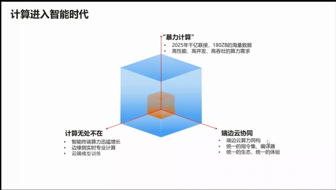
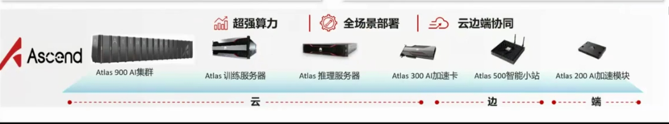

#### 1、AI算力硬件

##### 1).AI算力训练硬件

集成了高性能计算单元的硬件设备，以加速深度学习和其他机器学习算法的训练过程。这些硬件产品能够并行处理大量数据，执行复杂的数学运算，并在较短时间内完成模型的训练。

特性:高性能计算能力、低功耗设计、可扩展性、优化架构

##### 2).AI算力推理硬件

能够高效执行已经训练好的AI模型，对输入数据进行实时分析和预测的硬件设备。

特性:高效算力、低功耗、优化架构、实时性

#### 2、算力单位

1).

2).

3).