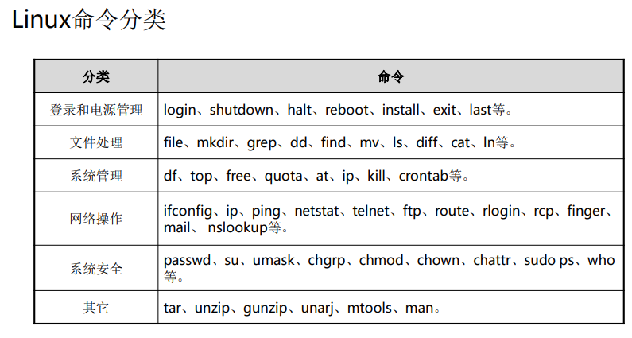
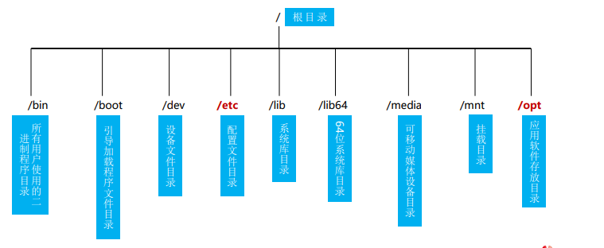

# 一、Linux命令基础知识
## 1、Linux的GUI与CLI
​					**GUI**
Graphical User Interface，
图形用户界面。用户界面的所有元素图形化，主要使用鼠标作为输入工具，使用按钮、菜单、对话框等进行交互，追求易用。
​					**CLI**
Command Line Interface，命令行界面。用户界面字符化，使用键盘作为输
入工具，输入命令、选项、参数执行程序，追求高效。

**PC：为什么要使用Linux命令行**
```
命令行更高效：
Linux系统中使用键盘操作速度要比鼠标更快。
图形化界面不可重复，而命令行可以编写的脚本完成所有过程（例如：删除过期日志文件）

图形化界面开销大：
	运行图形化界面会占用很多的系统资源，运行命令行可以让系统资源释放给它更应该做的事情。

命令行有时候是唯一的选择：
	大部分服务器操作系统不会安装图形界面(GUI)。
	联网设备的维护管理工具本来就没有图形化界面供我们使用
```
## 2、Linux命令语法格式
```
命令格式： 命令 【-选项】【参数】

示例：ls -la /etc
说明：
	个别命令使用不遵循此格式，【】符号表示非必选项。
	当有多个选项时，可以写在一起。
	简化选项(一个-)与完整选项（两个--），比如 ls -a 等于 ls --all
```
## 3、Linux命令行操作技巧
```
Tab键补全：可以用来自动补全命令或文件名，省时准确
	未输入命令状态下，连按两次 tab键列出所有可用命令。
	已输入部分命令名或文件名，按 tab键自动补全。

光标
    up 方向键上（可以调出输入历史执行记录，快速执行命令）
    down 方向键下（配合 up 选择历史执行记录）
    Home 移动光标到本行开头
    Ctrl + A 移动光标到行首
    Ctrl + E 移动光标到行尾
    Ctrl + C 终止当前程序
    Ctrl + L 清理屏幕显示
```


# 二、Linux基础命令
## 1、登录命令
###### login
```
login的作用是登录系统，使用权限是所有用户。

PS:
1).如果选择用命令行模式登录Linux的话，看到的第一个Linux命令就是login。
2).Linux是一个真正的多用户操作系统，可以同时接受多个用户登录，还允许一个用户
进行多次登录。
3).这是因为Linux和许多版本的Unix一样，提供了虚拟控制台的访问方式，允许用户在
同一时间从控制台（系统的控制台是与系统直接相连的监视器和键盘）进行多次登
录。
4).每个虚拟控制台可以看作是一个独立的工作站，工作台之间可以切换。
5).虚拟控制台的切换可以通过按下Alt键和一个功能键来实现，通常使用F1-F6 。
```
###### last
```
作用是显示近期用户或终端的登录情况，使用权限是所有用户。通过last
命令查看该程序的log，管理员可以获知谁曾经或企图连接系统。

主要参数：
    －n：指定输出记录的条数
    －t tty：只显示指定的虚拟控制台上登录情况
    －y：显示记录的年、月、日
    －ID：知道查询的用户名
    －x：显示系统关闭、用户登录和退出的历史
```
###### exit
```
作用是退出系统，它的使用权限是所有用户

主要参数：
	exit命令没有参数，运行后退出系统进入登录界面
```
## 2、电源管理命令
###### shutdown 
```
作用是关闭计算机，使用权限是超级用户

主要参数：
    －h：关机后关闭电源
    －r：关机后打开电源（相当于重启）
    －t：在改变到其它运行级别之前，告诉init程序多久以后关机
    －k：并不真正关机，只是送警告信号给每位登录者
    －F：在重启计算机时强迫fsck
    －time：设定关机前的时间

PS:
1).shutdown命令可以安全地将系统关机，使用直接断掉电源的方式来关闭Linux系统
十分危险
2).Linux与Windows不同，其后台运行着许多进程，所以强制关机可能会导致进程的
3).数据丢失，使系统处于不稳定的状态，甚至在有的系统中会损坏硬件设备
4).在系统关机前使用shutdown命令，系统管理员会通知所有登录的用户系统将要关闭，
并且login指令会被冻结，即新的用户不能再登录
```
###### halt
```
作用是关闭系统，使用权限是超级用户。
主要参数：
    －n：防止sync系统调用，它用在用fsck修补根分区之后，以阻止内核用老版本的超级块覆盖修补过的超级块
    －w：并不是真正的重启或关机，只是写wtmp（/var/log/wtmp）纪录
    －f：没有调用shutdown，而强制关机或重启
    －i：关机（或重启）前，关掉所有的网络接口
    －f：强迫关机，不呼叫shutdown这个指令
    －d：关闭系统，但不留下纪录
```
###### reboot
```
作用是重新启动计算机，使用权限是系统管理者
主要参数：
    －n: 保存数据后再重新启动系统
    －w: 并不会真的重开机，只是把记录写到/var/log/wtmp文件里
    －d: 不把记录写到/var/log/wtmp文件里（－n这个参数包含了－d）
    －i：关闭网络设置之后再重新启动系统
```
## 3、文件管理命令
### 1).目录
在Linux操作系统中，一切皆是文件
Linux的文件目录结构是树形，“/”称为根目录

| 目录名 |                    主要存放的文件及其用途                    |
| :----: | :----------------------------------------------------------: |
|  /bin  |      bin是Binary的缩写, 这个目录存放着最经常使用的命令       |
| /boot  | 这里存放的是启动Linux时使用的一些核心文件，包括一些连接文件以及镜像文件 |
|  /dev  | dev是Device(设备)的缩写, 该目录下存放的是Linux的外部设备，在Linux中访问设备的方式 和访问文件的方式是相同 |
|  /etc  |    这个目录用来存放所有的系统管理所需要的配置文件和子目录    |
|  /lib  | 这个目录里存放着系统最基本的动态连接共享库，其作用类似于Windows里的DLL文件。几 乎所有的应用程序都需要用到这些共享库 |
|  /mnt  |       系统提供该目录是为了让用户临时挂载别的文件系统的       |
|  /opt  |              这是给主机额外安装软件所摆放的目录              |
| /proc  | 系统内存映射的虚拟目录，可以通过直接访问这个目录来获取系统信息 |
| /root  |       该目录为系统管理员，也称作超级权限者的用户主目录       |
| /sbin  | s就是Super User的意思，这里存放的是系统管理员使用的系统管理程序 |
|  /srv  |           该目录存放一些服务启动之后需要提取的数据           |
|  /usr  | 这是一个非常重要的目录，用户的很多应用程序和文件都放在这个目录下，类似于windows 下的program files目录，其中/usr/bin是系统用户使用的应用程序；/usr/sbin是超级用户使 用的比较高级的管理程序和系统守护程序；/usr/src是内核源代码默认的放置目录 |
|  /tmp  |               这个目录是用来存放一些临时文件的               |
|  /var  | 习惯将那些经常被修改、不断扩充的目录放在这个目录下，包括各种日志文件 |
|  /run  | 是一个临时文件系统，存储系统启动以来的信息，当系统重启时被清理或删除 |
### 2).文件路径
在用shell或调用应用程序的时，都要写明被调用的程序路径。
路径分为绝对路径和相对路径：
    绝对路径：在Linux中，绝对路径是从 / (也被称为根目录)开始的，如果一个路径是从/开
    始的，那一定是绝对路径。
    相对路径：相对路径就是相对当前所在目录来说的路径
###### pwd
```
作用是用于打印出当前的工作目录
pwd命令有两个选项，-L 和 -P，其作用类似于cd 命令的同名选项：
	-L 目录连接链接时，输出连接路径。
	-P 输出物理路径。
```
###### cd
```
作用是改变当前工作目录
```
###### ls
```
ls命令是Linux 命令中使用频率最高者之一，用于列出目录的内容，或者文件的信息，
该命令的输出结果默认按照文件名排序，如果不指定目标，则列出当前目录的内容。

语法：ls [OPTION]... [FILE]...
-a 显示所有文件及目录 (ls内定将文件名或目录名称开头为“.”的视为隐藏档，不会列出)
-l 除文件名称外，亦将文件型态、权限、拥有者、文件大小等资讯详细列出
-t 将文件依建立时间之先后次序列出
-R 若目录下有文件，则以下之文件亦皆依序列出
```
###### mkdir
```
mkdir命令用于创建目录（文件夹）

语法：mkdir [OPTION]... DIRECTORY...
```
###### touch
```
touch命令可用于创建空文件
也可用于修改文件的时间戳
```
###### cp
```
用于复制文件或者目录，可以一次复制单个文件，也可以一次复制多个文件
（cp 命令属于高危命令，使用不慎就会有丢失数据的危险）

语法：cp [OPTION]... SOURCE... DIRECTORY
    -a：此选项通常在复制目录时使用，它保留链接、文件属性，并复制目录下的所有内容。
    -p：除复制文件的内容外，还把修改时间和访问权限也复制到新文件中。
    -r：若给出的源文件是一个目录文件，此时将复制该目录下所有的子目录和文件。
    -l：不复制文件，只是生成链接文件
```
###### mv
```
mv命令用于移动件或者目录（高危命令，使用不慎就会有丢失数据的危险）
如果原文件和目标文件在同一个父目录里面，则mv命令的效果就相当于给文件改名。

语法：mv [选项] 源文件或目录 目标文件或目录
    -b ：若需覆盖文件，则覆盖前先行备份
    -f ：force 强制的意思，如果目标文件已经存在，不会询问而直接覆盖
    -i ：若目标文件 (destination) 已经存在时，就会询问是否覆盖
    -u ：若目标文件已经存在，且 source 比较新，才会更新(update)

```
###### rm
```
用于删除文件或者目录

rm命令属于高危命令，没有一个工具能够100% 恢复rm命令删除的文件，rm命令
删除文件时并不是把文件放到类似图形界面的“回收站”里，所以没有“撤销删除”
操作可用

语法：rm [OPTION] file_or_dir
    -f, --force 忽略不存在的文件，从不给出提示
    -i, --interactive 进行交互式删除
    -r, -R, --recursive 指示rm将参数中列出的全部目录和子目录均递归地删除
    -v, --verbose 详细显示进行的步骤
```
###### cat
```
用于读取文件的全部内容，或者将几个文件合并为一个文件

语法：cat [OPTION] [FILE]
    -A, --show-all 等价于 –vET
    -b, --number-nonblank 对非空输出行编号
    -E, --show-ends 在每行结束处显示 $
    -n, --number 对输出的所有行编号,由1开始对所有输出的行数编号
```
###### head
```
用来显示文件的开头内容，默认head命令打印其相应文件的开头10行

语法：head [OPTION] [FILE]
    命令参数：
        -q 隐藏文件名
        -v 显示文件名
        -c<字节> 显示字节数
        -n 行数

```
###### tail
```
用于读取文件的尾部

语法：tail [OPTION]... [FILE]...
主要参数：
    -f 循环读取
    -q 不显示处理信息
    -v 显示详细的处理信息
    -c<数目> 显示的字节数
    -n<行数> 显示行数
```
###### more
```
more会以一页一页的显示方便使用者逐页阅读，而最基本的指令就是按空白键
（space）就往下一页显示，按 b 键就会往回（back）一页显示，而且还有搜寻字
串的功能 。more命令从前向后读取文件，因此在启动时就加载整个文件

语法：more [OPTION]... [FILE]...
+n 从笫n行开始显示。
-n 定义屏幕大小为n行。
+/pattern 在文件显示前搜寻该字串（pattern），然后从该字串前两行之后开始显示。
-c 从顶部清屏，然后显示。

常用操作命令
使用more命令在读取文件信息时，可以进行交互操作。
    Enter 向下n行，需要定义。默认为1行
    Ctrl+F 向下滚动一屏
    空格键 向下滚动一屏
    Ctrl+B 返回上一屏
    = 输出当前行的行号
    V 调用vi编辑器
    !命令 调用Shell，并执行命令
    q 退出more
```
###### less
```
less命令读取内容，分屏显示，less与more类似，但使用less可以随意浏览文件，
而more仅能向前移动，却不能向后移动，而且less在查看之前不会加载整个文件。

语法：less [OPTION]... [FILE]...

常用操作：
    /字符串：向下搜索“字符串”的功能
    ?字符串：向上搜索“字符串”的功能
    Q 退出less 命令
    空格键 滚动一页
    回车键 滚动一行
```
###### find
```
find命令用来在指定目录下查找文件
可以指定一些匹配条件，如按文件名、文件类型、用户甚至是时间戳查找文件

常用语法：find [path...] [expression]
    -name 按照文件名查找文件
    -perm 按照文件权限来查找文件
    -user 按照文件属主来查找文件
    -mtime -n +n 按照文件的更改时间来查找文件
```
###### gzip
```
gzip是在Linux系统中经常使用的一个对文件进行压缩和解压缩的命令。
gzip不仅可以用来压缩大的、较少使用的文件以节省磁盘空间。

语法：gzip[参数][文件或者目录]
    -d或--decompress或----uncompress 解开压缩文件。
    -f或--force 强行压缩文件，不理会文件名是否存在以及该文件是否为符号连接。
    -l或--list 列出压缩文件的相关信息。
    -r或--recursive 递归处理，将指定目录下的所有文件及子目录一并处理。
    -v或--verbose 显示指令执行过程
```
###### tar
```
用于打包文件，把多个文件打到一个包中，方便数据的移动。

语法：tar [OPTION...] [FILE]
    -c 建立新的压缩文件
    -x 从压缩的文件中提取文件
    -t 显示压缩文件的内容
    -z 支持gzip解压文件
    -j 支持bzip2解压文件
    -v 显示操作过程
```
###### In

| 软链接（symbolic link）                 | 硬链接（hard link）                  |
| --------------------------------------- | ------------------------------------ |
| 以路径形式存在，类似于Windows的快捷方式 | 以文件副本形式存在，但不占用实际空间 |
| 删除源文件后链接失效                    | 删除源文件后影响                     |
| 可以对目录进行链接                      | 不可以对目录进行链接                 |
| 可以跨文件系统                          | 不可以跨文件系统                     |

```
用于创建链接文件

ln命令在不带参数的情况下，默认创建的是硬链接

语法：ln [ -f | -n] [ -s ] SourceFile [ TargetFile ]
    -b 删除，覆盖以前建立的链接
    -d 允许超级用户制作目录的硬链接
    -f 强制执行
    -i 交互模式，文件存在则提示用户是否覆盖
    -n 把符号链接视为一般目录
    -s 软链接(符号链接)
```
4、帮助命令
###### help
```
在linux系统中，命令太多，记全几乎不太可能，但是，我们可以通过help命令获取
帮助。

命令语法:
help [选项] [命令]
    其中，选项内容包括如下:
        -d 显示命令简短主题描述
        -s 显示命令简短语法描述
```