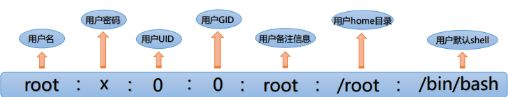
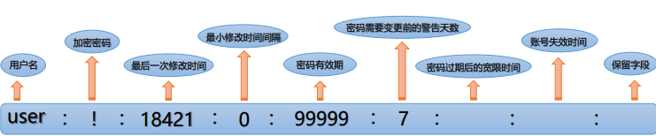
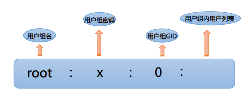
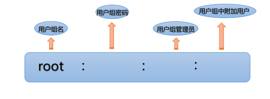
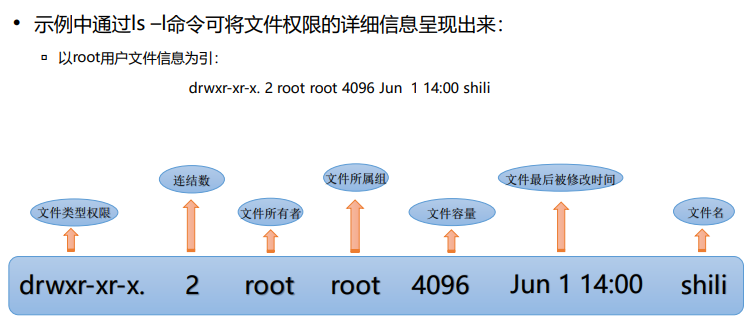
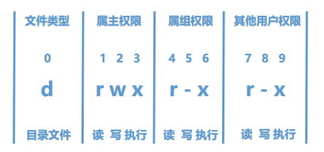

# 一、管理用户和组
## 1.用户的基础概念 
### 1).Linux是一个多用户的操作系统：
    所有要使用系统资源的用户需要先向系统管理员申请一个账号，之后以此账号进入系统
    可以在系统上建立多个用户,而多个用户可以在同一时间内登录至同一系统执行不同的任务，并不会相互影响。
### 2).用户：
	用户是能够获取系统资源的权限的集合
	每个用户都会分配一个特有的id号-uid
### 3).用户UID
UID指的是用户的ID（User ID），一个用户UID标示一个给定用户，UID是用户的唯一标示符，通过UID可以区分不同用户的类别（用户在登录系统时是通过UID来区分用户，而不是通过用户名来区分）：
	超级用户：
		也称为root用户，它的UID为0，超级用户拥有系统的完全控制权，可以进行修改、删除文件等操作，也可以运行各种命令，所以在使用root用户时要十分谨慎；
	普通用户:
		也称为一般用户，它的UID为1000-60000之间，普通用户可以对自己目录下的文件进行访问和修改，也可以对经过授权的文件进行访问；
	虚拟用户：
		也称为系统用户，它的UID为1-999之间，虚拟用户最大的特点是不提供密码登录系统，它们的存在主要是为了方便系统的管理。
		
### 4).区分用户类别
通过查看不同用户UID来区分用户的类别为超级用户、普通用户或是虚拟用户。
查看UID命令：id [option] [user_name]。
相关参数：
    -u，-user 只输出有效UID
    -n，-name 对于-ugG输出名字而不是数值
    -r，-real 对于-ugG输出真实ID而不是有效ID
**UID为0时，标识的是超级用户（即root用户），UID为1000-60000之间，标识的是普通用
户，UID为1-999之间，标识的是虚拟用户（即系统用户）**

## 2.用户相关管理命令
### 1).管理用户
在Linux系统中，每个普通用户都有一个账号，包括用户名、密码和主目录等信息。除此之外，还有一些系统本身创建的特殊用户，具有特殊的存在意义，其中最重要的用户就是管理员账户，默认的用户名为root（也就是超级用户）。通过操作命令行能够对用户文件进行创建、修改、删除更改密码等操作。
###### useradd-创建用户
```
useradd命令可用来创建用户账号，并保存在/etc/passwd文件中。

语法：useradd [options] user_name。
其中的命令选项说明如下：
    -u 指定用户UID
    -o 配合“-u”属性，允许UID重复
    -g 指明用户所属基本组，既可为用户组名，也可为GID（该组必须已存在）
    -d 指定用户的home目录，并自动创建用户home目录
    -s 指明用户的默认shell程序
    -D 显示或更改默认配置
```
###### usermod-修改用户
```
usermod可用来修改用户账号的各类信息。

语法：usermod [options] user_name。
其中的命令选项说明如下：
    -u 修改用户UID
    -g 修改用户所属用户组
    -I 修改用户账号名称
    -d 修改用户home目录
    -s 修改用户默认shell程序
    
修改一个用户user：
查看修改前user用户uid：id user。
修改uid为1003：usermod -u 1003 user，通过查看uid发现已更改
[root@localhost ~]# id user
uid=1002(user) gid=1004(user) groups=1004(user)

[root@localhost ~]# usermod -u 1003 user

[root@localhost ~]# id user 
uid=1003(user) gid=1004(user) groups=1004(user)
```
###### userdel - 删除用户
```
userdel用于删除指定的用户以及与该用户相关的文件

语法：userdel [options] user_name

其中的命令选项说明如下：
    -f 强制删除用户账号，即使用户当前处于登录状态
    -r 删除用户，同时删除与用户相关的所有文件
    -h 显示命令的帮助信息
    （userdel命令用于删除指定的用户以及用户相关的文件，实际上是对系统的用户账号文件进行了修改）
```
###### passwd - 修改用户密码
```
passwd用来修改用户的密码

语法：passwd [OPTION…] user_name。

其中的命令选项说明如下：
    -n 设置修改密码最短天数
    -x 设置修改密码最长天数
    -w 设置用户在密码过期前多少天收到警告信息
    -i 设置密码过期多少天后禁用账户
    -d 删除用户密码
    -S 显示用户密码信息
    （root用户可以修改任何用户的密码，普通用户只能修改自身的密码）

修改用户密码 - 示例
修改一个测试用户的密码：
    通过/etc/shadow命令查看修改前user密码，发现未设置密码，显示为“！”
    通过passwd修改user用户密码：passwd user
    再次通过/etc/shadow查看密码是否修改成功，通过查看发现密码修改成功
    
[root@localhost ~]# cat /etc/shadow
user:!:18421:0:99999:7:::

[root@localhost ~]# passwd user
Changing password for user user.
New password:
Retype new password:
passwd: all authentication tokens updated successfully

[root@localhost ~]# cat /etc/shadow
user:$6$KOrFTTStwbMS0eIG$3peFd8yIgxPyaSYi8TG8XFNUdYUdeMd60lR2hvRC6
zx3dAdbEqQcnQuDoWT7ocu3Ss.zzWSrEb6cZ6Ae6b2EN/:18421:0:99999:7:::
```
### 2).用户组的基础概念
#### a.用户组：
具有相同特性用户的逻辑集合，通过组的形式使得具有相同特性的多个用户能够拥有相同的权限，便于管理；
    每一个用户都拥有自己的私有组
    同一组内的所有用户可以共享该组下的文件
    每一个用户组都会被分配一个特有的id号-gid
#### b.用户组GID
用户组ID（Group ID，简称为GID）和用户UID类似，作为唯一标识符来标示系统
中的一个用户组：
    在添加账户时，默认情况下会同时建立一个与用户同名且UID和GID相同的组；
    GID与UID都会将0赋予给超级用户或者具有超级用户的用户组（也就是root用户组）；
    系统会预留一些较前的GID给虚拟用户（也称为系统用户）。
可以通过输入命令行id [option] [user_name]，查看用户组gid以及每个用户组下拥有的用户数量
#### c.用户组分类
​	用户组分类：
​		普通用户组：可以加入多个用户；
​	系统组：一般加入的用户为系统用户；
​	私有组：也称为基本组，在创建用户时，如果没有为其指明所属用户组，则会为该用户定义一个私有的用户组，且该用户组名称与用户名同名。
#### d.用户和用户组的关系
​    一对一：一个用户可以存在一个用户组中，作为组中的唯一成员
​    一对多：一个用户可以存在多个用户组中，该用户具有多个组的共同权限
​    多对一：多个用户可以存在一个用户组中，这些用户具有和组相同的权限
​    多对多：多个用户可以存在多个用户组中，其实就是以上三种关系的扩展
### 3).用户组相关管理命令
#### a.管理用户组
```
 随着用户的不断增多，用户权限的把控变得复杂繁重，对系统的安全管理产生负面影响，用户组的加入，使得每一个用户至少属于一个用户组，从而便利了权限管理。
用户和用户组管理是系统安全管理的重要组成部分，通过操作命令行能够对用户组文件进行创建、修改、删除以及关联用户等操作。
```
#### b.groupadd-创建组
```
用来创建一个新的用户组，并将新用户组信息添加到系统文件中

语法： groupadd [options] group_name
    其中的命令选项说明如下：
        -f 如果组已存在，则成功退出
        -g 为新用户组所使用的GID
        -h 显示此帮助信息并退出
        -o 允许创建有重复 GID 的组
        -p 为新用户组使用此加密过的密码
        -r 创建一个系统账户
```
#### c.groupmod -修改组 
```
用来更改群组识别码或者名称

语法：groupmod [options] group_name
    其中的命令选项说明如下：
        -g 修改为要使用的GID
        -h 显示此帮助信息并退出
        -n 修改为要使用的组名称
        -o 允许使用重复的 GID
        -p 更改密码(加密过的)
```
#### d.groupdel - 删除组
```
用来删除用户组，但若是用户组中包含一些用户，需先删除掉用户后再删除用户组

语法：groupdel [options] group_name
    其中的命令选项说明如下：
        -f 即便是用户的主组也继续删除
        -h 显示此帮助信息并退出
（groupdel命令用于从系统中删除组，需要注意的是，若是在组中仍然包括某些用户，此时需要先删除这些用户后，才能删除组）
```
#### e.gpasswd - 关联用户和组
```
用来添加或删除用户到组中。

语法：gpasswd [option] group_name。
    其中的命令选项说明如下：
        -a 向组 GROUP 中添加用户 USER
        -d 从组 GROUP 中添加或删除用户
        -M 设置组 GROUP 的成员列表
        -A 设置组的管理员列表
        -r 移除组 GROUP 的密码
        -R 向其成员限制访问组 GROUP
        -Q 要 chroot 进的目录
```
### 4).用户和组的关联文件
##### a.OpenEuler中用户关联的文件 
openEuler下涉及到管理用户信息的文件一般有以下两种:
/etc/passwd：用户账号信息文件：

- ​    在这个文件中，保存着系统中所有用户的主要信息，每一行代表着一个记录
- ​    每一行用户记录中定义了用户各个方面的相关属性

/etc/shadow：用户账号信息加密文件（又称为“影子文件”）：
- ​    用于存储系统中用户的密码信息
- ​    由于/etc/passwd文件允许所有用户读取，容易导致密码泄露，因此将密码信息从该文件中分离出来，单独放 置在/etc/shadow文件中
#### b./etc/passwd文件
/etc/passwd文件每一行由七个字段的数据组成，且字段之间用“:”隔开

**PS:**
```
Linux中的shell，是指一个面向用户的命令接口，表现形式为一个可以又用户登录的 界面，Linux的shell有很多种sh, csh, ksh, tcsh, bash等 （shell是建立在内核的基础上，且面向于用户的一种表现形式）
```
#### c./etc/passwd文件相关参数
| 字段序号 |                          字段的含义                          |
| :------: | :----------------------------------------------------------: |
|    1     | 用户名，用户名字符可以是大小写字母、数字、减号、点以及下划线，其他符号不合法 |
|    2     | 加密的密码，在此字段用“X”表示，具体密码需要到对应的/etc/shadow文件中查看 |
|    3     |        用户UID，用来对用户进行识别，从而判断用户类型         |
|    4     |     用户组GID，对应/etc/gruop中的组信息，将用户分组管理      |
|    5     |            备注信息，会注释处用户的家庭信息等属性            |
|    6     |     用户的home目录，即用户登录时所处目录，此字段可自定义     |
|    7     |          默认shell，用以将用户下达的指令传达给内核           |
#### d./etc/shadow文件
/etc/shadow文件只有超级用户（root用户）具有读权限，其他用户均没有权限，从而保证 了用户密码的安全性
密码在经由/etc/shadow保护后，在/etc/passwd文件的用户记录中只会以“X”的形式呈现。
与/etc/passwd文件相似，每一行记录代表一个用户，且以“ : ”隔开，不同之处在于 /etc/passwd中每行记录被分为九个字段

#### c./etc/shadow文件相关参数
| 字段序号 | 字段的含义                                                   |
| :------: | ------------------------------------------------------------ |
|    1     | 用户名，与文件/etc/passwd 中的用户名具有相同的意义           |
|    2     | 加密的密码，若是次字段显示的为“*”或“!”，说明该账户为不能登录账户 |
|    3     | 此字段表示最后一次修改密码的时间                             |
|    4     | 最小修改时间间隔；如果设置为0,则随时可进行密码的修改         |
|    5     | 密码的有效期；强制用户定期修改密码，提高系统的安全性         |
|    6     | 密码需要更改前的警告天数；当用户密码快要过期时，发出警告信息提醒用户进行密码修改 |
|    7     | 密码过期后宽限天数；若是在密码过期后设置的宽限天数内仍未修改密码，则禁用该用户 |
|    8     | 用户过期日期；过期后该用户将不再是一个合法用户，无法登陆系统 |
|    9     | 保留字段，目前为空，以备将来发展之用                         |
**（注：/etc/shadow 由 pwconv 命令根据/etc/passwd中的数据自动产生）**
#### d.openEuler中用户组关联的文件
openEuler下涉及到管理用户组信息的文件一般有以下两种：
/etc/group：组信息文件:
- 在这个文件中，保存着用户组的所有信息，每一行记录代表一个用户组；
- 将用户分组是对用户进行管理及控制访问权限的一种手段，每个用户都属于一个用户组；一个组中可以有多个 用户，一个用户也可以属于不同的组
 /etc/gshadow：组信息加密文件：
- 在这个文件中，会保存用户组加密信息，比如说用户组管理密码就保存在此（与/etc/shadow文件相似）
- 与/etc/group文件互补，对于大型服务器来说，拥有很多用户和组，此时会针对这些用户和组来生成一些复杂 的权限模型，此时设置并管理密码就显得尤为重要
#### e./etc/group文件
/etc/group文件每一行由四个字段的数据组成，且字段之间用“:”隔开
这里我们以root用户为例，根据root用户的文件记录来了解/etc/group文件用户组 记录中相关字段的意义：

#### f./etc/group文件相关参数
| 字段序号 | 字段的含义                                                   |
| -------- | ------------------------------------------------------------ |
| 1        | 用户组名，与文件/etc/passwd 中的用户名具有相同的意义         |
| 2        | 用户组密码，为保证安全性此字段用“X”表示，具体组密码保存在/etc/gshadow文件中 |
| 3        | 用户组GID，系统通过GID来识别用户组，判断用户组类别           |
| 4        | 用户组中用户列表，此字段会将用户组中所有用户罗列出来         |
#### g./etc/gshadow文件
/etc/gshadow文件每一行由四个字段的数据组成，且字段之间用“:”隔开。 
这里我们以root用户为例，根据root用户的文件记录来了解/etc/group文件中相关 字段的意义：

#### h./etc/gshadow文件相关参数
| 字段序号 | 字段的含义                                                   |
| -------- | ------------------------------------------------------------ |
| 1        | 用户组名，与文件/etc/group 中的用户名具有相同的意义          |
| 2        | 用户组密码，通常情况下不设置组密码，该字段可以为空或者“!”    |
| 3        | 用户组管理员，该字段可以为空，具有多个用户管理员的话，需要通过“,”分隔 |
| 4        | 用户组中附加用户，此字段会将用户组中附加用户罗列出来         |
# 二、文件权限管理 
## 1.文件权限的基本概念 
### 1).权限概述
权限是操作系统用来限制对资源访问的一种机制，权限一般分为**读、写、执行**
在Linux系统中，不同的用户所处的地位也不尽相同，不同地位的用户拥有不同的权 限等级，为了保证系统的安全性，Linux系统针对不同用户的权限制定了不同的规则
在Linux系统中，每个文件或目录都具有特定的访问权限、所属用户及所属组，通过这些规则可以限制什么用户、什么组可以对特定的文件执行什么样的操作
### 2).权限示例

| 文件类型 | 解释说明                                |
| -------- | --------------------------------------- |
| -        | 普通文件-除去其他六种类型文件           |
| d        | 目录                                    |
| b        | 块设备文件-可随机存取装置               |
| c        | 字符设备文件-键盘、鼠标等一次性读取装置 |
| \|       | 符号链接文件-指向另一文件（link file）  |
| p        | 命名管道文件（piep）                    |
| s        | 套接字文件（socket）                    |
### 3).权限位说明
Linux文件或目录的权限位是由9个权限位来控制的，每三位为一组，都是**[r]、[w]、[x]**三个 参数的组合，其中
- [r]代表的是读权限（read）
- [w]代表的是写权限（write）
- [x]代表的是 执行权限（execute）
且三个权限位的位置在文件或目录中是不变的。若是没有权限，则 用“-”表示

**（第0位确定文件类型；第1-3位确定文件所有者权限；第4-6位确定所有者的同组用户；第7-9位确定其他用户对该文件权限）**
### 4).访问权限
在文件信息中显示为： 
- -r 允许读取文件内容或目录下全部内容 
- -w 允许写文件或在目录下创建、删除文件 
-  -x 允许执行文件或进入目录
- -无任何权限（显示方式在r、w、x的位置处显示为-） 
以usertxt文件为例：drwxr-xr-x. 2 root root 4096 Jun 1 14:00 usertxt
| 位置    | 权限代号 | 对应二进制 | 对应十进制 | 权限详情                 |
| ------- | -------- | ---------- | ---------- | ------------------------ |
| 第123位 | rwx      | 111        | 4+2+1=7    | 文件属主可读可写可执行   |
| 第456位 | r-x      | 101        | 4+1=5      | 同组用户可读不可写可执行 |
| 第789位 | r-x      | 101        | 4+1=5      |                          |
## 2.文件权限的操作命令
#### a.chmod - 修改文件权限
- Linux的文件调用权限分为三级：文件所有者、群组及其他，通过chmod命令可以控制文件被何人调用
- 使用权限：文件所有者

```
文件调用权限针对于文件所有者，所属组以及其他人，使用chmod可以对文件的调用权限进行修改

语法：chmod [OPTION]... MODE[,MODE]... FILE... 
其中的命令选项说明如下：
    操作对象：
        u：用户user，表示文件或目录所有者
        g：用户组group，表示文件或目录所属组
        o：其他用户other
        a：所有用户all

    操作符：
        +：添加权限
        -：减少权限
        =：给定特定权限

    赋予的权限：
        r：读权限
        w：写权限
        x：执行权限
```
**根据配置场景，可以同时修改文件的一组权限，也可以只修改文件的某个权限**
#### b.chown - 修改文件权限
- Linux做为多用户多任务系统，所有文件都有其所有者，通过chown可以将特定文件的所有者更改为指定用户或 组
- 使用权限：管理员（root用户）
```
利用chown可以将指定文件的所有者改为指定的用户或组。

语法：chown [OPTION]... [OWNER][:[GROUP]] FILE...
    其中的命令选项说明如下：
        -c : 显示更改的部分的信息
        -f : 忽略错误信息
        -h :修复符号链接
        -v : 显示详细的处理信息
        -R : 处理指定目录以及其子目录下的所有文件
```
**根据配置场景，可以只修改属主，也可以只修改属组，亦可以同时修改属主属组**
#### c.chgrp - 修改文件权限
- 通过chgrp命令可以对文件或目录的所属群组进行更改
- 使用权限：管理员（root用户）
```
用来修改文件或目录的所属组

语法：chgrp [OPTION]... GROUP FILE...
    其中的命令选项说明如下：
        -v：显示指令执行过程
        -c：效果类似“-v”参数，但是只回报更改的部分
        -f：不显示错误信息
        -h：只修改符号连接的文件，而不对其他任何相关文件进行变动
        -R：递归处理，即将指定目录下的所有文件及子目录一并处理
```
**根据配置场景更改文件所属群组**
#### d.umask - 预设权限掩码
umask命令：遮罩码
```
umask可用来指定在建立文件或目录时进行权限掩码的预设

语法：umask: umask [-p] [-S] [mode]
    其中的命令选项说明如下：
        -p：显示命令名称
        -S：文字形式表示权限掩码
```
**常见umask值及与之对应的文件或目录权限**：
| umask值 | 文件权限 | 目录权限 |
| ------- | -------- | -------- |
| 022     | 644      | 755      |
| 027     | 640      | 750      |
| 002     | 664      | 775      |
| 006     | 660      | 771      |
| 007     | 660      | 700      |
## 3.文件的ACL
常用权限的操作命令chmod、chown、chgrp及umask已经可以对文件权限进行修改，那么为什么还会出现访问控制列表ACL(Access Control List)？ 
在没有ACL技术之前，Linux系统对文件的权限控制仅可划分文件的属主、用户组、其他用户三类，随着技术的发展，传统的 文件权限控制已经无法适应复杂场景下的权限控制需求，比如说一个部门（即一个用户组group）存在有多名员工（即用户 user01、user02…），针对于部门内不同职责的员工，会为其赋予不同的权限，如为user01赋予可读写权限，为user02赋予 只读权限，不为user03赋予任何权限，此时由于这些员工属于同一部门，就无法为这些不同的员工进行权限的细化。为此 ACL(Access Control List)访问控制列表技术应运而生，使用ACL权限控制可以提供常见权限（如rwx、ugo）权限之外的权限 设置，可以针对单一用户或组来设置特定的权限。 
常见类型： 
- 针对文件所有者(owner)分配权限 
- 针对文件所属用户组分配权限 
- 针对其他用户分配 
- etc..
### 1).ACL - 相关命令
在linux里我们可以通过ACL来管理某个文件及其特定的用户和用户组权限，简单来说ACL只 需掌握三个命令即可：setfacl,getfacl,chacl。 
setfacl：设置文件的ACL：
```
chmod根据文件所有者、所属群组及其他用户三级权限进行权限分配，而setfacl则可以针对每一文件或目录进行更加精准的权限分配
```
getfacl：获取文件的ACL
chacl：更改文件或目录的ACL：
```
与chmod相似，但是更为强大精细，通过chmod可以控制文件被何人调用，但若是某一用户的文件只想给特定的用户看时，则 需要chacl出场完成用户的需求
```
#### a.getfacl
```
getfacl可获取文件或目录的访问控制列表ACL。

语法：getfacl [-aceEsRLPtpndvh] file ...
    其中的命令选项说明如下：
        -a：仅显示文件访问控制列表
        -d：仅显示默认的访问控制列表
        -c：不显示注释表头
        -e：显示所有的有效权限
        -E：显示无效权限
        -s：跳过只有基条目(base entries)的文件
        etc…
```
#### b.setfacl
```
setfacl可用来设置文件的ACL

语法：setfacl [-bkndRLP] { -m|-M|-x|-X ... } file ...
    其中的命令选项说明如下：
        -m 修改指定文件的acl，不能和-x混合使用
        -x 删除后续参数
        -b 删除所有acl设定参数
        -k 移除预设的acl参数
        -R 递归设置acl参数
        -d 预设目录的acl参数
```
#### c.chacl
```
chacl可用来设置文件或目录的控制权限：

语法：chacl [acl/R/D/B/l/r] pathname... / chacl -b acl dacl pathname... / chacl -d dacl pathname...
    其中的命令选项说明如下：
        -b 同时修改文件权限和默认目录权限
        -d 设置目录的默认权限
        -R 只删除文件的权限
        -D 只删除目录的权限
        -B 删除所有权限
        -I 列出所有文件和目录权限
        -r 设置所有目录和子目录下的权限
```
## 三、其他权限管理
Linux中默认账户为普通用户，但是在更改系统文件或者执行某些命令时，都需要以 root用户的权限才能进行，此时就需要将默认的普通用户更改为root用户。 
在切换用户身份时，常常用到的命令有三种： 
- su：此命令在切换用户时，仅切换root用户身份，但shell环境仍为普通用户
- su –：此命令在切换用户时，用户身份和shell环境都会切换为root用户
- sudo：此命令可以允许普通用户执行管理员账户才能执行的命令
#### a.命令 - su/su- 
```
su可用来更改用户身份，但不会更改shell环境

语法：su [options] [-] [ [...]] 
    其中的命令选项说明如下：
        -m，-p：执行su时不会改变环境变量 
        -s：指定要执行的shell（bash csh tcsh 等）
        -c：变更账号为USER的使用者并在执行完command后变为原使用者
        -f：不需要读启动档，仅用于 csh 或 tcsh
        etc
```
#### c.命令 - sudo
```
sudo可允许普通用户执行root用户才能执行的任务

语法：sudo –h | -K | -k | -V 
    其中的命令选项说明如下： 
        -h：显示版本号以及指令的使用说明 
        -k：使使用者在下次执行sudo时询问密码 
        -V：显示版本编号 
        -l：显示使用者的权限 
        -L：显示sudos设置 

通过sudo命令查看版本编号： 
    命令：sudo -V 
```