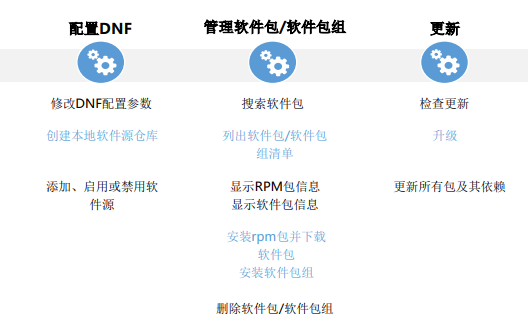

# 一、管理软件包
## 1.RPM软件包
### 1).Linux软件包管理概述
```
Linux软件包可分为两类：源码包、二进制包，不同的软件包有不同的提供方式，常
用的方式有rpm包和tgz包两种。为此，常用应用软件的安装方式也有两种，一种为
使用rpm工具安装，一种为编译安装。

rpm作为标准的软件包管理工具，具有便捷的安装方式，是安装软件的首选方式。

openLinux、SUSE、CentOS等不同的分发版本同样使用rpm来对软件包进行管理。

不同的平台使得软件包的打包格式及工具不尽相同，其中Debin和Ubuntu采用的是
Deb包安装以及apt-get源安装的方式来对软件包进行管理， FreeBSD则采用的是
Ports，.txz的打包格式以及make, pkg工具
```
### 2).使用RPM命令管理
RPM是一种用于互联网下载包的打包和自动安装工具，会生成具有.RPM扩展名的文
件，可以用来管理应用程序的安装、卸载和维护

RPM软件包命名格式：
name-version-release.arch.rpm
```
RPM软件包管理优点：
    简单便捷，兼容版本
    参数信息记录在数据库中，便于查询、升级或卸载软件时使用

RPM软件包管理缺点：
    安装环境需与打包环境一致
    具有很强的依赖关系，卸载软件时需要对依赖性软件优先处理，否则会导致其他软件无法正常使用
```
## 2.软件（安装、查询、升级、卸载） 
```
RPM常用于安装、删除、升级、刷新和查询的场景

语法：rpm [OPTION...]
    其中的命令选项说明如下：
        -i：指定安装的软件包
        -h：使用“#（hash）”符显示rpm详细的安装过程及进度
        -v：显示安装的详细过程
        -U：升级指定的软件包
        -q：查询系统是否已安装指定的软件包或查询指定rpm包内容信息
        -a：查看系统已安装的所有软件包
        -V：查询已安装的软件包的版本信息
        -c：显示所有配置文件
        -p：查询/校验一个软件包的文件
```
#### a.安装
```
语法：
    rpm –i name
    rpm –iv -nodeps name
    rpm –ivh -allmatches name

其中的命令选项说明如下：
    -i：安装一个包
    -iv：安装一个包并在安装过程中显示正在安装的文件信息
    -ivh：安装一个包并在安装过程中显示正在安装的文件信息和进度
```
#### b.卸载
```
语法：
    rpm –e name
    rpm –e name
    rpm –e name

其中的命令选项说明如下：
    rpm软件包卸载需要考虑包与包之间的依赖性
    卸载时若不考虑包的依赖性，可以使用nodeps命令（不检测依赖性）进行强制卸载
    若是该软件包存在多个版本，可以使用allmatches命令进行批量卸载
```
#### c.升级
```
语法：
    rpm –U name
    rpm –Uvh name
    rpm –F name
    rpm –Fvh name
	
其中的命令选项说明如下：
    -Uvh：代表存在旧包时，欲删除旧包安装新包时使用
    -Fvh：代表存在旧包时，在旧包的基础上进行升级
```
#### d.查询
```
语法：
    rpm -q name
    rpm -qa name

命令选项说明如下：
    -q：查询软件包是否安装
    -qa：查询所有安装的软件包
    -qf：查询所有已安装过的软件包
    -qp：查询未安装的软件包
    -ql：查询已安装的软件包中的文件列表和完整目录
    -qi：查询软件包的详细信息
    -qc：查询已安装的软件包中的配置文件
    -qd：查询已安装的软件包中的帮助文档
```
# 二、使用dnf管理软件
Linux系统的软件管理工具yum是基于rpm包管理，可以从指定的服务器自动下载RPM服务器并进行安装，yum可以作为软件仓库对软件包进行管理，相当于一个“管家”，同时能够解决软件包间的依赖关系，提升了效率，既然如此，为什么还会出现DNF工具呢？
yum工具性能差、内存占用过多、依赖解析速度变慢等问题长期得不到解决，同时yum工具过度依赖yum源文件，若是源文件出现问题，yum相关操作可能会失败，针对这种情况，DNF工具应运而生，DNF工具克服了YUM软件管理工具的一些瓶颈，提升了用户体验、内存占用、依赖分析及运行速度等方面的内容。
## 1).DNF工具概述
```
1).DNF（Dandified YUM）作为Linux软件包管理工具，可以用来管理RPM软件包

2).DNF可以查询软件包的信息，从指定软件库去获取所需软件包，并通过自动处理依赖关系来实现安装、卸载以及更新

3).DNF与YUM完全兼容，提供了YUM兼容的命令行以及为扩展和插件提供的API

4).DNF的使用需要管理员（root）权限
```
## 2).管理软件包

#### a.软件源服务
```
软件源(Software Sources)是Linux系统免费的应用程序安装仓库

软件源可以是网络服务器、是光盘、甚至是硬盘上的一个目录

Linux软件源的好处：
    需要用到一个软件的时候，可以通过工具自动地下载并自动地安装；
    软件源可以让你及时获取重要的安全更新，解决安全隐患；
    解决软件依赖的复杂关系、提高软件安装效率
```
#### b.DNF配置文件 - /etc/dnf/dnf.conf
```
DNF的主要配置文件是/etc/dnf/dnf.conf，该文件中“main”部分保存着DNF的全局 配置。

通过cat命令，可以查看“main”的具体参数：cat /etc/dnf/dnf.conf。 

其中的参数说明如下： 
    cachedir：缓存目录，该目录用于存储RPM包和数据库文件

    best：升级包时，总是尝试安装其最高版本，如果最高版本无法安装，则提示无法安装的原因并停止安装。 
    	默认值为True

    installonly_limit：设置可以同时安装“installonlypkgs”指令列出包的数量。默认值为3，不建议降低此值

    clean_requirements_on_remove：删除在dnf remove期间不再使用的依赖项，如果软件包是通过DNF安装 的，而不是通过显式用户请求安装的，则只能通过clean_requirements_on_remove删除软件包，即它是作为 依赖项引入的。 默认值为True
```
#### c.配置DNF - 修改配置参数
```
repository允许用户定义定制化的软件源仓库，需要注意的是各个仓库的名称不能
相同，会引起冲突，用户可以通过添加一个或多个“repository”部分来修改需安装
软件源位置。

通 过 vim 命 令 ， 可 以 在 文 件 中 添 加 一 个 或 多 个 “ repository ” ： vim
/etc/dnf/dnf.conf

其中的参数说明如下：
name=repository_name：软件仓库（repository ）描述的字符串
baseurl=repository_url：软件 仓 库 （ repository ）的地址 
    使用http协议的网络位置 ：例如 http://path/to/repo 
    使用ftp协议的网络位置：例如 ftp://path/to/repo
    本地位置：例如file:///path/to/local/repo
```
#### d.创建本地软件源仓库
```
创建软件源仓库具体步骤：
	1.安装createrepo（root权限下）：
		dnf install createrepo
    2.将需要的软件包放置在目录下，比如/mnt/local_repo/；
    3.执行命令创建软件源
		createrepo --database /mnt/local_repo
```
#### e.添加软件源
```
用户定义定制化的软件源仓库，除了可以在 /etc/dnf/dnf.conf 文件中添加一个或多个“repository”外，还可以选择在/etc/yum.repos.d/目录下添加“.repo”文件。

添加“.repo”文件的方式需要在root权限下进行
		成功执行以下命令后会在/etc/yum.repos.d/目录下生成对应的repo文件
	dnf config-manager --add-repo repository_url
```
#### f.启用和禁用软件源
```
添加好软件源之后，需要在root权限下启用软件源（其中的repository为新增.repo
文件的repo id），启用命令如下：
    dnf repolist #查看新增.repo文件的repo id 
    dnf config-manager --set-enable repository

若是软件源不再被使用，可以通过命令行禁用该软件源，需要在root权限下禁用
禁用命令如下：
    dnf repolist #查看新增.repo文件的repo id 
    dnf config-manager --set-disable repository
```
#### g.管理软件包
```
DNF能够便捷的对软件包进行安装、查询和删除

用户可以通过rpm包名称、缩写和描述来搜索所需软件包，具体命令如下：
	dnf search term
```
#### h.列出软件包清单
```
DNF可以通过命令列出已安装和可用的RPM软件包,具体命令如下：
    dnf list all
    dnf list glob_expression... #查看指定RPM包信息
```
#### i.显示RPM包信息
```
通过DNF命令行能够查看RPM包的相关信息，具体命令如下：
	dnf info package_name..
```
#### j.下载、安装和删除RPM包
```
通过DNF命令行能够下载、安装和删除RPM包，具体命令如下：
    dnf download package_name
    dnf install package_name
    dnf remove package_name...
```
#### k.管理软件包组
```
软件包集合是将一组具有共同目的的软件包集合在一起，比如系统工具。

用户可以通过dnf命令查看所有已安装及可用的软件包组，具体命令如下：
    dnf groups summary
    dnf group list			#可列出软件包组和对应组ID
```
#### l.显示软件包组信息
```
通过dnf命令列出一个软件包组中必须安装的软件包及可选包，具体命令如下：
    dnf group info glob_expression...
```
#### m.安装和删除软件包组
```
每一软件包组都具有对应的名称和id，在安装和删除软件包组时，可以通过名称或id来进行
安装和删除。

    dnf group install group_name/groupid
    dnf group remove group_name/groupid
```
#### n.检查并更新
```
DNF命令可以检查系统中的软件包/软件包组是否需要更新，并且可对所有需要更新的软件
包/软件包组或特定的软件包进行升级

用户可以通过rpm包名称、缩写和描述来搜索所需软件包，具体命令如下：
    dnf check-update
    dnf update package_name / dnf group update group_name
```
# 三、源代码安装
## 1.源代码软件及安装概述 
### 1).概述
```
通过源代码安装软件是除了rpm软件包安装外的又一种安装软件的方式。Linux下许多软件是通过源码包方式发行的，相对于二进制软件包来说，源码包的移植性较好，仅需发布一份源码包，不同用户经过编译即可正常运行，但是其配置和编译过程较为繁琐

openEuler中会优先选择rpm来进行软件安装，但也会存在需要使用源码安装的场
景：
    rpm软件包版本太旧，编译参数不适用于当前业务
    欲安装的软件无现成rpm软件包可用
    rpm软件包缺乏某些特性
    优化编译参数，提升性能
```
### 2).优缺点
```
源码安装优点：
    编译过程可以根据自身需求设置参数进行软件安装，灵活性好
    经过本机编译，使得源码安装的软件与本机兼容性最好

源码安装缺点：
    配置及编译过程较为繁琐
    可能由于安装软件过新或其他问题，导致没有对应的依赖包，软件升级较为复杂，得不偿失
```
## 2.使用源码安装软件步骤(configure/make/make install)
### 1).步骤
```
1.下载源码包并解压（校验包完整性）

2.查看README和INSTALL文件（记录了软件的安装方法及注意事项）

3.创建Makefile文件-通过执行 ./configure 脚本命令生成

4.编译-通过 make 命令将源码自动编译成二进制文件

5.安装软件-通过 make install 安装命令来将上步编译出来的二进制文件安装到对应的目录中去，默认的安装路径为/usr/local/，相应的配置文件位置为/usr/local/etc或/usr/local/***/etc
```
### 2).示例-Python
```
a.下载源码包并解压（校验包完整性）
wget https://www.python.org/ftp/python/3.7.7/Python-3.7.7.tgz
tar -zxvf Python-3.7.7.tgz

b.进入源码目录，查看README文件
cat Python-3.7.7/README.rst

c.执行./configure命令，生成Makefile文件
./configure --prefix=/usr/local/Python

d.执行Make命令进行编译
make/make clean

e.执行make install命令进行软件的安装
make install
```
**（注意，在安装时可能会缺乏相关环境组件，可通过yum工具来进行组件的下载安装）**
# 四、使用systemd管理服务
## 1.systemd简介 
在Linux中，systemd是与SysV和LSB初始化脚本兼容的系统和服务管理器，开启 systemd服务可以提供基于守护进程的按需启动策略。 
systemd服务支持快照和系统状态恢复，维护挂载和自挂载点，使得个服务之间基 于从属关系实现更为精细的逻辑控制，具有更高的并行性能。
### 1).Systemd unit概念
systemd服务的开启和监督系统是基于unit的概念，unit由一个与配置文件对应的名 称和类型组成，unit通常有以下几种类型：
```
Service unit：系统服务 

Target unit：一组systemd units 

Automount unit：文件系统挂载点

Device unit：内核识别的设备文件

Mount unit：文件系统挂载点

Path unit：在一个文件系统中的文件或目录

Scope unit：外部创建的进程

Snapshot unit：systemd manager的保存状态
```
### 2).Systemd特性
```
更快的启动速度
提供按需启动能力
采用cgroup特性跟踪和管理进程的生命周期
启动挂载点和自动挂载的管理
实现事务性依赖关系管理
与SysV初始化脚本兼容
能够对系统进行快照和恢复
```
## 2.使用systemd
### 1).管理服务(systemctl)
systemd可以通过systemctl命令来对系统服务进行运行、关闭、重启、显示、启用 或禁用的操作
systemctl命令与sysvinit命令的功能相似，但是建议用systemctl来进行系统服务管理
| ysvinit命令                    | systemd命令                     | 备注                                |
| ------------------------------ | ------------------------------- | ----------------------------------- |
| service NetworkManager start   | systemctl start NetworkManager  | 用来启动一个服务 (并不会重启现有的) |
| service NetworkManag er stop   | systemctl stop NetworkManager   | 用来停止一个服务 (并不会重启现有的) |
| service NetworkManag er reload | systemctl reload NetworkManager | 当支持时，重新装载配置文件而不中    |
### 2).Systemctl - 显示服务
```
若是用户需要查看当前正在运行的服务，可以通过如下命令来进行查看： 
systemctl list-units --type service					 #若是要查看所有服务，需要在命令行后添加 –all 参数
```
### 3).Systemctl - 显示服务状态
```
若是用户需要查看某个服务的状态，可以通过如下命令来进行查看：
systemctl status name.service

其中的命令参数说明如下：
    Loaded：说明服务是否被加载，同时显示对应的绝对路径是否启用
    Active：说明服务是否正在运行，并显示时间节点
    Main PID：相应系统服务PID值
    CGroup：相关控制组的其他信息
```
### 4).Systemctl - 相关操作
```
systemctl start name.service	//运行

systemctl stop name.service		//关闭

systemctl restart name.service		//重启

systemctl enable name.service		//显示

systemctl disable name.service		//启用
```
### 5).Systemctl - 其他操作
```
关闭系统：
systemctl poweroff #关闭系统并下电
systemctl halt #关闭系统但不下电

重启系统：
systemctl reboot 

系统待机：
systemctl suspend 

系统休眠：
systemctl hibernate 
systemctl hybrid-sleep #使系统待机并处于休眠状态
```