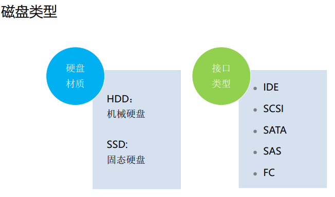
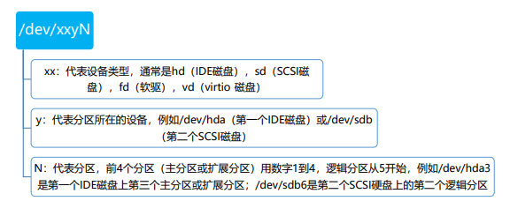
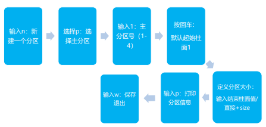
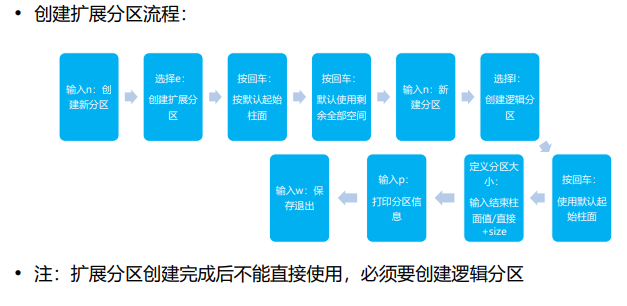
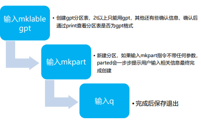
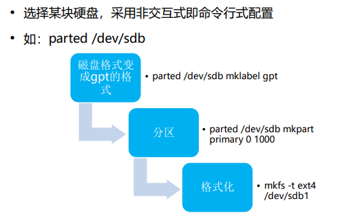
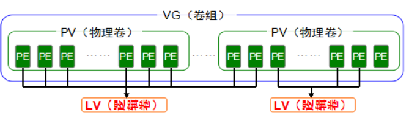
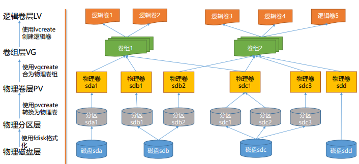
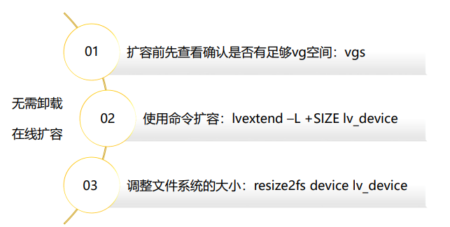
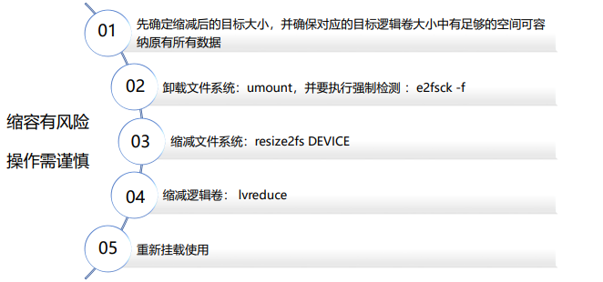

# 一、文件系统基础概念 
## 1.文件系统 
文件系统是操作系统用于明确存储设备或分区上的文件的方法和数据结构；即在存 储设备上组织文件的方法。操作系统中负责管理和存储文件信息的软件机构称为文 件管理系统，简称文件系统。

文件系统类型及使用场景
| 常见文件类型 | 使用场景                                                     |
| ------------ | ------------------------------------------------------------ |
| FAT          | windows9X系统使用的文件系统，包括FAT16，FAT32                |
| NTFS         | NTFS文件系统是一个基于安全性的文件系统，是Windows NT所采用的独特的文件系 统结构，Win 2000采用了更新版本的NTFS文件系统NTFS 5.0 |
| NFS          | 网络文件系统，用于在UNIX系统间通过网络进行文件共享           |
| RAW          | RAW文件系统是一种磁盘未经处理或者未经格式化产生的文件系统    |
| Ext          | GNU/Linux 系统中标准的文件系统，其特点为存取文件的性能极好，对于中小型的文 件更显示出优势，包括Ext2，Ext3，Ext4 |
| XFS          | 一种高性能的日志文件系统，最早于1993年，由Silicon Graphics为他们的IRIX操作系 统而开发，之后被移植到Linux 内核上，特别擅长处理大文件，同时提供平滑的数据传输 |
## 2.openEuler文件系统
openEuler内核源于Linux， Linux内核支持十多种不同类型的文件系统，比如Btrfs、JFS、 ReiserFS、ext、ext2、ext3、ext4、ISO9660、XFS、Minix、MSDOS、UMSDOS、VFAT、 NTFS、HPFS、NFS、SMB、SysV、PROC等，表格中列举常用几种并做说明

openEluer默认文件系统为ext4
| 常用文件系统 | 说明                                                         |
| ------------ | ------------------------------------------------------------ |
| Ext          | 专门为Linux设计的文件系统类型，目前最新版本ext4              |
| XFS          | 一种高性能的日志文件系统，最早于1993年，由Silicon Graphics为他们的IRIX操作系 统而开发，之后被移植到Linux 内核上，特别擅长处理大文件，同时提供平滑的数据传输 |
| vfat         | vfat是Linux对DOS,Windows系统下的FAT(包括fat16和Fat32)文件系统的一个统称 |
| NFS          | 网络文件系统，用于在UNIX系统间通过网络进行文件共享           |
| ISO 9600     | 该文件系统中光盘所使用的标准文件系统，Linux对该文件系统也有很好的支持，不仅能读取光盘和光盘ISO映像文件，而且还支持在Linux环境中刻录光盘 |
## 3.系统交换分区 
### 1).系统交换空间
Linux系统交换空间（swap）就是磁盘上的一块区域，可以是一个分区，也可以是一个文件， 简单的说就是当物理内存资源紧张时，将内存中不常访问的资源保存到预先设定的硬盘上的 交换空间，来释放该资源占用的内存，这样系统就有更多的物理内存为各个进程服务，而当 系统需要访问swap上存储的内容时，再将swap上的数据加载到内存中

物理内存和交换空间的和就是系统可提供的虚拟内存的总量

为什么需要swap分区？ 
- 增加系统可用内存空间—当物理内存不够用时，增加swap分区比增加物理内存更经济
- 提高系统整体性能—将不常用数据移动到swap后，系统会有更多内存用于缓存，加快系统I/O
- 许多linux发现版（如ubuntu）的休眠功能依赖与swap分区—当系统休眠时，会将内存数据保存到 swap分区，下次启动时再加载到内存

### 2).swap分区配置
Linux有两种形式的交换空间：交换分区和交换文件。交换分区就是一个独立的硬盘， 没有文件或内容，即swap分区；交换文件是文件系统中的一个特殊文件，独立于系 统和数据文件之外
- 创建swap分区：fdisk创建分区，mkswap创建swap分区，swapon启用swap分区
- 创建swap文件：创建文件，mkswap格式化文件，swapon启用swap文件

推荐的swap大小配置

| RAM大小   | 推荐的交换空间 |
| --------- | -------------- |
| ≤ 2GB     | 2X RAM         |
| 2GB – 8GB | =RAM           |
| >8GB      | 8GB            |

# 二、磁盘存储挂载与使用
## 1.磁盘基础

### 1).磁盘接口说明
| 磁盘接口类型                                                 | 说明                                                         |
| ------------------------------------------------------------ | ------------------------------------------------------------ |
| IDE（Integrated Device  Electronics:电子集成驱动器）         | 最初硬盘的通用标准，任何电子集成驱动器都属于IDE，甚至包括SCSI |
| SATA（Serial-ATA：串行ATA）                                  | SATA的出现将ATA和IDE区分开来，而IDE则属于Parallel-ATA(并行ATA)。 所以，一般来说，IDE称为并口，SATA称为串口 |
| SCSI（Small Computer  System Interface：小型计算机 系统专用接口） | SCSI硬盘就是采用这种接口的硬盘。SAS(Serial Attached SCSI)就是串口的 SCSI接口。一般服务器硬盘采用这两类接口，其性能比上述两种硬盘要高， 稳定性更强，支持热插拔，但是价格高，容量小，噪音大 |
| FC（FibreChannel）                                           | 使光纤通道能够直接作为硬盘连接接口，为高吞度吐量性能密集型系统的设 计者开辟了一条提高I/O性能水平的途径 |
### 2).Linux如何查看磁盘信息
```
fdisk –l 
//用于查看系统所有磁盘的信息，包括已挂载和未挂载磁盘；

df –h 
//命令查看系统挂载、磁盘空间大小和利用率
```
## 2.磁盘分区
磁盘分区可以将硬盘驱动器划分为多个逻辑存储单元，这些单元称为分区。通过将 磁盘划分为多个分区，系统管理员可以使用不同的分区执行不同功能。 

磁盘分区的好处： 
- 限制应用或用户的可用空间。 
- 允许从同一磁盘进行不同操作系统的多重启动
- 将操作系统和程序文件与用户文件分隔
- 创建用于操作系统虚拟内存交换的单独区域
- 限制磁盘空间使用情况,以提高诊断工具和备份映像的性能

### 1).磁盘分区类型
通常所说的“硬盘分区”就是指修改磁盘分区表，注意以下情况： 
- 考虑到磁盘的连续性，一般建议将扩展分区放在最后面的柱面内
- 一个硬盘只有一个扩展分区，除去主分区，其它空间都分配给扩展分区
- **硬盘容量=主分区+扩展分区**；**扩展分区容量=各个逻辑分区容量之和**

### 2).磁盘分区命名规则
在Linux中，没有盘符这个概念，通过设备名来访问设备，设备名存放在/dev目录中
命名规则如下：

**注：Linux中，SSD、SAS、SATA类型的硬盘，都用sd来标识，IDE硬盘属于IDE接口类型的硬盘，用hd来标识**
### 3).磁盘分区方案 - MBR
 主启动记录(Master Boot Record) 分区方案指定了在运行BIOS固件的系统上应如何对磁 盘进行分区，它是存在于驱动器开始部分的一个特殊的启动扇区
如果是SCSI接口硬盘则最多只能有15（其中扩展分区不能直接使用所以不计算）个分区， 其中主分区最多4个，逻辑分区最多12个。IDE接口硬盘最多只能有63（其中扩展分区不 能直接使用所以不计算）个分区，其中主分区最多4个，逻辑分区最多60个
由于分区大小数据以32位值存储,使用MBR方案分区时,最大磁盘和分区大小限制为2TB
### 4).fdisk分区工具使用
```
fdisk是传统的Linux硬盘分区工具，也是Linux系统中最常用的一种硬盘分区工具之一，但不支持大于 2TB 的分区。
命令格式如下：
    语法：fdisk(选项)(参数)
        常用选项释义如下：
            -b <分区大小>：指定每个分区的大小
            -l：列出指定的外围设备的分区表状况
            -s <分区编号>：将指定的分区大小输出到标准输出上，单位为区块
            -u：搭配"-l"参数列表，会用分区数目取代柱面数目，来表示每个分区的起始地址
            -v：显示版本信息
```
### 5).fdisk硬盘分区操作
选择好具体某块硬盘后，进入交互模式进行分区操作
如：fdisk /dev/sdb #交互式命令参数如表格所示
创建主分区流程：

| 命令 | 说明                                                         |
| ---- | ------------------------------------------------------------ |
| a    | 设置可引导标记                                               |
| b    | 编辑 bsd 磁盘标签                                            |
| c    | 设置 DOS 操作系统兼容标记                                    |
| d    | 删除一个分区                                                 |
| l    | 显示已知的文件系统类型。82 为 Linux  swap 分区，83 为 Linux 分区 |
| m    | 显示帮助菜单                                                 |
| n    | 新建分区                                                     |
| o    | 建立空白 DOS 分区表                                          |
| p    | 显示分区列表                                                 |
| q    | 不保存退出                                                   |
| s    | 新建空白 SUN 磁盘标签                                        |
| t    | 改变一个分区的系统 ID                                        |
| u    | 改变显示记录单位                                             |
| v    | 验证分区表                                                   |
| w    | 保存退出                                                     |

### 6).磁盘分区方案 - GPT
随着硬盘驱动器容量的不断增长,老旧的MBR分区方案的2 TB磁盘和分区大小限制已不再 是理论上的限制,而是在生产环境中越来越经常遇到的实际问题，因此,GPT正在取代传统 的MBR方案进行磁盘分区
GPT意为GUID分区表，驱动器上的每个分区都有一个全局唯一的标识符（globally  unique identifier，GUID），对于运行统一可扩展固件接口(UEFI) 固件的系统,GPT是在 物理硬盘上布置分区表的标准
没有主分区和逻辑分区之分，每个硬盘最多可以有128个分区，GPT 为逻辑块地址分配 64位 ，因此最大支持18EB的分区大小
### 7).parted分区工具使用
```
parted是另一款在linux下常用的分区软件，可支持创建2T以上磁盘分区，相对于
fdisk，它的使用更加方便，同时提供了动态调整分区大小的功能，命令格式如下：

语法：parted ［options］ ［device [command [options...]...]］
    其中的命令选项说明如下：
        －h ：显示帮助信息。
        －i ：交互模式。
        －s ：脚本模式。
        －v ：显示parted的版本信息。
        device ：磁盘设备名称，如/dev/sda。
        command ：parted指令，如果没有设置指令，则parted将会进入交互模式
```
### 8).parted硬盘分区操作 - 交互式
选择好具体某块硬盘后，进入交互模式进行分区操作
如：parted /dev/sdb #交互式命令参数如表格所示

| 命令        | 说明                                                         |
| ----------- | ------------------------------------------------------------ |
| align-check | 检查分区N的类型(minopt)是否对齐                              |
| mklabel     | 创建新的磁盘标签 (分区表)                                    |
| name        | 给指定的分区命名                                             |
| print       | 打印分区表，或者分区                                         |
| rescue      | 修复丢失的分区                                               |
| resizepart  | 调整分区大小                                                 |
| rm          | 删除分区                                                     |
| select      | 选择要编辑的设备，默认只对指定的 设备操作，这里可以改变指定的设备 |
| disk_set    | 更改选定设备上的标志                                         |
| disk_toggle | 切换选定设备上的标志状态                                     |
| quit        | 退出                                                         |
| set         | 更改分区的标记                                               |
| toggle      | 设置或取消分区的标记                                         |
| unit        | 设置默认的单位                                               |
| version     | 显示版本信息                                                 |
### 9).parted硬盘分区操作 - 非交互式

## 3.格式化与挂载
### 1).简介
格式化是指对磁盘或磁盘中的分区进行初始化的一种操作，将分区格式化成不同的 文件系统，这种操作通常会导致现有的磁盘或分区中所有的文件被清除。

### 2).磁盘格式化命令 - mkfs
```
mkfs命令是make filesystem的缩写，用来在特定的分区建立Linux文件系统

语法：mkfs [-V] [-t fstype] [fs-options] filesys [blocks]
    其中的命令选项说明如下：
        device ： 预备检查的硬盘分区，例如：/dev/sda1
        -V : 详细显示模式
        -t : 给定档案系统的型式，Linux 的预设值为 ext2
        -c : 在制做档案系统前，检查该partition 是否有坏轨
        -l bad_blocks_file : 将有坏轨的block资料加到 bad_blocks_file 里面
        block : 给定 block 的大小
```
### 3).磁盘挂载
格式化完成以后，我们还不能使用磁盘，必须挂载以后才能用，原因如下： 
- Linux的宗旨是一切皆文件，要项使用磁盘，必须先建立一个联系，这个联系就是一个目 录，建立联系的过程我们叫做挂载
- 当我们访问sdb2底下的这个目录的时候，实际上我们访问的才是sdb2这个设备文件。这 个目录相当于一个访问sdb2的入口，可以理解为一个接口，有了这个接口才可以访问这个磁盘
```
挂载点目录
根目录下已有media 和mnt 这两个目录被叫做挂载点目录。除此之外，我们也可以自己创建一个目录作为一个挂载点目录
```
```
临时挂载
使用命令：mount /dev/sda5 /test ，意思就是说将/dev/sda5挂载到test目录中，重启后失效
```
```
永久挂载
使用永久挂载，就意味着它开机会自动挂载，使用vim编辑 /etc/fstab
```
### 4).fstab
#### a.介绍
```
/etc/fstab文件的作用

用来存放文件系统的静态信息的文件，统启动的时候，会自动地从这个文件读取信息，并
且会自动将此文件中指定的文件系统挂载到指定的目录，这样我们只需要将磁盘的挂载信
息写入这个文件中就不需要每次开机启动之后手动进行挂载了
```
```
fstab文件格式

<file system> <dir> <type> <options> <dump> <pass>
tmpfs /tmp tmpfs nodev,nosuid 0 0
/dev/sda1 / ext4 defaults,noatime 0 1
/dev/sda2 none swap defaults 0 0
```
#### b.重要参数说明
| 字段    | 参数                | 功能                                                         |
| ------- | ------------------- | ------------------------------------------------------------ |
| options | auto                | 在启动时或键入了 mount -a 命令时自动挂载                     |
| options | ro                  | 以只读模式挂载文件系统                                       |
| options | rw                  | 以读写模式挂载文件系统                                       |
| options | user                | 允许任意用户挂载此文件系统                                   |
| options | nouser              | 只能被 root 挂载                                             |
| options | dev/nodev           | 解析/不解析文件系统上的块特殊设备                            |
| options | noatime/ nodiratime | 不更新文件系统/目录上 inode 访问记录，可以提升性能           |
| options | defaults            | 使用文件系统的默认挂载参数                                   |
| options | sync/async          | I/O 同步/异步进行                                            |
| options | suid/nosuid         | 允许 /允许suid 操作和设定 sgid 位，这一参数通常用于一些特殊任务，使一般用 户运行程序时临时提升权限 |
| dump    | 0 /1                | 0 表示忽略， 1 则进行备份。大部分的用户是没有安装 dump 的 ，对他们而言 应设为 0 |
| pass    | 0, 1, 2             | 根目录应当获得最高的优先权 1, 其它所有需要被检查的设备设置为 2. 0 表示设备 不会被 fsck 所检查 |
# 三、逻辑卷管理
## 1.逻辑卷基础
### 1).逻辑卷概念
LVM-逻辑卷管理是Linux环境中对磁盘分区进行管理的一种机制，是建立在硬盘和 分区之上、文件系统之下的一个逻辑层，可提高磁盘分区管理的灵活性
- 物理单元（PE） ：Physical Extents--具有唯一编号的PE是能被LVM寻址的最小单元，PE的大小可以指定，默 认为4MB。PE的大小一旦确定将不能改变，同一个卷组中的所有的物理卷的PE的大小是一致的；
- 逻辑单元（LE）：Logical Extents--是逻辑卷中可用于分配的最小存储单元，逻辑区域的大小取决于逻辑卷所 在卷组中的物理区域的大小，在同一个卷组中，LE的大小和PE是相同的，通常一一对应； 
- 物理卷（PV）：Physical Volume--底层真正提供容量，存放数据的设备，它可以是整个硬盘、硬盘上的分区 等； 
- 卷组（VG）：Volume Group--建立在物理卷之上，它由一个或多个物理卷组成，即把物理卷整合起来提供容 量分配，一个LVM系统中可以只有一个卷组，也可以包含多个卷组；
- 逻辑卷（LV）：Logical Volume--逻辑卷建立在卷组之上，它是从卷组中“切出”的一块空间，它是最终用户使 用的逻辑设备，逻辑卷创建之后，其大小可以伸缩。
### 2).逻辑卷原理
逻辑卷（lv）是将几个磁盘分区或者块设备(pv，pv可以位于不同的磁盘分区里，pv 大小可以不一)组织起来形成一个大的扩展分区（vg卷组，一个vg至少要包含一个 pv），该扩展分区不能直接用，需要将其划分成逻辑卷（lv）才能使用，lv可以格式 化成不同的文件系统，挂载后直接使用。

### 3).逻辑卷优点

## 2.管理逻辑卷
### 1).逻辑卷创建流程

### 2).pv
```
pvcreate命令用于创建物理卷，可以使用物理磁盘或者磁盘分区创建。

语法：pvcreate [选项] 设备文件名
    其中的命令选项说明如下：
        －f ：强制创建物理卷，不需要用户确认
        －u ：指定设备的UUID
         －y ：所有的问题都回答yes

其中的参数说明如下：
指定要创建的物理卷对应的设备文件名

注：使用分区创建时，磁盘分区后的id为83，需要将id改为8e，才能创建物理卷，可用fdisk修改id
```
### 3).vg
```
vgcreate命令用于创建LVM卷组。卷组将多个物理卷组织成一个整体，屏蔽了底层
物理卷细节。在卷组上创建逻辑卷时不用考虑具体的物理卷信息

语法：vgcreate [选项] 卷组名 物理卷列表
    其中的命令选项说明如下：
        －l ：卷组上允许创建的最大逻辑卷数
        －p ：卷组中允许添加的最大物理卷数
        －s ：卷组上的物理卷的PE大小

其中的参数说明如下：
    卷组名：要创建的卷组名称
    物理卷列表：要加入到卷组中的物理卷列表
```
### 4).lv
```
lvcreate命令用于创建LVM的逻辑卷，逻辑卷是创建在卷组之上的。

语法：lvcreate [选项] 逻辑卷名称
    其中的命令选项说明如下：
        －L：指定逻辑卷的大小，单位为“kKmMgGtT”字节
        －l ：指定逻辑卷的大小（LE数）

其中的参数说明如下：
    逻辑卷：指定要创建的逻辑卷名称

注：逻辑卷创建完成后，同样需要格式化，挂载后才能使用，方式同2.4章节介绍的方法
一致，即用mkfs格式化创建文件系统，mount挂载至目录。
```
## 3.动态调整逻辑卷
### 1).逻辑卷扩容

### 2).逻辑卷缩容

### 3).逻辑卷容量变更
```
lvresize指令用于调整逻辑卷空间大小，可以增大空间和缩小空间，实际上包含了
lvextend和lvreduce的功能，因此扩容及缩容步骤相同

语法：lvresize [选项] 逻辑卷名称
    其中的命令选项说明如下：
        －L：指定逻辑卷的大小，单位为“kKmMgGtT”字节
        －l ：指定逻辑卷的大小（LE数）

其中的参数说明如下：
		逻辑卷：指定要创建的逻辑卷名称

如使用lvresize指令增加容量:
[root@openEuler ~]# lvresize -L +200M /dev/vg1000/lvol0 #将逻辑卷空间增加200M
```