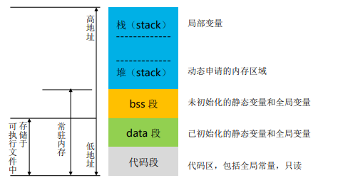
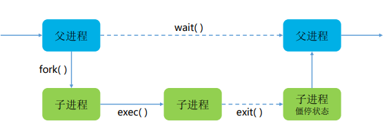
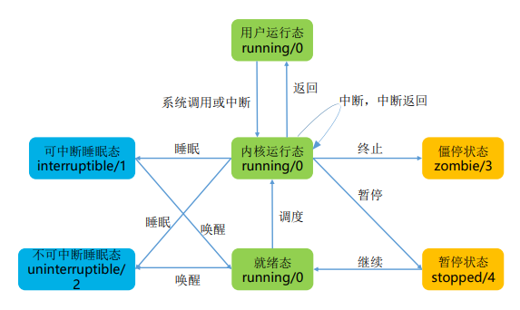

# 一、任务管理 
## 1.简介
在系统运维过程中，可能需要在某个预设的时间执行特定任务 
比如定时发送邮件、备份并清空日志文件等任务 
任务的内容可以看作是一系列命令或者一个脚本，我们则需要在特定时间去执行它
## 2.类型
### 1).计划执行
在特定时间运行一次：at 
#### a.简介
```
at 命令可以指定 Linux 在特定时刻运行脚本

atd 是 at 的守护进程，在系统启动时就会以后台模式运行

atd 进程会定期检查系统上的 /var/spool/at 目录，获取通过 at 命令写入的任务
```
#### b.语法
```
用户使用 at 命令在指定时刻执行指定的命令序列

该命令至少需要指定一个命令和一个执行时间
at 命令可以只指定时间，也可以时间和日期一起指定

at 命令语法：
at [-V] [-q 队列] [-f 文件名] [-mldbv] 时间
at -c 作业[作业...]
```
#### c.绝对计时
at 允许使用一套相当复杂的时间指定方法：
- 接受在当天的 hh:mm（小时：分钟）式的时间指定；如果该时间已经过去，那么就放存 第二天执行
- 使用 midnight（深夜）、noon（中午）、teatime（饮茶时间，一般是下午4点）等比 较模糊的词语来指定时间 
- 采用 12 小时计时制，即在时间后面加上 AM 或者 PM 来说明是上午还是下午 
- 指定命令执行的具体日期，指定格式为month day（月日）或者 mm/dd/yy（月/日/年） 或者dd.mm.yy（日.月.年）；指定的日期必须跟在指定时间的后面
#### d.设置时间 - 相对计时
```
使用相对计时法，对于安排不久后就要执行的命令较为方便：
指定格式为: now+count time-units，
now就是当前时间，time-units 是时间单位，
这里可以是
minutes（分钟）、hours（小时）、days（天）、weeks（星期）

count 是时间的数量，究竟是几天，还是几小时等；还有一种计时方法就是直接使用today（今
天）、tomorrow（明天）来指定完成命令的时间

例如指定在今天 16:30 执行某个命令；假设现在时间是 12:30，2015年6月7日，命令如下：
at 4:30pm 
at 16:30 
at 16:30 today 
at now+4 hours 

at now+240 minutes 
at 16:30 7.6.15 
at 16:30 6/7/15 
at 16:30 Jun 7

以上 8 条命令的执行效果完全相同
```
#### e.执行权限
```
对于 at 命令来说，需要定时执行的命令是从标准输入或者使用 –f 选项指定的文件
中读取并执行的

如果 at 命令是从一个使用 su 命令切换到用户 shell 中执行的，那么当前用户被认
为是执行用户，所有的错误和输出结果都会送给这个用户

对于其他用户来说，是否执行某个命令或脚本取决于 /etc/at.allow 和 /etc/at.deny
文件
[root@openEuler ~]# at -f example.sh 15:00
warning: commands will be executed using /bin/sh
job 1 at Wed Jul 29 15:00:00 2020

[root@openEuler ~]# atq
1 Wed Jul 29 15:00:00 2020 a root
```
### 2).定期执行
按周期执行多次：cron(周期性重复执行一些命令)
#### a.运行机制
```
cron 会搜索 /var/spool/cron 目录，寻找以 /etc/passwd 文件中的用户名命名的 crontab 文件，然后将 crontab 文件装入内存 

cron 还将搜索 /etc/crontab 文件，这个文件（cron 时间表）是以特定格式写成的 

cron 启动以后，先检查是否有用户设置了crontab文件，如果没有就转入睡眠状态， 释放系统资源；所以该后台进程占用资源极少，之后每分钟被换醒一次，查看当前 是否有需要运行的命令
```
#### b.corntab 命令
- crontab 命令用于安装、删除或者显示用于驱动 cron 后台进程的表格 
- 用户把需要执行的命令序列放到 crontab 文件中以获得执行，而且每个用户都可以 有自己的 crontab 文件
```
crontab -u //设置某个用户的cron服务，root用户在执行crontab时需要此参
数

crontab -l //列出某个用户cron服务的详细内容

crontab -r //删除某个用户的cron服务

crontab -e //编辑某个用户的cron服务
```
#### c.crontab 文件
```
在 crontab 文件中输入需要执行的命令和时间

该文件中每行都包括6个域，其中前5个域是指定命令被执行的时间，最后一个域是
要被执行的命令

每个域之间使用空格或者制表符分隔，格式如下：
minute hour day-of-month month-of-year day-of-week 
commands
```
#### d.crontab 文件参数说明
minute hour day-of-month month-of-year day-of-week  commands
| 参数          | 描述                              |
| ------------- | --------------------------------- |
| minute        | 分钟（0 – 59）                    |
| hour          | 小时（0 – 23）                    |
| day-of-month  | 一个月的第几天（1 – 31）          |
| month-of-year | 一年的第几个月（1 – 12）          |
| day-of-week   | 一周的星期几（0 – 6），0 代表周日 |
| commands      | 需要执行的命令                    |
```
例：每周一上午 8:00 执行命令
00 08 * * 1 commands
```
#### e.crontab 文件参数补充说明
- 上述参数项都不能为空，必须指定值
- 对于要执行的命令，调用的时候需要写出命令的绝对路径
- 除了数字还有几个特殊的符号“*” 、 “/”和“-” 、 “ ， ”
| 参数 | 描述                       |
| ---- | -------------------------- |
| *    | 所有取值范围内的数字       |
| /    | 每，如“*/5”表示每 5 个单位 |
| -    | 从某个数字到某个数字       |
| ，   | 离散的几个数字             |
```
例：晚上11点到早上8点之间每两个小时，在/tmp/test.txt文件中加入sleepy文本，在 crontab 文件中对应的行如下：
* 23-8/2 * * * echo"sleepy" >> /tmp/test.txt
```
#### f.编辑配置文件
cron 服务每分钟不仅要读一次 /var/spool/cron 内的所有文件 ， 还需要读一次 /etc/crontab
使用 crontab 配置是针对某个用户的，而编辑 /etc/crontab 是针对系统的任务
```sh
SHELL=/ 此文件的文件格式如下： bin/sh
PATH=/usr/bin:/usr/sbin:/sbin:/bin:/usr/lib/news/bin
MAILTO=root //如果出现错误，或者有数据输出，数据作为邮件发给这个账号
HOME=/
# run-parts01 
* * * * root run-parts /etc/cron.hourly //每个小时执行一次/etc/cron.hourly里的脚本
02 4 * * * root run-parts /etc/cron.daily //每天执行一次/etc/cron.daily里的脚本
22 4 * * 0 root run-parts /etc/cron.weekly //每周执行一次/etc/cron.weekly里的脚本
42 4 1 * * root run-parts /etc/cron.monthly //每月执行一次/etc/cron.monthly里的脚
```
# 二、网络管理
## 1.概念
- 设备
- 主机内的网卡
- 广播地址
- 到达本网段上所有主机的地址
- 接口
- 为使用设备，驱动程序在设备上创建了接口
- 子网掩码
- 将 IP 地址划分成网络地址和主机地址两部分的掩码
- 路由
- IP 包跨网段访问时候的下一跳地址
- 链路
- 设备到网络的连接
## 2.网卡
### 1).设备配置文件
网络设备默认的配置路径：/etc/sysconfig/network-scripts/ 
配置文件：ifcfg-*
```sh
[root@openEuler ~]# ls -l /etc/sysconfig/network-scripts/
total 4
-rw-r--r--. 1 root root 308 Jul 8 11:07 ifcfg-enp4s0
```
### 2).网卡配置文件参数说明
**参数值不区分大小写，可以不用引号**
| 参数           | 说明                                               |
| -------------- | -------------------------------------------------- |
| TYPE           | 配置文件接口类型                                   |
| BOOTPROTO      | 系统启动地址协议                                   |
| ONBOOT         | 系统启动时是否激活                                 |
| IPADDR         | IP 地址                                            |
| NETMASK        | 子网掩码                                           |
| GATEWAY        | 网关地址                                           |
| BROADCAST      | 广播地址                                           |
| HWADDR/MACADDR | MAC 地址，只需设置其中一个，同时设置时不能相互冲突 |
| PEERDNS        | 是否指定 DNS，如果使用 DHCP 协议，默认为 yes       |
| DNS{1, 2}      | DNS 地址                                           |
| USERCTL        | 用户权限控制                                       |
| NAME           | 网络连接名称                                       |
| DEVICE         | 物理接口名称                                       
### 3).修改配置文件
使用编辑器直接修改配置文件，修改前做好备份；
配置修改后不会立即生效，需要重启 NetworkManger 服务进程或者重启系统
```sh
备份配置文件：
[root@openEuler ~]# cp ifcfg-eth1 ifcfg-eth1.bak

重启 NetworkManager 服务进程：
[root@openEuler ~]# systemctl reload NetworkManager
```
### 4).网卡最小配置文件示例
```sh
TYPE=Ethernet
BOOTPROTO=static
NAME=enp0s3
DEVICE=enp0s3 
ONBOOT=yes
IPADDR=192.168.56.100 
NETMASK=255.255.255.0
```
### 5).查看 IP 地址
```
查看设备，包含没有配置的网络设备
ip addr
```
```
使用 ip 命令显示设备和地址信息：
[root@openEuler ~]# ip addr show enp4s0
2: enp4s0: <BROADCAST,MULTICAST,UP,LOWER_UP> mtu 1500 qdisc fq_codel state UP group default qlen
1000
	link/ether 28:6e:d4:89:70:de brd ff:ff:ff:ff:ff:ff
    inet 192.168.110.246/24 brd 192.168.110.255 scope global dynamic noprefixroute enp4s0
    valid_lft 552070sec preferred_lft 552070sec
    inet6 fe80::fc7e:f7ba:e0d0:2f1f/64 scope link noprefixroute
    valid_lft forever preferred_lft forever
```
| 序号 | 说明                                       |
| :--: | ------------------------------------------ |
|  1   | 当前接口的状态为启动：UP，若关闭则为：DOWN |
|  2   | link 信息：设备的 MAC 地址                 |
|  3   | inet 信息：IPv4 地址，子网掩码             |
|  4   | 广播地址、作用域、设备名称                 |
|  5   | inet6 信息：IPv6 信息                      |
## 2.NetworkManager
```
 NetworkManager 是系统中动态控制及配置网络的守护进程，用于保持当前网络设
备和连接处于工作状态。

通过命令行工具 nmcli 可以控制 NetworkManager，nmcli 全面，强大且复杂

关键概念：
    设备：网络中，设备即网络接口；
    连接：连接是供设备使用的配置；
    同一个设备可能存在多个连接，但一次只能有一个保持活动状态。
```
## 3.nmcli
### 1).查看网络信息
```
con 代表连接，--active 选项可以过滤出活动的连接

nmcli connection show --active
```
### 2).创建连接
```
1.创建一个名为“Demo”的连接，使用DHCP方式通过enp4s0网口连接
2. 显示所有连接
3. 启动刚刚创建的“Demo”连接
4. 查看当前连接状态
```
```
[root@openEuler ~]# nmcli connection show --active
NAME UUID TYPE DEVICE
enp4s0 1d859d5a-b0c0-3b49-b153-269e0d4a85ce ethernet enp4s0
virbr0 52137c43-98c9-4f34-8954-d3d1ea89b946 bridge virbr0

[root@openEuler ~]# nmcli connection show
NAME UUID TYPE DEVICE
enp4s0 1d859d5a-b0c0-3b49-b153-269e0d4a85ce ethernet enp4s0
virbr0 52137c43-98c9-4f34-8954-d3d1ea89b946 bridge virbr0

[root@openEuler ~]# nmcli connection add con-name 'Demo' type Ethernet ifname
enp4s0
Connection 'Demo' (789c723b-cd60-4515-99fc-5074b6f38498) successfully added.

[root@openEuler ~]# nmcli connection show
NAME UUID TYPE DEVICE
enp4s0 1d859d5a-b0c0-3b49-b153-269e0d4a85ce ethernet enp4s0
virbr0 52137c43-98c9-4f34-8954-d3d1ea89b946 bridge virbr0
Demo 789c723b-cd60-4515-99fc-5074b6f38498 ethernet --

[root@openEuler ~]# nmcli connection up 'Demo'
Connection successfully activated (D-Bus active path: 
/org/freedesktop/NetworkManager/ActiveConnection/16)

[root@openEuler ~]# nmcli connection show
NAME UUID TYPE DEVICE
Demo 789c723b-cd60-4515-99fc-5074b6f38498 ethernet enp4s0
virbr0 52137c43-98c9-4f34-8954-d3d1ea89b946 bridge virbr0
enp4s0 1d859d5a-b0c0-3b49-b153-269e0d4a85ce ethernet --
```
### 3).修改连接
使用命令 nmcli con mod 修改连接，传入的参数为键值对。
键为属性名称，可通过 nmcli con show [连接名] 查询，如：
```
[root@openEuler ~]# nmcli connection show Demo
connection.id: Demo
connection.uuid: 789c723b-cd60-4515-99fc-5074b6f38498
connection.stable-id: --
connection.type: 802-3-ethernet
connection.interface-name: enp4s0
connection.autoconnect: yes
connection.autoconnect-priority: 0
connection.autoconnect-retries: -1 (default)
connection.multi-connect: 0 (default)
connection.auth-retries: -1
connection.timestamp: 1595988280
```
```
以修改 DNS 服务器为例：
[root@openEuler ~]# nmcli connection modify 'Demo' ipv4.dns 192.168.100.250

[root@openEuler ~]# nmcli connection show Demo | grep ipv4.dns
ipv4.dns: 192.168.100.250
ipv4.dns-search: --
ipv4.dns-options: ""
ipv4.dns-priority: 0
```
## 4.路由
### 1).简介
要让不同子网的两台主机能够相互通讯，就需要有一种能够描述如何从一台主机到 另一台主机的机制，这一机制称为：路由选择（Routing），路由选择通过路由项 进行描述
路由项是一对预先定义的地址，包括：目的地（Destination）和网关（Gateway）
路由项的含义是通过网关能够完成与目的地的通讯；路由表是多个路由项的集合
### 2).路由管理与配置
openEuler 中，使用 route 查看、配置、管理本机路由。 
除了 route 命令，ip 和 nmcli 命令也可以用来管理系统路由。
这些命令作用于系统中的路由表，系统运行时，路由表加载到内存中，由系统内核 进行维护
### 3).route
#### a.查看路由表
```sh
route -n
```
#### b.新增路由
**新增（暂时）一条到网段或主机的路由**
```sh
route [-f] [-p] [Command [Destination] [mask Netmask] [Gateway] [metric Metric]] [if Interface]]
```
```
[root@openEuler ~]# route add -net 192.168.101.0 netmask 255.255.255.0 dev enp4s0

[root@openEuler ~]# route add -host 192.168.100.10 dev enp4s0

[root@openEuler ~]# route
Kernel IP routing table
Destination Gateway Genmask Flags Metric Ref Use Iface
default _gateway 0.0.0.0 UG 100 0 0 enp4s0
192.168.100.10 0.0.0.0 255.255.255.255 UH 0 0 0 enp4s0
192.168.101.0 0.0.0.0 255.255.255.0 U 0 0 0 enp4s0
192.168.110.0 0.0.0.0 255.255.255.0 U 100 0 0 enp4s0
192.168.122.0 0.0.0.0 255.255.255.0 U 0 0 0 virbr0
```
#### c.删除路由
**使用 route del 命令删除到网段或者主机的路由**
```
语法：
route del [-net|-host] [netmask Nm] [gw Gw] [[dev] If]
```
```
[root@openEuler ~]# route del -host 192.168.100.10 dev enp4s0

[root@openEuler ~]# route
Kernel IP routing table
Destination Gateway Genmask Flags Metric Ref Use Iface
default _gateway 0.0.0.0 UG 100 0 0 enp4s0
192.168.101.0 0.0.0.0 255.255.255.0 U 0 0 0 enp4s0
192.168.110.0 0.0.0.0 255.255.255.0 U 100 0 0 enp4s0
192.168.122.0 0.0.0.0 255.255.255.0 U 0 0 0 virbr0
```
#### d.配置静态路由
**使用 nmcli 命令为网络连接配置静态路由**
```
语法：
nmcli connection modify enp3s0 +ipv4.routes "192.168.122.0/24 10.10.10.1"
```
```
使用编辑器配置静态路由，使用交互式命令如下：
# nmcli con edit type ethernet con-name enp3s0 
===| nmcli interactive connection editor |=== 
Adding a new '802-3-ethernet' connection 
Type 'help' or '?' for available commands. 
Type 'describe [<setting>.<prop>]' for detailed property description. 
You may edit the following settings: connection, 802-3-ethernet (ethernet), 802-1x, ipv4, ipv6, dcb

nmcli> set ipv4.routes 192.168.122.0/24 10.10.10.1 

nmcli> 

nmcli> save persistent 
Saving the connection with 'autoconnect=yes'. That might result in an immediate activation of the 
connection. 
Do you still want to save? [yes] yes 
Connection 'enp3s0' (1464ddb4-102a-4e79-874a-0a42e15cc3c0) successfully saved. 

nmcli> quit
```
## 5.主机名
主机名是一个局域网中唯一标识一台机器的名称
这台机器不一定是一台物理机器，也可以是一台虚拟机
主机名信息存放在文件 **/etc/hostname** 中
```
[root@openEuler ~]# cat 
/etc/hostname
openEuler
```
### 1).设置主机名
临时设置主机名（直到下次重启前有效）：hostname new-name
永久设置主机名：hostnamectl set-hostname new-name
通过修改文件设置主机名：在 /etc/hostname 文件中写入 new-name
```
[root@openEuler ~]# hostname
openEuler
[root@openEuler ~]# hostname huawei
[root@openEuler ~]# hostname
huawei
[root@openEuler ~]# hostnamectl set-hostname openEuler01
[root@openEuler ~]# hostname
openEuler01
[root@openEuler ~]# echo "HCIA-openEuler" > /etc/hostname
[root@openEuler ~]# hostname
openEuler01
```
### 2).hosts 文件
局域网中存在着一些主机，我们可以通过 IP 地址去访问它们
随着局域网中主机数量增加，IP 地址较难记忆，我们希望通过主机名直接访问其他 主机
这时我们可以通过一张记录着主机名和 IP 地址的表找到这些主机，这张表就是 hosts。
```sh
[root@openEuler ~]# cat /etc/hosts
127.0.0.1 localhost localhost.localdomain localhost4 localhost4.localdomain4 
::1 localhost localhost.localdomain localhost6 localhost4.localdomain6
```
### 3).修改 hosts 文件
```
可以用编辑器修改 hosts文件内容，格式：
ip<TAB>domain.com
192.168.10.20 www.example.com

若想去掉某条记录，加 # 注释即可，如：
#ip<TAB>domain.com
#192.168.10.20 www.example.com
```
## 6.DNS
### 1).hosts 与 DNS
随着网络中主机数量的增加，单个 hosts 文件难以承载众多的映射关系
当在 hosts 中找不到域名对应的 IP 时，主机会将域名提交给域名解析服务器 （DNS），然后 DNS 返回 IP 给主机，这个过程称为：**域名解析**
DNS 就像是一个公共的 hosts 文件/分布式数据库
### 2),查询 DNS 记录
```
作用：查看域名解析是否正常，帮助诊断网络问题

语法：
nslookup domain [dns-server]
其中 domain 是要查询的域名
[dns-server] 是域名解析服务器，非必选参数，常见的如：8.8.8.8，114.114.114.114
```
```
查询exam.openEuler.com对应的 IP：

[root@openEuler ~]# nslookup exam.openEuler.com
Server: 192.168.100.250
Address: 192.168.100.250#53
Name: exam.openEuler.com
Address: 192.168.100.250
```
### 3).DNS 解析记录
**DNS 中除了将域名解析到一个 IP 地址之外，还支持其他类型的解析记录**
| 记录         | 描述                                                         |
| ------------ | ------------------------------------------------------------ |
| A            | 将域名指向一个IPv4地址                                       |
| CNAME        | 将域名指向一个域名，实现与被指向域名相同的访问效果           |
| MX           | 建立电子邮箱服务，将指向邮件服务器地址                       |
| NS           | 域名解析服务器记录，如果要将子域名指定某个域名服务器来解析   |
| TXT          | 可任意填写，可为空，一般做一些验证记录时会使用此项           |
| AAAA         | 将主机名（或域名）指向一个IPv6地址                           |
| SRV          | 添加服务记录服务器服务记录时会添加此项，SRV记录了哪台计算机提供了哪个服务 |
| SOA          | 起始授权机构记录，用于在众多NS记录中标识哪一台是主服务器     |
| PTR          | A记录的逆向记录，将IP反向解析为域名                          |
| 显性/隐性URL | 转发 将域名指向一个http(s)协议地址，访问域名时，自动跳转至目标地址，显示或隐藏真实地址 |
## 7.其他
nslookup 可以查询各种类型的记录，例如：
```
[root@openEuler ~]# nslookup
> set type=A
> exam.openEuler.com
Server: 192.168.100.250
Address: 192.168.100.250#53
Name: exam.openEuler.com
Address: 192.168.100.250
```
# 三、进程管理
## 1.进程介绍
进程（Process）是计算机中已运行程序的实体，是程序的一个具体实现
每个 Linux 进程在被创建的时候，都被分配给一段内存空间，即系统给该进程分配一定的逻 辑地址空间

## 2.进程的生命周期
每个进程都有一个唯一的进程 ID （PID），用于追踪该进程
任何进程都可以通过复制自己地址空间的方式（fork）创建子进程，子进程中记录 着父进程的 ID（PPID）
第一个系统进程是 systemd，其他所有进程都是其后代

## 3.进程的状态

## 4.进程的优先级
进程的 CPU 资源（时间片）分配就是指进程的优先级（priority）
优先级高的进程有优先执行权利
配置进程的优先级对多任务环境下的 Linux 很有用，可以改善系统性能
```
[root@openEuler ~]# ps -l
F S UID PID PPID C PRI NI ADDR SZ WCHAN TTY TIME CMD
0 S 0 686110 686109 0 80 0 - 3383 do_wai pts/0 00:00:00 bash
0 S 0 686217 686110 0 80 0 - 3386 do_wai pts/0 00:00:00 bash
0 R 0 688767 686217 0 80 0 - 3399 - pts/0 00:00:00 ps
```
PRI，即进程的优先级，表示程序被CPU执行的先后顺序，值越小进程的优先级别越 高
NI，即 nice 值 ，表示进程可被执行的优先级的修正数值，可理解为“谦让度”
进程的 nice 值不是进程的优先级，但是可以通过调整 nice 值可以影响进程的优先值
| 优先级（PRI）范围 | 描述       |
| ----------------- | ---------- |
| 0—99              | 实时进程   |
| 100—139           | 非实时进程 |

## 5.调整进程的优先级
openEuler 中使用 nice 和 renice 调整进程的 nice 值，进而影响进程优先级 
```
nice命令语法，优先序（adjustment 取值范围 -19 ~ 20）： 
nice [-n adjustment] [command [arg...]]


例如，将 vi 运行的优先级设置为 -18： 
nice -n -18 vi &
```
```
renice 命令语法，优先序范围同 nice，作用对象有程序群组 -g、进程 -p、用户-u，语法格式： 
renice [-n adjustment] [-] <pid>

例如，将 vi 运行的优先级设置为 10： 
# renice -n 12 -p 9700
9700(process ID) old priority -18, new priority 12
```
## 6.前台与后台进程
```
后台进程几乎不和用户交互，优先级略低
	Linux 的守护进程（Daemon）是一种特殊的后台进程，其独立于终端并周期性地执行任 务或等待唤醒

前台进程和用户交互，需要较高的响应速度，优先级较高
	前台进程就是用户使用的有控制终端的进程
```
## 7.控制前台与后台进程
opneEuler 中常用以下命令管理进程，包括前后台切换及启停： 
**&**：将 & 放在命令的最后，可以把这个命令放到后台执行 
**Ctrl + z**：当前台正在执行一个命令时，按键 Ctrl + z，将其放到后台并暂停
**Ctrl + c**：中断当前正在执行的命令 
**jobs**：查看当前有多少正在后台运行的命令
**fg**：将后台中的命令调至前台继续运行 
**bg**：将后台任务唤醒，并在后台运行
## 8.查看进程
在对系统进行故障排除时，了解进程的状态非常重要
openEuler 中，使用 ps 或 top 命令查看每个进程的详细信息
## 9.查看进程 - ps、top
ps 命令可以显示当前进程，并列出详细的进程信息，字段含义如下表
常用 ps aux 或 ps -ef 查看进程信息
 ps 命令用于显示特定时间点的进程信息，top 命令可以实时显示进程信息。
| 字段 | 描述                |
| ---- | ------------------- |
| UID  | 用户识别符          |
| PID  | 唯一进程识别符      |
| %CPU | 进程的 CPU 占用率   |
| %MEM | 进程的内存占用率    |
| NI   | 进程谦让度，nice 值 |
| PRI  | 进程优先级          |
| TTY  | 与进程关联的终端    |
| STAT | 进程的状态          |
## 10管理进程 - 信号
openEuler 中，进程之间通过信号来通信，常见信号见表格
进程的信号是预定义好的一个消息，进程能识别它并决定是忽略还是做出反应
系统管理员需要知道如何向一个进程发送何种信号，以管理进程
| 信号 | 名称 | 描述                         |
| ---- | ---- | ---------------------------- |
| 1    | HUP  | 挂起                         |
| 2    | INT  | 中断                         |
| 3    | QUIT | 结束运行                     |
| 9    | KILL | 无条件终止                   |
| 11   | SEGV | 段错误                       |
| 15   | TERM | 尽可能终止                   |
| 17   | STOP | 无条件停止运行，但不终止     |
| 18   | TSTP | 终止或暂停，但继续在后台运行 |
| 19   | CONT | 在 STOP或TETP之后恢复执行    |
## 11.管理进程
openEuler 中使用 kill 和 killall 命令向进程发送信号
发送的前提是，当前用户必须是进程的属主或 root 用户
kill 通过 PID 向进程发信号，默认发送 TERM 信号，使用 –s 参数指定其他信号， 
```
# kill 3389
# kill -s HUP 3389
```
例：killall 通过进程名向进程发信号，且支持通配符，
```
# killall python*
```