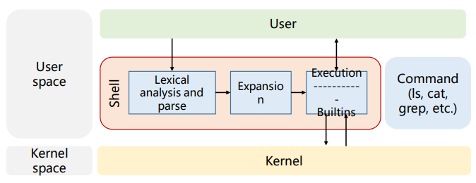
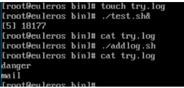

# 一、Shell 基础介绍
## 1.openEuler 构成 Shell 简介
### 1).概述
- Shell 是系统的用户界面，提供了用户与内核进行交互操作的一种接口
- Shell 将用户输入的命令并且把它们送到内核去执行，然后返回执行结果
- Shell 是可编程的，它允许用户编写由 Shell 命令组成的程序

### 2).Shell 发展史
- 1971 : Bell Labs 的 Ken Thompson 为 UNIX 开发了第一个 Shell: V6 Shell 是一个在内核之外执行的独立的用户程序
- 1977 ：Steven Bourne 在 AT&T Bell Labs 为 V7 UNIX 创建 Bourne shell
- 1978 ：Bill Joy 在伯克利分校攻读研究生期间为 BSD UNIX 系统开发的 csh
- 1983 ： Ken Greer 在卡内基-梅隆大学开发了 tcsh，将 C Shell 引入了 Tenex 系统中的一些功能，如命令行编辑 功能和文件名和命令自动补全功能
- 1983 ：David Korn 在 AT&T Bell Labs 创建 korn shell，它功能更强大，提供关联数组表达式运算
- 1989 ：Bourne-Again Shell（或 Bash）是一个开源 GNU 项目，旨在取代 Bourne shell；Bash 由 Brian Fox 开 发，已成为世上最流行的 Shell，它兼容 sh、csh、ksh，是 Linux 系统的默认 Shell

在 Linux 中，有多种 Shell 程序可供选择， 比如 dash、csh、zsh 等， 默认的 Shell 可以在 /bin/sh 查看，在/etc/passwd 中修改。
### 3).查看 Shell
```
登陆 openEuler，查看系统默认安装的 Shell
cat /etc/shells  

查看当前登陆用户默认 Shell
echo $SHELL

查看当前的 Shell 
echo $0
```
## 2.Shell 脚本（定义、作用、格式、权限及执行） 
### 1.基础
在 Unix/Linux 里，一个程序/命令只做好一件事
复杂的问题可以通过多个命令的组合来解决
形式最简单的 Shell 脚本就是一系列命令构成的可执行文件，并可以被其他脚本复用

PS:
编写风格良好易读的 Shell 脚本 
可以提高日常任务的**自动化程度**和**准确性**
### 2.Shell 脚本的约束
没有“银弹” 
- Shell 脚本可以完成很多任务，但不适用于所有情况
- 对于可以通过调用其他命令行实用工具来完成的任务，Shell 脚本是一种不错的选择
- Shell 脚本可以作为一种“胶水”语言，整合其他编程语言

PS:
当解决某个问题时， Shell 脚本实现起来复杂度高，效率低， 此时就可以考虑使用其他编程语言。
### 3.开发环境
可以在任意文本编辑器中打开新文件来创建 Shell 脚本
高级编辑器如 Vim 和 Emacs，在识别文件的后缀为 .sh 后，可以提供语法高亮、检 查、补全等功能
```
[root@openEuler ~]# vim demo.sh #新建一个脚本文件，并

写入如下内容：
#!/bin/bash
echo "Hello World“

[root@openEuler ~]# sh demo.sh
Hello World
```
### 4.Shell 脚本指定解释器
Shell 脚本只是静态的代码，若要输出结果，还需要解释器的参与 
一般在脚本的第一行，指定执行此脚本的解释器
如果不指定解释器，脚本也能在默认的解释器中正常运行，但出于规范和安全的考虑，建议 指定如下：
```
#!/bin/bash
#!/bin/csh
```
请思考这两种表示有何不同？
```
1. `#!/bin/bash`：这个shebang（也称为hashbang）告诉系统使用`/bin/bash`作为解释器来执行脚本。这意味着脚本将使用Bash shell的语法和特性。如果你在Linux或macOS系统上运行这个脚本，它将正常工作。

2. `#!/bin/csh`：这个shebang告诉系统使用`/bin/csh`作为解释器来执行脚本。这意味着脚本将使用C Shell（csh）的语法和特性。如果你在类似BSD系统的Unix环境中运行这个脚本，它将正常工作。
```
### 5.执行 Shell 脚本
对于脚本文件，我们有两种执行方式：
```
sh script_name.sh 

./script_name.sh
```
Linux 中一切皆文件，脚本/命令/程序都是一个文件，文件作为一个对象，具有权限的属性
在执行别人发送或从网上下载的脚本时可能会遇到权限问题，赋予执行权限可解决：
```
 chmod +x script_name.sh
```
如果某个 Shell 脚本可执行，则可以通过在命令行中输入其名称调用 
被成功调用的前提是，脚本所在路径包含在 $PATH 变量中 
- 查看 $PATH 变量
- 修改 $PATH 变量
- 查找某个命令/脚本的路径
```
[root@openEuler ~]# echo $PATH /usr/local/sbin:/usr/local/bin:/usr/sbin:/usr/bin:/root/bin 

[root@openEuler ~]# PATH=$PATH:/New/path 

[root@openEuler ~]# echo $PATH /usr/local/sbin:/usr/local/bin:/usr/sbin:/usr/bin:/root/bin:/New/path
```
### 6.后台执行 Shell 脚本
有时候一些脚本执行时间较长，命令行界面会被占用，因此可以采取后台运行脚本：
./my_script.sh &
这种方法在退出 Shell 后，脚本进程会随之终止，为了保证脚本一直运行，可以采 用： 
- nohup ./my_script.sh &
- 脚本的的标准输出和标准错误会重定向到 nohup.out 文件里
使用 **jobs** 命令可以查看后台中运行着的进程
# 二、Shell 编程基础 
## 1.输入输出、管道
### 1).Linux 中的文本流
**文本流**存在于 Linux 的每一个进程中 
Linux 的每个进程启动时，会打开三个文本流的端口：**标准输入、标准输出、标准错误**
这三个端口对应着一个程序的输入、输出和异常的抛出 
```
[root@openEuler ~]# date
Wed Jul 29 10:39:17 CST 2020

[root@openEuler ~]# datee
bash: datee: command not found
```
**PS:** 
在 bash 中输入一串字符后，bash 进程中的**标准输入**端口捕获命令行中的输入
进行处理后从**标准输出**端口中传出，回显在屏幕上
如果处理过程中发生异常，则会通过**标准错误**端口，将异常回显在屏幕上
### 2).输出重定向
某些情况下，我们需要保存程序的输出，此时就可以通过重定向，将程序的输出保 存到文件中
#### a.将标准输出定向到文件中：
```sh
ls > dir_log
```
PS:使用这种方式会将程序的标准输出覆盖文件内容
#### b.将标准输出追加到文件中：
```sh
ls >> dir_log
```
**PS:**
使用这种方式会将程序的标准输出追加至文件的末尾
#### c.执行完命令后，可以通过 cat dir_log 查看保存的文件内容
### 3).输入重定向
与输出重定向类似，输入重定向是把程序的标准输入进行重新定向
与输出重定向类似，输入重定向是把程序的标准输入进行重新定向
#### a.输入重定向：
```
格式：command < inputfile

将右边的文件作为标准输入，然后传入左边的命令

例： wc -l < /dev/null
```
#### b.内联输入重定向：
```
格式： command << maker

输出重定向需要文件，而内联输入重定向可以使用即时输入的文本作为标准输入传入左边的命令

右边的字符“maker”作为标志，表示标准输入的开始和结束，自身不包含在标准输入里。
```
右图例中以“maker”作为标志
```
[root@openEuler ~]# less << EOF
> item 1
> item 2
> item 3
> EOF
item 1
item 2
item 3
(END)
```
### 3).管道
有时需要将一个命令的输出连到另一个命令的输入，如果用重定向实现会较复
管道( | )就像现实中的水管一样，可以连接两个命令的输入和输出，甚至是串联多个命令
```
格式：command1 | command2 | command3 

[root@openEuler ~] ls /bin/ | grep python | less
```
**管道实际上是进程间通信（IPC）的一种方式**
## 2.字符、变量、运算
### 1.字符
| 特殊字符 | 说明         |
| -------- | ------------ |
| #        | 注释         |
| '        | 字符串引用   |
| \        | 转义         |
| /        | 路径的分隔符 |
| !        | 表示反逻辑   |
### 2.变量
#### a.定义
任何语言都有变量这个要素
Shell 与其他强类型的编程语言如：C，Java 和 C++ 等有很大不同，Shell 中的变量是**无类型**的
通过一个变量，我们可以引用一块内存区域的值，变量名就是这块内存区域上贴的一个标签
```
语法：
变量赋值：variable=value
```
```
[root@openEuler ~]# a='Hello World'
[root@openEuler ~]# echo a
a
[root@openEuler ~]# echo $a
Hello World
```
#### b.类型
在 Linux Shell 中，变量主要有两大类： 
- 环境变量
- 用户定义变量
每种类型的变量依据作用域不同，又分为全局变量和局部变量
- 全局变量作用在整个 Shell 会话及其子 Shell
- 局部变量作用在定义它们的进程及其子进程内
查看变量
- 使用 printenv 查看全局变量
- 使用 set 查看某个特定进程中的所有变量，包括局部变量、全局变量以及用户定义变量
修改变量
- 在 .bash_profile 或 .bashrc 中添加 export 语句，永久修改变量
#### c.命名规则
- 变量名由数字、字母、下划线组成
- 必须以字母或者下划线开头
- 不能使用 Shell 里的关键字
```
[root@openEuler ~]# help | grep for
break [n] printf [-v var] format [arguments]
for NAME [in WORDS ... ] ; do COMMANDS; done unset [-f] [-v] [-n] [name ...]
for (( exp1; exp2; exp3 )); do COMMANDS; done until COMMANDS; do COMMANDS; done
```
###### 在 Shell 脚本中，单引号 ’ ’ 与双引号 “ ” 有什么区别？
```
在Shell脚本中，单引号和双引号的使用有着明显的区别，主要体现在它们如何处理内部的变量、命令以及特殊字符：

1. 单引号：
   所见即所得。单引号内的内容会原样输出，不会进行任何解析。这意味着，即使单引号内有变量或命令，它们也会被当作普通字符串处理，而不会执行或替换[^1^][^2^][^3^][^4^]。
   例如，`echo '$a'`会输出`$a`，而不是变量`a`的值[^1^]。

2. 双引号：
   双引号内的内容会被解释器解析。如果双引号内有变量，它们会被替换为对应的值；如果有命令（如反引号内的命令），它们会被执行并返回结果[^1^][^2^][^3^][^5^]。
   例如，`echo "$a"`会输出变量`a`的值，而不是`$a`这个字符串[^1^]。
   双引号还会对某些特殊字符（如反斜杠`\`、美元符号`$`、反引号``）进行解析[^1^]。

总结来说，单引号用于需要原样保留文本的情况，而双引号则用于需要解析变量或命令的情况
```
#### d.扩展变量
在以下示例中，如果不使用花括号，Bash 会将 $FIRST_$LAST 解释为变量 $FIRST_ 后跟变量 $LAST，而不是由_ 字符分隔的变量 $FIRST 和 $LAST
因此，在此情况下，必须使用花括号引用的形式才能使变量扩展正确运行
```
[root@openEuler ~]# FIRST_=Jane
[root@openEuler ~]# FIRST=john
[root@openEuler ~]# LAST=Doe
[root@openEuler ~]# echo $FIRST_$LAST
Doe
[root@openEuler ~]# echo ${FIRST}_$LAST
john_Doe
```
#### e.变量的赋值与输出
定义并赋值如下变量，个人姓名 name，日期 time
输出姓名及日期变量
读取输入并输出
```
name=Euler
time=‘2020202’
echo “My name is $name, today is 
$time”
read name
echo “Hello, $name, welcome!”
```
#### f.Shell 的算术扩展
```
算术扩展可用于执行简单的整数算术运算
```
```
语法：$[表达式]
```
```
[root@openEuler ~]# echo $[1+1]
2
[root@openEuler ~]# echo $[2*2] 
4
[root@openEuler ~]# COUNT=1; echo $[$[$COUNT+1]*2] 
4
```
#### g.在 Shell 中计算时间
- 定义24小时，60分钟，60秒变量
- 定义每天秒数变量并赋值
- 输出变量
```
[root@openEuler ~]# SEC_PER_MIN=60
[root@openEuler ~]# MIN_PER_HR=60
[root@openEuler ~]# HR_PER_DAY=24
[root@openEuler ~]# SEC_PER_DAY=$[ $SEC_PER_MIN * $MIN_PER_HR * 
$HR_PER_DAY ]
[root@openEuler ~]# echo "There are $SEC_PER_DAY seconds in a day"
There are 86400 seconds in a day
```
### 3.运算
| 运算符 | 作用         |
| ------ | ------------ |
| ++     | 变量后置递增 |
| --     | 变量后置递减 |
| ++     | 变量前置递增 |
| --     | 变量前置递减 |
| -      | 一元减法     |
| +      | 一元加法     |
| **     | 求幂         |
| *      | 乘法         |
| /      | 除法         |
| %      | 求余         |
| +      | 加法         |
| -      | 减法         |
#### a.优先级(由高到低)
| 运算符  | 作用                       |
| ------- | -------------------------- |
| ++、--  | 变量后置递增和变量后置递减 |
| ++、--  | 变量后置递增和变量后置递减 |
| -、+    | 一元减法和加法             |
| **      | 求幂                       |
| *、/、% | 乘法、除法、求余           |
| +、-    | 加法、减法                 |
#### b.变量递增的前置后置区别
###### echo $[++i] 和 echo $[i++] 输出是否一样？
```
不一样。`echo $[++i]` 和 `echo $[i++]` 的输出结果取决于变量 i 的初始值。

1. `echo $[++i]`：先对 i 进行自增操作，然后输出 i 的值。例如，如果 i 的初始值为 5，那么执行后 i 变为 6，输出结果为 6。

2. `echo $[i++]`：先输出 i 的值，然后对 i 进行自增操作。例如，如果 i 的初始值为 5，那么输出结果为 5，但执行后 i 变为 6。
```
```
[root@openEuler ~]# i=3
[root@openEuler ~]# echo $[i]
3
[root@openEuler ~]# echo $[++i]
4
[root@openEuler ~]# echo $[i++]
4
[root@openEuler ~]# echo $i
5
```
## 3.语句（条件、循环）
### 1).条件语句
#### a.If-then 语句
###### 语法：
```sh
if command
	then
		commands
fi
```
Bash Shell 会先执行 if 后面的语句，如果其退出状态码为 0，则会继续执行 then 部分的命 令，否则会执行脚本中的下一个命令
#### b.多分支判断语句
在涉及多条件判断时，可能会使用较为繁琐的 if-then-else 语句，通过 elif 语句频 繁检测同一个变量的值，此时更适合使用 case 语句
###### 语法：

```sh
case variable in
    pattern1 | pattern2) commands1;;
    pattern3) commands2;;
    *) default commands;;
esac
```
### 2).循环语句
- Shell 脚本中常会遇到一些重复任务，相当于循环执行一组命令直到满足了某个特定条件
- 常见的循环语句有三种：for、while、until
- 循环控制符有两种：break、continue 用于控制循环流程的转向
#### a.for 循环
###### 语法(Shell 风格)
```sh
for var in list
    do
    	commands
done
```
```sh
for i in {1..10}
do
	printf "$i\n"
done
```
###### 语法(C 语言风格)
```sh
for ((var assignment ; condition ; iteration process))
do
	commands
done
```
```sh
for (( i = 1; i < 10 ; i++))
do
	echo “Hello”
done
```
##### for 循环中的列表
```sh
[root@openeuler ~]# for HOST in host1 host2 host3; do echo $HOST; done 
host1
host2
host3

[root@openeuler ~]# for HOST in host{1..3}; do echo $HOST; done 
host1
host2
host3

[root@openeuler ~]# for EVEN in $(seq 2 2 8); do echo "$EVEN"; done;
2
4
6
8
```
##### for 循环奇数累加器
定义奇数累加器文件，并执行
```sh
#!/bin/bash

sum=0
for i in {1..100..2}
do
	let "sum+=i"
done 
echo 
"sum=$sum"
```
##### for 循环文件展示
展示目录下所有文件
```sh
#!/bin/bash

for file in $(ls)
do
	echo "file: $file“
done
```
#### b.while 循环
- 也称为前测试循环语句，重复次数是利用一个条件来控制是否继续重复执行这个语句
- 为避免死循环，必须保证循环体中包含循环出口条件
###### 语法：
```sh
前后
while (条件)
do
	语句
done
	语句
```
```sh
#!/bin/bash

sum=0;i=1 
while(( i <= 100 ))
do
    let "sum+=i"
    let "i += 2" 
done
	echo "sum=$sum"
```
#### c.until 循环
###### 与 while 循环类似，但是跳出循环的条件判断有所区别
```
while循环：当指定条件为真（返回状态码0）时，执行循环体中的命令。一旦条件变为假（返回非0状态码），则跳出循环

until循环：与while循环相反，它在条件为假时执行循环体内的命令，只有当条件变为真时才会退出循环
```
###### 语法
```
前后
until (条件)
do
	语句
done
	语句
```
```
#!/bin/bash
#奇数累加器

sum=0;i=1 
until(( i > 100 ))
do
    let "sum+=i"
    let "i += 2" 
done
    echo "sum=$sum"
```
# 三、Shell 编程最佳实践
## 1.调试
Shell 脚本错误故障排除
编写、使用或维护 Shell 脚本的管理员不可避免地会遇到脚本的错误
- 错误通常是由于输入错误、语法错误或脚本逻辑不佳导致
- 在编写脚本时,将文本编辑器与 bash 语法高亮显示结合使用可以帮助使错误更明显
- 找到并排除脚本中错误的最直接方法是调试
- 避免在脚本中引入错误的另一种简单方法是在创建脚本期间遵循良好风格
### 1).调试模式
脚本上激活调试模式,请向脚本第一行中的命令解释器中添加 -x 选项 
如此前乘法表，进行如下修改： 
```sh
#!/bin/bash -x
```
bash 的调试模式将打印出脚本执行前由脚本执行的命令
已执行的所有 shell 扩展的结果都将显示在打印输出中，所有变量数据状态会实时 打印，以供跟踪：
```sh
[root@openEuler tmp]# bash -x adder.sh
```
### 2).评估退出代码
- 每个命令返回一个退出状态，也通常称为返回状态或退出代码
- 退出代码可以用于脚本的调试 

以下示例说明了几个常见命令的执行和退出状态检索
```sh
[root@openEuler tmp]# ls /etc/hosts
/etc/hosts
[root@openEuler tmp]# echo $?
0

----------------------------------------------------------------

[root@openEuler tmp]# ls /etc/nofile
ls: cannot access /etc/nofile: No such file or directory
[root@openEuler tmp]# echo $?
2
```
在脚本中使用退出代码 

- 一旦执行，脚本将在其处理所有内容之后退出，但是有时候可能需要中途退出脚本， 比如在遇到错误条件时
- 可以通过在脚本中使用 exit 命令来实现这一目的，当脚本遇到 exit 命令时，脚本将 立即退出并跳过对脚本其余内容的处理

```sh
[root@openEuler tmp]# cat 
hello.sh 
#!/bin/bash
echo "Hello World"
exit 1

[root@openEuler tmp]# ./hello.sh 
Hello World
[root@openEuler tmp]# echo $?
1
```
## 2.语法风格
良好风格
以下是要遵循的一些具体做法:
- 将长命令分解为多行更小的代码块，代码段越短，就越便于读者领悟和理解
- 将多个语句的开头和结尾排好，以便于查看控制结构的开始和结束位置以及它们是否正确关闭
-  对包含多行语句的行进行缩进，以表示代码逻辑的层次结构和控制结构的流程
- 使用行间距分隔命令块以阐明一个代码段何时结束以及另一个代码段何时开始
- 在整个脚本中通篇使用一致的格式
- 添加注释和空格如何能够极大改善脚本可读性
- 利用这些简单做法，极大方便了用户在编写期间发现错误，还提高了脚本对于将来 读者的可读性
以下代码可读性较差：
```sh
#!/bin/bash
for PACKAGE in $(rpm -qa | grep kernel); do echo "$PACKAGE was installed on $(date -d @$(rpm -q --qf "%{INSTALLTIME}\n" $PACKAGE))"; done
```
修改后的脚本：
```sh
#!/bin/bash
# 此脚本是读取关于kernel相关的软件包信息，并从RPM数据库中查询软件包的安装时间
PACKAGETYPE=kernel
PACKAGES=$(rpm -qa | grep $PACKAGETYPE)
# 循环处理信息
for PACKAGE in $PACKAGES; do 
    #查询每个软件包的安装时间截
    INSTALLEPOCH=$(rpm -q --qf "%{INSTALLTIME}\n" $PACKAGE)
    # 把时间截转换为普通的日期时间
    INSTALLDATETIME=$(date -d @$INSTALLEPOCH)
    # 打印信息
    echo "$PACKAGE was installed on $INSTALLDATETIME"
done
```
## 3.最佳实践示例
#### 监测日志告警信息并邮件通知
###### 场景描述：
某运营商要求对当前环境日志文件“error.log”进行长期监测，如发现关键词“danger” ， 则发送告警邮件
###### 要求：
- 日志文件可自己新建，用脚本模拟写入
- 发送邮件可通过 mail 指令，但受限实验环境，可通过向日志文件写入“mail”字符串来替代
实现效果如图所示：

运行监测脚本 
- 日志初始内容为空写入关键词“danger” 
- 自动发送邮件（写入 mail 替代）
后台运行监测脚本： 
```
./test.sh &
```
模拟报错:
```
./addlog.sh 
```
查看 error.log 文件，检查结果：
```
cat /var/log/error.log
```
```
#!/bin/bash
# 日志检测脚本 test.sh

tail -f /var/log/error.log | while read danger;
do echo ‘mail’ >> /var/log/error.log;
sleep 1m;
done
```
```
#!/bin/bash
# 模拟报错脚本 addlog.sh
echo ‘danger’ >> /var/log/error.log
```