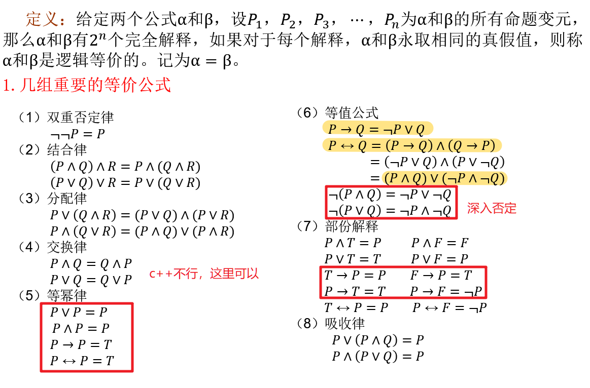
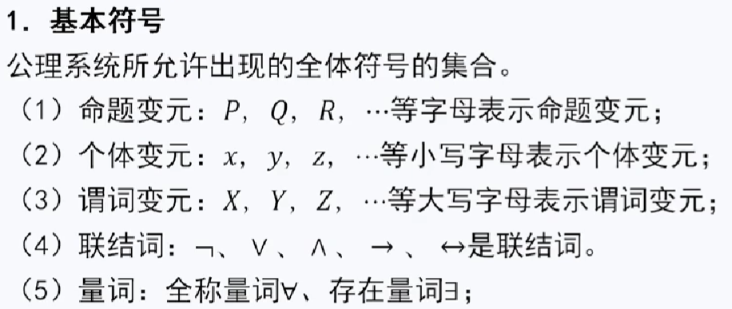
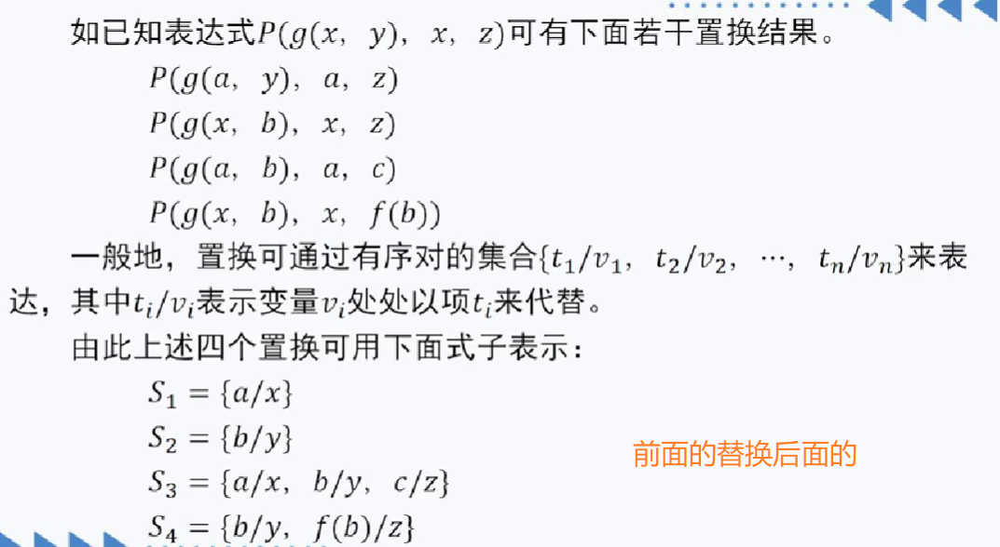
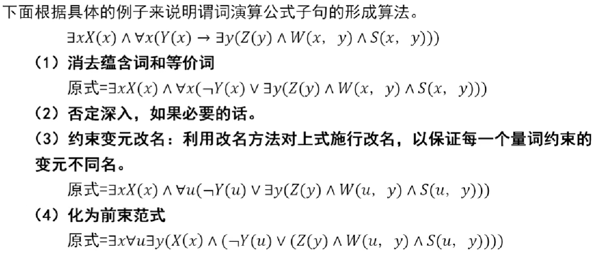
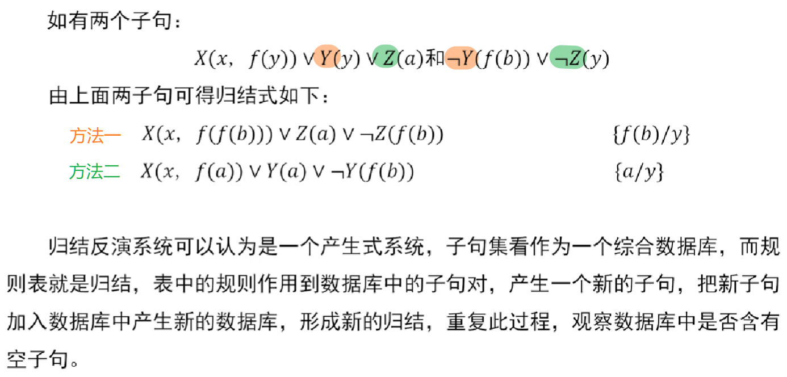
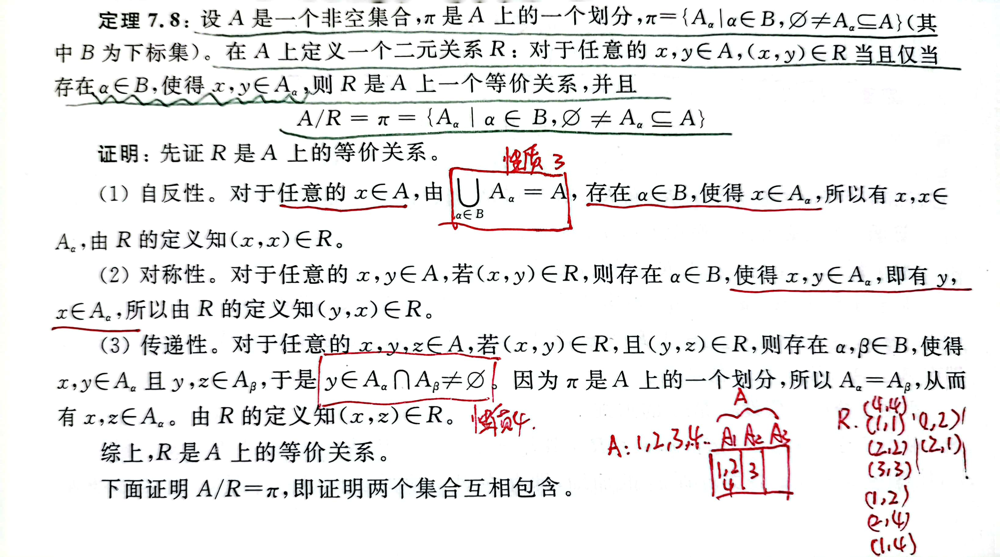
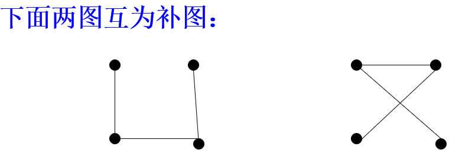
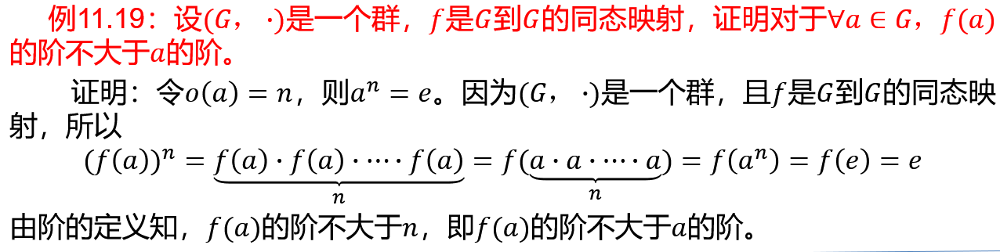
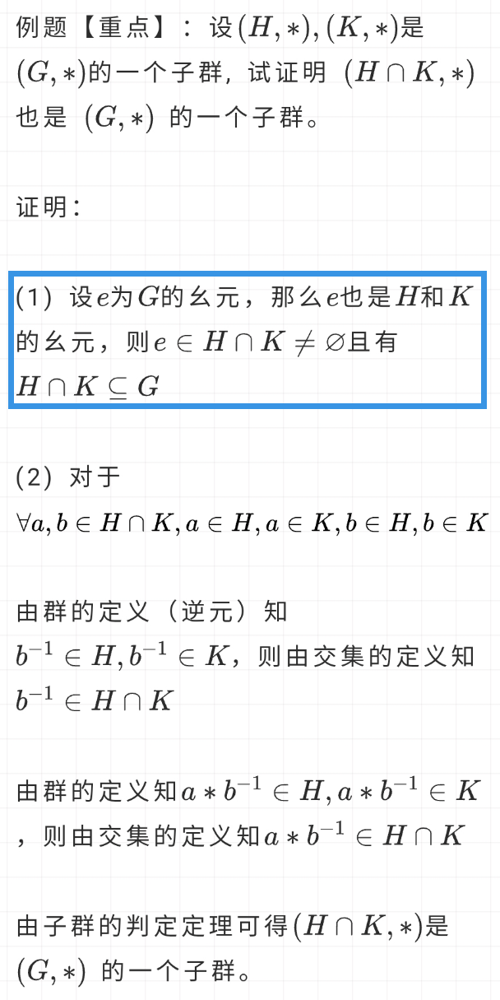

## 第一章 命题演算基础

### 1.1 联结词

**1.1.4 命题符号化**

### 1.2 逻辑等价公式

### 1.3 范式

一、析取式和合取式

合取式∧与成真解释相对应，析取式∨与成假解释相对应

二、析取范式和合取范式

**定义**

形如A_1∨A_2∨⋯∨A_n的公式称为析取范式，其中每个A_i (i=1，2，⋯，n)为合取式，即合取式的析取。

形如A_1∧A_2∧⋯∧A_n的公式称为合取范式，其中每个A_i (i=1，2，⋯，n)为析取式，即析取式的合取。

有些范式既是析取范式又是合取范式，如P，¬P，P∧Q，P∨Q

定理：任何命题演算公式均可以化为合取范式（即析取式的合取），也可以化为析取范式（即合取式的析取）。

**析取范式和合取范式的求解方法**

三、主合取范式和主析取范式

略

## 第二章 命题演算的推理理论

### 2.1 命题演算的永真推理系统

**2.1.1 公理系统的组成部分**

1、基本符号

2、公理

3、规则

4、定理

（1）公理是定理；

（2）由公理出发，利用分离规则和代入规则推导的公式为定理。

**2.1.2 公理系统的推理过程**

**2.1.3 若干导出规则**

### 2.2 命题演算的假设推理

**假设推理证明定理的方法** 

(1) 把待证公式的前件一一列出，注明为假设或前提。

(2) 按推理规则进行推理，但此时**不能对假设以及演绎公式实施代入规则**。

(3) 当推导出待证公式的后件时，就完成了该定理的证明。

(4) 记得最后写由推理定理知。

### 2.3 命题演算的归结证明法

要证明公式A→B（其中A和B为子公式）为定理，实际上是证明**¬(A→B) = A∧¬B**为矛盾式。归结法就是从公式A∧¬B出发对子句进行归结。

**归结证明过程**

**1、建立子句集**

原理：要证明公式A_1→(A_2→(⋯→(A_(n-1)→(A_n→B))⋯)为真，实际上只需证明公式 A_1∧A_2∧A_3∧⋯∧A_n∧¬B为矛盾式

（1）将上述方法所得公式A_1∧A_2∧A_3∧⋯∧A_n∧¬B（待证公式所有前键和后键的否定的合取）化为合取范式；

（2）把合取范式的所有析取式构成一个集合，即子句集。

**2、对子句集S的归结**

依归结规则进行归结，直至归结出空子句(用“□”表示)，**则证明原公式为定理，否则不为定理**。**子句可以多次使用**。

更多的例题去看书。

## 第三章 谓词演算基础

### 个体和谓词

个体：个体是指具有独立意义、独立存在的东西

**常个体**：也称为常个体或实体，例如“南京理工大学”，“人工智能”，“计算机科学与技术“，用a、b、c…等表示，**常个体可以在谓词演算公式中直接写上去**

**个体域**：由个体组成的集合，例如“南京理工大学的学生”，个体域常用 I、J、K…等表示。

**个体变元**：以个体域 I 为变域的变元称为个体域 I 上的个体变元。  用*x*、*y*、*z、*…等表示。

**谓词**：谓词是指个体所具有的性质或若干个体之间的关系。一般地讲，动词、系动词、形容词和集合名词（比如D(e)表示e为气球，P(e)表示e为人，还比如“人工智能类课程”）均可以表达成谓词。

谓词命名式：谓词后填以命名变元e后的式子称为谓词命名式。命名变元仅代表谓词的元数不代表其它意思。如A(e)表示A为一元谓词；B(e_1，e_2)表示B为二元谓词；依此类推。e用来占位的。

### 函数项和量词

**函数项**：以个体域为定义域、以个体域为值域的函数。约定用*f*，*g*，*h*等表示抽象的函数项。例如 f(e):表示e的father；m(e):表示e的mother。一般在“谁的什么”时用。

**量词**：
∀x( → )
∃x( ∧ )

#### 知识表达(要考)

### 改名和代入

**1、自由变元和约束变元**

#### **约束变元改名**

#### **自由变元代入**

### 两组等价公式

### 范式

#### 前束范式

#### SKOLEM标准形

## 第四章谓词演算的推理理论

### 永真推理系统

一、语法部分

注意：这里的△表示的是**全称量词**，用全称量词将自由变元约束了起来。

二、公理和规则

这里总结一下规则：
（1）分离规则；
（2）全称量词可以直接加上/消去（全0规则，全称量词消去规则）
（3）全n规则（包括全1和全n，∀加后键上）
（4）存n规则（存在量词引入规则，∃加前键上）

三、语义部分

四、说明

五、例题

### 假设推理系统

一、假设推理过程的证明方法

（1）把待证公式的**前件作为假设一一列出**，假设中的**全称量词∀可用全称量词消去规则消去**，**存在量词可引入额外假设消去**，并在式子后注明它为额外假设；

（2）按永真的证明方法进行证明，但此时**不能对假设实施代入**；

（3）**待证公式的后件中若有全称量词，可用全~0~规则引入，存在量词可由公理17引入**。

这种方法就是想消去全称量词和存在量词，然后像命题演算一样推理。

二、例题

### 归结推理系统

一、置换

二、归纳反演系统

1、谓词演算公式子句的形成

2、一般归纳

3、归结过程

（1）根据条件得到子句集；
（2）**否定结论，并用同样的步骤（化为前束范式，去掉存在量词，直接消去全称量词，化为合取范式，消去合取词得到子句集）得到子句；**
（3）按2的方法开始归结，直到停机。

4、例题

这道题很重要，在2021的卷子上出现过

书上还有题，去看看。

### 霍恩子句逻辑程序

先把给出的谓词公式SKOLEM标准化，得到子句，把子句：C = P∨¬Q~1~∨¬Q~2~∨⋯∨¬Q~n~ ，转化成：P←Q~1~，Q~2~，⋯，Q~n~ ，转化时看到∧就分别写，看到∨就**肯定放左边，否定放右边，肯定←否定**。

例题

书上p83 4.8

卷子上

霍恩子句逻辑程序其实和归结推理是一样的，只是表示形式不一样，归结的过程都一样的。

## 第五章 递归函数论

本源函数：

**I(x)=x**，指函数值与自变量的值相同，称为幺函数。

**I~mn~ (x~1~，x~2~，⋯，x~n~，⋯，x~m~) = x~n~**，即函数值与第n个自变量的值相同，此函数称为广义幺函数。

**O(x)=0**，即函数值永为0，称为零函数。

**S(x)=x+1**，此函数为后继函数，有S^3^ (x)=S(S(S(x)))

**(m, n)标准迭置**

## 第六章 集合

**6.1.1 集合的基本概念**
集合是最基本的数学概念之一，是不能精确定义的数学概念。由于它太基本了，所以不能用更基本的概念来定义它，然而，这并不影响我们去理解它和掌握它。

N代表自然数集。（0，1，2，3）
Z代表整数集。
I代表正整数集。
Q代表有理数集，它可以表示如下：
{p/q|p∈I，q∈I，q≠0}。（无理数：无限不循环小数）
R代表实数集，它由所有实数（包括有理数与无理数）组成。

### 子集和集合相等

 一、子集与包含关系
 定义6.1:  A，B是两个集合，**对于任意的x，若x∈A，则x∈B**（子集的判定定理），我们说集合A是集合B的子集，也说集合B包含集合A，记为**A ⊆ B**。若A不是的B子集，记为A⊈B，也说B不包含A。A⊈B当且仅当∃x∈A 但x∉B 。

二、相等关系
定义6.2:  A，B是两个集合。**若A⊆B，且B⊆A**（相等关系证明），则说A与B是相等的两个集合，记为A=B。若A⊆B且A≠B，说A是B的真子集，记为A⊂B。

**6.1.4 集合的特点**
第一，我们所讨论的集合，仅考虑它所包含的不同的元素，也就是说集合中元素重复出现没有意义。
第二，我们所讨论的集合，集合中的元素没有任何方式的顺序。
第三，我们所讨论的集合，对集合中的元素没有任何的限制，也就是说一个集合中的元素之间彼此独立，可以毫不相干。例如，A={南京理工大学，a，1010，人工智能}

**6.1.5 多重集**
多重集是一些对象的总体，但这些对象不必不同。在多重集里，一个元素的重数是它在该多重集里出现的次数。一个元素在集合中没有出现，我们可以规定它的重数为0。集合仅是多重集中重数仅为0和1的特殊情况。

**6.2 集合的基本运算**
一、并、交、差

### 集合的证明题

这题是书上的，很重要，卷子上有一道一样的题，只不过它只要证充分性

这里的技巧：
1、要证明是空集，可以用反证法，先否定不是空集（制造条件）
2、要证明包含关系，用子集的定义，对任意x∈A，去证明x∈B

这一题的证明方法和上面的类似

二、集合的对称差
定义：设A和B是两个集合,则存在一个集合，它的元素是所有的或者属于A不属于B、或者属于B不属于A的元素组成，称它为集合A和集合B的对称差，即A⨁B=(A-B)∪(B-A)

定理6.4：设A和B是两个集合，则A⨁B=(A∪B)-(A∩B) 

定理6.5：对于任何集合A，有
A⨁A=∅
A⨁∅=A

定理6.6：设A、B、C是三个任意集合，则对称差具有结合律：(A⊕B)⊕C=A⊕(B⊕C)

### 集合的幂集合

**6.3 全集和集合的补**

一、全集
我们在研究某一个具体问题时，往往规定一个集合，使所涉及的集合都是它的子集合，称这个集合为全集，记为U。

二、补集设A是一个集合，U是全集合，我们称集合U-A为A的补集，记为 $\overline{A}$，即：$\overline{A} = U-A=\left\{x∈U|x∉A\right\}$ 。

定理6.10：德∙摩根（De Morgan）律，设A和B是任意两个集合，则：
$\overline{A∩B} = \overline{A}∪\overline{B}$
$\overline{A∪B} = \overline{A}∩\overline{B}$

## 第七章 关系

### 7.1 集合的笛卡尔积集

**7.1.1 有序二元组**
定义7.1**：**设 a 和 b 是两个元素，把 a 作为第一个元素，把 b 作为第二个元素，按这个顺序排列的一个二元组，称为有序二元组，简称之为**有序对**，记为 (a，b)。注意:（1）当a≠b时，(a，b)≠(b，a)；（2）两个有序对相等，即 (a，b) = (x，y) 当且仅当a=x，b=y。

**7.1.2 笛卡尔积集**
定义7.2:  A × B＝{(a，b)|a∈A，b∈B}
如，𝐴={张彬，李林}，𝐵={数据结构，离散数学，操作系统}，
则   𝐴×𝐵={(张彬，数据结构)，(张彬，离散数学)，(张彬，操作系统)，(李林，数据结构)， (李林，离散数学)，(李林，操作系统)}

性质：
1、与空集的笛卡尔积集还是空集（注意这个！）
2、不满足交换律
3、不满足结合律

**7.1.3 有序n元组、n个集合的笛卡尔积集**
(a_1，a_2，⋯，a_n ) = ((a_1，a_2，⋯，a_(n-1) ),  a_n)

### 7.2 二元关系的基本概念

**7.2.1 二元关系**
定义：设A，B是两个集合，**R是A×B的任意一个子集**，即 R ⊆ A × B，则称R为从集合A到集合B的一个**二元关系**，简称之为从A到B的一个二元关系。

几个特殊的关系：
（1）若R=∅，称R为空关系。
（2）若R=**A×B**，称R为**全关系**。
（3）A=B时，称二元关系R ⊆ A × A 为 A 上的二元关系。
（4）当A=B时，记**∆~A~  = {(x，x)|x∈A}**，称之为A上的**恒等关系**。注意恒等关系包含A中的**所有**元素，例如A={1，2}，∆~A~ ={(1，1)，(2，2)}，如果少了(2，2)，就不是恒等关系了。
设R是从A到B的一个二元关系，若(x，y)∈R，也记为 xRy，并称元素x与y具有关系R；若(x，y)∉R,称元素x与y没有关系R。

**7.2.2 二元关系的表示**
一个二元关系，除了用列出有序二元组的方法表示之外（关系就是一个有序二元组的集合，所以关系就是一个集合），也可以用表的形式或图的形式来表示。

已知学生的集合A={a，b，c，d，e},课程的集合B={数据结构，离散数学，英语，程序设计，计算机导论，操作系统}，学生与课程的选课关系可以表示为：R={(a，数据结构)，(a，离散数学)，(b，英语)，(c，数据结构)，(d，英语)，(d，操作系统)，(e，数据结构)，(e，离散数学)，(e，程序设计)}，它是从A到B的一个二元关系。

**7.2.3 二元关系与数据结构**
根据二元关系的定义，*A*上的二元关系可以分为空关系、一对一关系、一对多的关系、多对一关系和多对多关系等关系。它们可对应四种基本数据结构。集合结构：数据元素之间就是“属于同一个集合”，除此之外没有任何关系。线性结构：数据元素之间存在着一对一的线性关系。树形结构：数据元素之间存在着一对多的层次关系。图状结构或网状结构：数据元素之间存在着多对多的任意关系。

**7.2.4 二元关系的运算**
一、关系的交、并、差和对称差
因为二元关系是以有序二元组为元素的集合，所以两个关系的交、两个关系的并、两个关系的差、以及两个关系的对称差等概念，可由集合论中对应的交、并、差、对称差等概念直接引出。 具体地说，令R_1和R_2是从A到B的二元关系，那么R_1∩R_2，R_1∪R_2，R_1-R_2和R_1⨁R_2也是从A到B的二元关系，它们分别称为R_1和R_2的交，并，差、对称差。
例：已知A={1，2，3，4}，集合A上的二元关系为R_1={(1，1)，(1，2)，(2，3)，(3，4)}，R_2={(1，1)，(1，4)，(2，3)，(3，4)，(3，2)}。试求R_1∩R_2，R_1∪R_2，R_1-R_2和R_1⨁R_2。
解：R_1 ∩ R_2={(1，1)，(2，3)，(3，4)}
R_1∪R_2={(1，1)，(1，2)，(2，3)，(3，4)，(1，4)，(3，2)}
R_1 - R_2={(1，2)}
R_1 ⨁ R_2={(1，2)，(1，4)，(3，2)}

二、二元关系的逆运算与复合运算
定义：设A和B是两个集合, R是从A到B的一个二元关系，即R⊆A×B。令 R ̃={(y，x)|(x，y)∈R}，则R ̃⊆B×A是从B到A的一个二元关系，称之为R的逆关系。就是把所有的二元组内部交换。
例：已知A={1，2，3，4，5}，R={(1，1)，(1，2)，(2，3)，(3，4)，(5，3)，(5，4)}，则 R ̃={(1，1)，(2，1)，(3，2)，(4，3)，(3，5)，(4，5)}。

定义：设A，B，C是三个任意集合，R_1是从A到B的一个二元关系，R_2是从B到C的一个二元关系。记 R_1∘R_2={(x，z)∈A×C│存在y∈B，使得(x，y)∈R_1，(y，z)∈R_2}，则R_1∘R_2⊆A×C是一个从A到C的二元关系，称之为R_1与R_2的复合关系。特例，当A=B=C，R_1=R_2时，R_1∘R_2记为R_1^2^，即，R_1^2^ = R_1 ∘ R_1。

定理：设A、B、C、D是四个任意集合，R_1、R_2 、R_3分别是从A到B、从B到C、从C到D的任意二元关系。则有：
（1） **R_1 ∘ ∆_B = ∆_A ∘ R_1 = R_1**
（2）(R_1 ) ̃  ̃=R_1 
（3）**(R_1 ∘ R_2 ) ̃ = (R_2 ) ̃ ∘ (R_1 ) ̃** 
（4）(R_1∘R_2 )∘R_3=R_1∘(R_2∘R_3)

### 7.4 二元关系的性质(重点)

**7.4.1 自反性、反自反性、对称性、反对称性、传递性和反传递性**

设R是集合A上的一个二元关系(A->A)，即R⊆A×A。

**自反性：对于任意的x∈A，均有(x，x)∈R**，则称关系R有自反性，或称R是A上的自反关系。

例如已知A={1，2，3，4，5}，关系R_1={(1，1)，(2，2)，(3，3)，(4，4)，(5，5)，(4，5)，(2，1)，(3，5)}具有自反性；关系R_2={(1，1)，(2，2)，(3，3)，(4，4)，(3，4)，(4，5)}不具有自反性，因为缺了(5，5)

**反自反性：对于任意的x∈A，均有(x，x)∉R**，则称关系R有反自反性，或称R是A上的反自反关系。

例如已知A={1，2，3，4，5}，关系R_1={(1，2)，(2，3)，(4，5)，(2，1)，(3，5)}具有反自反性；关系R_2={(1，2)，(2，3)，(4，4)，(3，4)，(4，5)}不具有反自反性。他也不具有自反性！

* 这里可以看出一个关系可以既没有自反性，也没有反自反性。

**对称性：对于任意的x，y∈A，若(x，y)∈R，就有(y，x)∈R**，则称关系R有对称性，或称R是A上的对称关系。即：有边必须双向

例如已知A={1，2，3，4，5}，关系R_1={(1，1)，(2，2)，(1，2)，(2，1)，(2，3)，(3，2)，(3，5)，(5，3)}具有对称性；关系R_2={(1，1)，(3，3)，(1，2)，(2，1)，(2，3)，(3，2)，(3，5)}不具有对称性。

**反对称性：对于任意的x，y∈A，若(x，y)∈R，且(y，x)∈R，就有x=y**，则称关系R有反对称性，或称R是A上的反对称关系。即：有边必须单向

例如已知A={1，2，3，4，5}，关系R_1={(1，1)，(2，2)，(3，3)，(2，1)，(2，3)，(3，5)，(4，3)}具有反对称性；关系R_2={(1，1)，(3，3)，(1，2)，(2，1)，(2，3)，(3，5)，(4，5)}不具有反对称性。

* 这里可以看出如果一个关系中只有环(x，x)，这个关系既有对称性，又有反对称性。

**传递性：对于任意的x，y，z∈A，若(x，y)∈R，且(y，z)∈R，就有(x，z)∈R**，则称关系R有传递性，或称R是A上的传递关系。

例如已知A={1，2，3，4，5}，关系R_1={(1，1)，(2，2)，(3，3)，(1，2)，(2，1)，(2，3)，(1，3)，(3，5)，(1，5)，(2，5)}，R_2={(2，1)，(3，4)}均具有传递性；R_3={(1，1)，(3，3)，(1，2)，(2，1)，(2，3)，(3，5)，(4，5)}不具有传递性。

值得注意的是，若R有(1,2)和(2,1)，必须补上(1,1)，(2,2)才传递！

**反传递性：对于任意的x，y，z∈A，若(x，y)∈R，且(y，z)∈R，就有(x，z)∉R**，则称关系R有反传递性，或称R是A上的反传递关系。

例如已知A={1，2，3，4，5}，关系R_1={(1，2)，(2，1)，(2，3)，(3，5)，(4，5)}，R_2={(2，1)，(1，4)}均具有反传递性；关系R_3={(1，1)，(2，3)，(3，5)，(4，5)}不具有反传递性。

注意，反传递关系不能有环(x，x)！因为根据上面的定义，如果x=y=z，当(x，y)在关系R中时，(x，z)也在R中。

* 一个关系可以既传递又反传递，比如空关系，还有像上面的R_2或者R={(1,2)}这种，前键为假，就直接为真了

**总结：上面三个可以记为nbb，还有就是记住反传递关系不能有环。**

根据特殊关系的定义知：
A上的全关系A×A具有自反性，对称性和传递性。
A上的恒等关系∆~A~具有自反性、对称性、反对称性和传递性。
A上的空关系∅具有反自反性、对称性、反对称性、传递性和反传递性。

注意证明的时候直接按照定义来，所以以上六个定义一定要记住。

### 7.5 二元关系的闭包运算

**7.5.1 自反闭包、对称闭包和传递闭包**

设A是一个非空集合，R是A上的一个二元关系，假定P是关系的某一性质。R未必具有性质P，可以在R中添加一些有序二元组而构成新的具有性质P的关系R^′^，但又不希望R^′^变得“过大”，最好具有一定的最小性。我们将这种包含了关系R且具有性质P的最小集合R^′^ 称为R的具有性质P的闭包。关于性质P，仅限于讨论自反性、对称性、传递性。

简单来说，R的闭包R’就是：**具有某一性质的R的最小超集**。R可能不具有这些性质(例如自反、传递)，但R中加上一些关系(尽可能地少加)后成为R'，R'具有了这些性质，那R'就是R的xx闭包。

定义：A是一个非空集合，R是A上的一个二元关系。若一个关系R^′⊆A×A满足以下三个条件：
（1）R′是自反（对称、传递）的；
（2）R⊆R′；
（3）对任意关系R‘’，若R⊆R‘’且R‘’具有自反（对称、传递）性，则R′⊆R‘’。
则称R′为R的自反（对称、传递）闭包，分别用r(R)，s(R)，t(R)分别表示R的自反闭包、对称闭包、传递闭包。

举个例子：

**7.5.2 闭包的判定定理**

定理：设R是集合A上的二元关系，则r(R)=R∪∆_A。
定理：设s(R)是集合A上的二元关系，则s(R)=R∪R ̃。

### 7.6.1 等价关系和等价类(重点)

定义：A是一个非空集，R是A上的一个二元关系，若**R满足自反性，对称性，传递性**，则称R是A上的等价关系。

定义：若R是A上的等价关系，a是A中任意一个元素，称集合{x∈A|(x，a)∈R}或{x∈A|(a，x)∈R}为集合A关于关系R的一个等价类，记为[a]~R~，即[a]~R~={x∈A|(x，a)∈R}={x∈A|(a，x)∈R}，其中a叫代表元。

简而言之，等价类就是：**A中所有与a有R关系的元素的集合**。在R中找包含a的关系，就是找哪些元素与a有关系，a与a自己和b有过关系，所以[a]~R~={a，b}

等价关系的证明：

书上的题目：

这是2018的卷子：

待做。。。

**7.6.2 商集合**

定义：设A是一个非空集合，R是A上的一个等价关系，称集合{[x]~R~ |x∈A}为集合A的商集合，记为A/R。即A/R={[x]~R~ |x∈A}。**A的所有等价类构成的集合就是商集**。

在上面的例2中，由定义知，Z/R={[0]~R~，[1]~R~，[2]~R~，[3]~R~，[4]~R~，[5]~R~}。

### 7.6.3 集合的划分(重点)

构造等价关系的原因就是为了得到一种好的分割。

证明划分：
1、A~i~ 不为空；
2、A~i~ 是 A 的子集；
3、并集刚好等于A（所以这里要证左⊆右且右⊆左）；
4、两两之间交集为空；

理解划分和等价关系：
集合A的一个等价关系R和划分π是相对应的。

* 已知划分可以求出等价关系：一般地，设{A_1，A_2，⋯，A_n}是集合A的划分，则由该划分构造的等价关系为R = (A_1 × A_1) ∪ (A_2 × A_2) ∪⋯∪ (A_n × A_n)。即划分的每一部分内部自己与自己做笛卡尔积，然后并起来得到的就是等价关系。
* 已知等价关系同样可以求出对应的划分，就是求等价类的集合。（看等价类的定义）
总之，**等价关系对应了集合的一个划分**。

证明划分的题目：

这题比较难（等价关系→划分）

这题比较简单（划分→等价关系）

这道题是2018卷子上的

注意步骤尽量写详细。第二点是证明属于，如果题干中不能直接得到的话，就考虑用证明子集的方法写。第三点如果不能直接得到的话就要分两步证明左包含右和右包含左来证明等于。第四点交集不为空如果不好证的话优先考虑反证法，一般证交集为空或者集合为空，都可以用反证法，设它不为空。

### 7.7 偏序关系和格(重点)

**7.7.1 偏序关系和偏序集**

定义：设A是一个非空集合，R是A上的一个二元关系，若**R满足自反性、反对称性、传递性，则称R是A上的一个偏序关系**，并称(A，R)是一个偏序集。

设*R*是非空集合*A*上的二元关系,如果*R*是**自反**、**反对称**、**传递的**，称*R*为*A*上的偏序关系,记作≼。

如果集合*A*上有偏序关系*R*，则称*A*为偏序集，用序偶<*A*,*R*>表示之。若<*x*,*y*>∈R,常记作x≼y。

证明偏序关系的例题：

这题是2020卷子上的，看着是不是很眼熟，这和上面的等价关系的例3一样的

## 第八章 函数与集合的势

### 函数的基本概念

part 1

函数（映射）是指两个集合之间的一种对应关系。所以函数也是一种关系。
映射：设X,Y是两个给定的集合，若按照某种规则 f，使得X中的每一个元素，都可以在Y中找到唯一的元素与之对应，则称这个对应规则 f 是集合X到集合Y的一个映射，记作 X->Y。函数是X, Y笛卡尔积集的子集，$f \subseteq X \times Y$ 。
X中的元素称之为原像也称逆像，Y中的元素称之为像。
关键词：
1、X中的全部元素（X不能剩元素，Y中可以剩元素）
2、Y中有唯一的与之对应（右手横着比剪刀手才是正确的，即一个Y可以对多个X，但一个X只能对一个Y）

part 2

所有从A到B的函数构成的集合被称为B上A，意思是A中的每一个元素到B中的每一个元素，记为B^A^ 。
特别地，A到A的映射记为A^A^ 。但是注意这和 $\Delta _{A}$ 不一样，前者是A中的 x~1~ 到 x~2~，而后者只能 x 到 x 自己，故前者包含后者。

part 3

映射包括单射、满射。
**函数/映射**：Y中可以剩元素，一个Y可以对多个X（一对一或多对一的关系）
**单射**：Y也只对一个X（去掉剪刀手） $\Leftrightarrow \forall x,y\in A，f\left( x \right)=f\left( y \right)\Rightarrow x=y$
**满射**：Y中也不剩元素 $\Leftrightarrow \forall y\in B，\exists x \in A$ 使 $y=f\left( x \right)$
**双射**：单射且满射

### 函数的复合运算和逆函数

定理：函数的复合运算满足结合律，即h o (g o f) = (h o g) o f，就用上面这个式子证。（注意：这个定理后面证变换群的时候会用，o直接满足结合律）

定理：f: A→B, g: B→C。如果f和g均是单射/满射/双射，则g o f也是单射/满射/双射

定理：
对于可逆函数 $f$，存在唯一的函数 $g$，使得 $g \circ f=\Delta _{A}$ 和   $f \circ g=\Delta _{B}$ 同时成立，称 $g$ 为 $f$ 的逆函数。
用 $f^{-1}$ 表示可逆函数 $f$ 的逆函数，它满足 $f^{-1} \circ f=\Delta _{A}$ 和 $f \circ f^{-1}=\Delta _{B}$ 。

定理：
f 是 左可逆函数 当且仅当 f 是单射
f 是 右可逆函数 当且仅当 f 是满射
**f 是 可逆函数 当且仅当 f 是双射**
这些都是充要条件，反过来也可以用，例如已知 f 是双射，可以直接得出存在 f^-1^ 。 （注意：这里后面证变换群的时候会用，直接得到 f 的逆元）

### 无限集

#### 集合的势

定义：集合A中含有的不同元素的多少称为集合的势，记为|A|。

证明集合的势相等：找两个集合之间的**双射** f
A、B是两个集合，若存在f: A->B，且f是双射函数，则|A|=|B|。

### 集合势大小的比较与鸽巢原理

#### 集合势的大小

证明集合的势小于等于：找两个集合之间的**单射** f
要证明小于的话，还要继续证明两个集合的势不相等

#### 鸽巢原理

例题：

## 第九章 图论

### 图的基本概念

有向图 G=(V,E)
定义9.1 设V是一个非空有限集合， E是V上的二元关系。 则称有序二元组G=(V,E)是一个有向图，并称V为顶点(vertex)集， E为边(edge)集。

* **阶**：顶点数|V|。

* **自环**：若一条边的始点和终点是同一顶点，称该边为自环。
  注意和圈区分：**初等回路（圈）**：若一个回路中顶点不重复出现，则称之为初等回路，又称之为圈。

无向图G=(V,E)
定义9.2 设V是一个非空有限集合，E是一个多重集合，E的元素是仅含V中两个元素的多重子集。则称二元组G=(V,E)是一个无向图。

* **多重图**：一个图，有向图或无向图，其边集若是多重集（集合中可以有相同的元素），称这样的图为多重图，也简称图。若一个图，也就是多重图，其重数大于1的边称为多重边，又称有这样边的图为有多重边的图。

* **简单图**：称一个**没有多重边，没有自环，也没有孤立点**的图为简单图。

* **完全图**：一个简单图，若每一对不同的顶点之间都有一条边相连，这样的图称为完全图。完全图的边数计算：$C_{n}^{2} $ ，n 当然是点数

* **K~n~** ：一个有n(∈N)个顶点的完全图在同构的意义下是唯一的，记为K~n~ 。

图的同构 G1≅G2
定义 设G1=(V1,E1)和G2=(V2,E2)是两个图，若存在函数f:V1→V2，f是双射（一一对应），且若定义函数g:E1→E2，对于任意的{v1,v1’} ∈E1，g({v1,v1’})={f(v1),f(v1’)}，g也是一个双射。则称图G1和图G2是同构的两个图，记为G1≅G2，并称f为图的同构映射。

* **子图、真子图、生成子图**：

  定义9.4 设G=(V,E), H=(V’,E’)是两个图。

  ​      若V’ ⊆V且E’ ⊆E，则说 H是G的子图。 

  ​      若V’ ⊊ V或E’ ⊊ E，则说 H是G的真子图。

  ​      若H是G的子图且V’=V，说H是G的生成子图。(顶点数相等)
  

* **补图**
  

#### 握手定理(非常重要!!)

结点的度
G=(V，E)是一个图，对于每一个v∈V，我们称关联顶点v的边数为顶点v的度数，记为d(v)。

* **握手定理**：G=(V，E)是一个无向图，则所有节点的**度数之和等于边数的两倍**，即∑d(v)=2|E|。

例题：

有向完全图
一个有向图去掉边的方向以后所得无向图是完全图，则称为有向完全图。关于顶点度数的定义有向图要复杂一点。定义9.6：G=(V，E)是一个有向图，v∈V，我们称以v为始点的边的条数为v的出度，记为d~出~ (v)；以v为终点的边的条数为v的入度，记为d~入~ (v)。

### 图的通路和连通性

在图的研究中，通路和回路是两个重要的概念，而图是否具有连通性则是图的一个基本特征。

**通路和回路**

* 通路：设G=(V，E)是一个无向图，一个顶点的序列(v(i_1 )，v(i_2 )，⋯，v(i_s ))称为图G=(V，E)中的一条通路。一条通路也可以用边的序列来表示，若(e(i_1 )，e(i_2 )，⋯，e(i_t ))是图G中的一条通路。我们称一条通路经过的边的多少为这条通路的长度。称两个顶点间的最短通路的长度为该两个顶点间的距离。

* 简单通路：称一条通路为**简单**通路, 如果它的**每一条边**都不重复出现。
* 初等通路：称一条通路为**初等**通路, 如果它的**每一个顶点**都不重复出现。

* 回路：设(vi1，vi2，…，vis)是图G=(V,E)中的一条通路，若vi1=vis，则这条通路为G中的一条回路。
* 简单回路：若一个回路中边不重复出现，则称之为简单回路。
* 初等回路（圈）：若一个回路中顶点不重复出现，则称之为初等回路，又称之为圈。

**连通图和连通分量**

* 连通图：G=(V，E)是一个无向图，若G中任意二个不同的顶点之间在G中都有通路存在，则称G是一个连通图，否则称G为不连通图。

### 欧拉图

问题引入：哥德尼斯堡七桥问题，通过每一座桥一次且仅一次

* 欧拉通路、欧拉回路、欧拉图：G=(V，E)是一个图，G中一条通路称为欧拉通路，若此条通路经过了图中**每条边**一次且仅一次。若一条欧拉通路是一个回路，则称此回路为欧拉回路。**一个图若有欧拉回路，则称这个图为欧拉图**。

#### 充分必要条件

定理：一个没有孤立点的无向图具有欧拉**通路**，当且仅当它是连通的，并且或者**没有奇数度的顶点或者有且仅有2个奇数度的顶点**。

推论：一个无向图有欧拉**回路**当且仅当**所有顶点均为偶数度**。

例题：

一笔画问题 ：
一个图能够一笔画即此图要么没有奇数度顶点，要么仅有两个奇数度顶点。一个无向图是否有欧拉通路的问题与此图能否一笔画是同一个问题。

有向图的欧拉通路、欧拉回路、欧拉图：
定理：一个有向图有欧拉回路，当且仅当它是连通的，并且每一个顶点的**入度与出度相等**。一个有向图有欧拉通路，当且仅当它是连通的，并且**或者每一顶点的出度等于入度；或者除二个顶点外，其余各顶点出度等于入度，这二个顶点一个入度比出度多1，一个入度比出度少1**。

注意通路和回路要看清楚，回路要求的条件更强。还有一个图若有欧拉回路，这个图才是欧拉图，只有欧拉通路是不行的。

### 哈密尔顿图

问题引入：哈密頓周遊世界問題，每个点访问一次，并回到出发点。

* 哈密尔顿通路、哈密尔顿回路(圈)：G=(V，E)是一个图，G中一条通路若通过**每一个顶点**一次且一次，称这条通路为哈密尔顿通路。G中一个圈，若通过每一个顶点一次且仅一次，称这个圈为哈密尔顿圈。**一个图若存在哈密尔顿圈，就称为哈密尔顿图**。

与欧拉图情况相反，到目前为止判定一个图是否是哈密尔顿图的充要条件尚不知道，而且这个问题是图论中主要的未解决问题之一。

#### 必要条件

**必要条件**：定理：若G=(V，E)是一个哈密尔顿图，则对于*V* 的每一个非空子集*S*，均有 W(G-S)≤|S|。其中W(G-S)表示图*G*擦去属于*S* 中的顶点后，剩下子图的连通分枝的个数。说得更简单一点就是：**一个哈密尔顿图，删去图中的一些点（任意删），剩下的子图中的连通分枝的个数要小于等于删去的点的个数**。

注意这个是必要条件，主要看不满足的情况，如果不满足一定不是哈密尔顿图，如果满足也不一定是哈密尔顿图。

#### 充分条件(非常重要!!)

**充分条件**：定理：设G=(V，E)是一个简单无向图，|V|=n≥3，若对于任意2个不相邻的顶点u，v∈V，d(u)+d(v)≥n，那么G是哈密尔顿图。说得更简单一点就是：**任意两个不相邻的顶点的度数之和要大于等于顶点数**。

这个是充分条件，如果满足就一定有哈密尔顿圈，但如果不满足也可能有哈密尔顿圈。

例题：

这题是2020卷子上的：注意建图怎么写的

**充分条件的推广**：定理：G=(V，E)是一个简单图，若对于V中任意二个不相邻的顶点u，v∈V，d(u)+d(v)≥n-1，其中|V|=n，则G中有哈密尔顿**通路**。注意有通路不是哈密尔顿图，但是哈密尔顿通路可以做到访问图中的每个顶点一次且仅一次，不回到原点。

### 二部图

二部图最重要的两点：

1. 二部图的充要条件：一个图G是二部图当且仅当它的所有回路的长度均是偶数。注意树中没有圈，所以回路的长度是0，0也是偶数，所以树也是二部图。
2. 二部图被分成两部分V~1~和V~2~，这两部分点集的度数相等，即d(V~1~)=d(V~2~)，还有等于边数d(V~1~)=d(V~2~)=|E|。

一、二部图和完全二部图

定义：设G=(V，E)是一个图，若存在顶点集V的一个划分{V_1，V_2}，使得对于任意的e∈E，存在v_1∈V_1，v_2∈V_2，使得{v_1，v_2}=e。我们说(V_1，V_2)是图G的顶点的二分类。称图G为**二部图**，或称二分图，也称偶图，又称G为具有二分类(V_1，V_2)的偶图。

简单来说就是顶点集 V 可分割为两个互不相交的子集 V~1~ 和 V~2~ ，图中每条边的两个顶点都分别属于这两个互不相交的子集，**边只能在这两个子集之间，两个子集内的顶点之间没有边**。

定义：G=(V，E)是一个二部图，(V_1，V_2)是G的二分类，若对于任意的v_1∈V_1，v_2∈V_2，有{v_1，v_2}∈E，说G是一个**完全二部图**。一个完全二部图G，(V_1，V_2)是它的二分类，|V_1 |=n，|V_2 |=m，记G为 k~n,m~，图给出了两个完全二部图 k~2,3~ 和 k~3,3~。

二、判定定理

定理：**一个图G是二部图当且仅当它的所有回路的长度均是偶数。**

三、匹配

定义：设无向图G=(V，E)，(V_1，V_2)是G的一个二分类，M⊆E。若M中任意两条边都不相邻，则称M为G的一个匹配，并把M中的边所关联的两个结点称为在M下是匹配的。

若在M中再加入任何一条边就不是匹配了，称M为极大匹配。

边数最多的极大匹配称为G的最大匹配。

设M为G的一个匹配，若V_1中的每个顶点都是匹配中边的端点或|M|=|V_1 |，则称匹配M是从V_1到V_2的完全匹配。

若G中的每个顶点都是匹配中边的端点，则称M为完全匹配。

四、求最大匹配的算法

匈牙利算法：[搜索与图论学习笔记（2） - 知乎 (zhihu.com)](https://zhuanlan.zhihu.com/p/596631058)

试试这个

### 平面图

平面图的定义

区域

#### 欧拉公式(非常重要!!)

定理：对于任何一个连通的平面图G=(V，E)，|V|=n，|E|=m，则有 **n-m+r=2**，即 **顶点数-边数+区域数=2**，其中r代表G的区域数。

#### 命题 2m≥kr(非常重要!!)

命题：G=(V，E)是一个简单平面图(必须有简单这个条件)，|E|=m，r为区域数。若平面图的每个区域至少有k条边围成，则**2m≥kr**，即 **两倍的边数 ≥ k * 区域数**。

证明：因为平面图的每个区域至少有k条边围成，所以围成r个区域的总边数≥kr。又因为一条边最多关联两个区域，而度数为1的顶点邻接的边仅关联一个区域，所以围成r个区域的总边数≤2m，故2m≥kr。

**例题：**

证明定理：任何一个简单的无向连通平面图G=(V，E)，|V|=n(≥3)，|E|=m，则有m≤3n-6。（这个结论所有平面图都满足）

证明：由于G是**简单图(没有重边，没有自环，没有孤立点)**，则任何一个区域至少由三条边围成，所以由上命题知 **2m≥3r**，其中r是区域数，即r≤2/3 m。因为G为简单的无向连通平面图，所以n-m+r=2。所以有n-m+2/3 m≥2，即有m≤3n-6。

证明定理：

## 第十章 树与有序树

### **10.1 树的基本概念**

定义**：**一个简单无向图若连通且**不含圈**，则称它为一棵树，记为T=(V，E)。T是一棵树，T中**度数为1的顶点称为树叶**，**度数大于1的顶点称为分枝点**。

定理10.1：设T=(V，E)是一棵树，则有|E|=|V|-1，即**边数等于顶点数减一**。

这个定理和握手定理一起用，握手定理需要总度数和边数，这个定理有顶点数和边数。

应用的例子：

* 例2021.11：设 G 为 n (n ≥ 5) 阶无向简单图，证明：
（1）如果 G 不含有圈，G 的边数 ≤ n - 1。
（2）G 或 G 的补图（$\overline{G}$）中必含有圈。
  

* 推论：任何一棵至少含有两个顶点的树至少有二片树叶。
  证明：设T=(V，E)是一棵树，若T中最多只有一片树叶，则根据握手定理及上定理知 2|E|= ∑d(v) ≥ 1 + 2(|V|-1) = 2|E| + 1 > 2|E|。矛盾。故，T中至少有二片树叶。（PS：式子中的1是那一片树叶的度为1，剩下的点都应该是分支点了，度数至少为2，所以这样的总度数为2|E| + 1。这样看来，两个顶点的链不能算作树）

*  例：已知一棵树有5个5度顶点，3个3度顶点，3个2度顶点，问有几个一度顶点？
  解：设有x个1度顶点，则根据握手定理及定理10.1知：5×5+3×3+3×2+1×x=2(5+3+3+x-1)，得x=10。所以树中有10个一度顶点。

* 例：T=(V，E)是一棵树，证明：若T仅有两个一度顶点，则T是一条直线。
  证明：若T不是一条直线，则T中存在一个顶点其度数大于等于3，根据握手定理及树的性质知：|E| = ∑d(v) ≥ 2 × 1 + 1 × 3 + 2(|V| - 3) = 2(|V| - 1) + 1 = 2|E| + 1 > 2|E|矛盾，故T是一条直线。

* 这题用到了握手定理和上面那个定理，还有**二部图的性质**：二部图被分成两部分V~1~和V~2~，这两部分点集的度数相等，即d(V~1~)=d(V~2~)，还有等于边数d(V~1~)=d(V~2~)=|E|

### **10.2 连通图的生成树**

## 第九十章的一个总结

**树与二部图**

一棵树是二部图，因为回路长度为0

这题用到了握手定理和上面那个定理，还有**二部图的性质**：二部图被分成两部分V~1~和V~2~，这两部分点集的度数相等，即d(V~1~)=d(V~2~)，还有等于边数**d(V~1~)=d(V~2~)=|E|**

**哈密尔顿图与二部图**

这题用到了**哈密尔顿图的必要条件（删去的点数大于等于剩下的连通块数）**推出了矛盾，删去的点是二部图中少的那一部分，剩下的连通块数就是多的那一部分的点数，然后这不小于删去的点数，故矛盾。

**无圈的图：树**

例2021.11：设 G 为 n (n ≥ 5) 阶无向简单图，证明：
（1）如果 G 不含有圈，G 的边数 ≤ n - 1。（**顶点数一定时，所有不含圈的图中，树的边数最多**）
（2）G 或 G 的补图（$\overline{G}$）中必含有圈。

简单连通图，无圈就是树。如果顶点数固定，不含圈，则所有图中边数最多的就是树。同时第一题从边数小于等于顶点数减一可以联想到**树的性质：边数等于顶点数减一**。

## 第十一章 群与环

### 代数系统

S 是一个非空集合，*是 S 上的一个代数运算，将他们封装到一起，记为 (S, *)，称其为一个代数系统。

#### 同态映射和同构映射

定义：（代数系统的）

定理：

#### 群同态，群同构

定义：（重点！）

#### 自同态，自同构

定义：

例题：

群同态映射的证明：直接用公式证明同态性

自同构映射的证明：要证明**双射（单射，满射）**和**同态性**

幺元和逆元的群同态映射：这个定理可以记住

### 半群

定义：
(S, \*) 是一个代数系统，若：
	1、\* 是 S 上的闭运算；
	2、\* 满足结合律；
则 (S, \*) 是一个半群。

#### 幺元

定义：x * e = x

重要性质：
* 一个群若有幺元，则幺元必然唯一
* f 是 G 到 A 的一个群同态映射，有 f(e~1~) = e~2~ （详见群同态）

#### 逆元

定义：a^-1^ * a = e

重要性质：a 的逆元若存在则唯一

群中元素的逆元的性质：

（3）f 是 G 到 A 的一个群同态映射，对于任意 x ∈ G，有 f(x^-1^) = (f(x))^-1^ （详见群同态）

### 群

定义：
(S, \*) 是一个代数系统，若：
	1、\* 是 S 上的闭运算；
	2、\* 满足结合律；
	3、存在幺元∈S；
	4、存在逆元∈S；
则 (S, \*) 是一个群。

证明群例题：

#### **群的性质**

定理1：设(G，∗)是一个群，则

   （1）对于∀g∈G，(g^-1^) ^-1^ = g； 

   （2）对于∀g~1~，g~2~∈G，(g~1~ ∗ g~2~ )^-1^ = g~2~^-1^ ∗ g~1~^-1^。(注意这里是反过来的，如果群不是交换群，则A\*B与B\*A不相等)

定理2：群满足左右消去律

#### 无限群 有限群 交换群 元的阶

定义11.17：设(G，∙)是一个群，

若G是无限集，则称(G，∙)是**无限群**。

若G是有限集，且|G|=n，则称(G，∙)是**n阶有限群**。

对于G中的任意两个元素a，b∈G，若有a∙b=b∙a

则称(G，∙)是**交换群**，又称之为**阿贝尔（Abel）群**。

例题

### 变换群和置换群

#### 变换群

G：由 A 到 A 的一些函数构成的集合，*：函数的复合运算

证明变换群的例题： 

注意：一个双射也叫做变换

#### 置换群

交换 > 置换，置换要求 A 是有限集

### 子群

定义：

子群的判定定理1：首先是 A 要是 G 的子集且**非空**（因为子群的定义里要求非空），一是满足闭运算，二是每个元素都有逆元。

对子群的理解：子群的幺元是群的幺元。子群元素的逆元也是该元素在群中的逆元。要记得子群中的所有元素都在群中，因此可以对这些元素用交换律，闭运算等性质。

例题：这里**用 e ∈ A 来证明了 A 非空**，还有一道题也是这样的，可以用 e 来证非空。

子群的判定定理2:   A 要是 G 的子集且**非空**，a · b^-1^ ∈ A 

例题：

定理三：A 是有限集（无限集不能用这个定理），A 要是 G 的子集且**非空**，满足闭运算

### 群的证明题汇总

例一

这道题得到一个结论：**若 (a)^n^  = e，则 a 的阶应该 ≤ n，即 o(a) ≤ n。**

例二（这次很可能要考）

例三

例四

这道题用了定理2，但是也可以不用定理的。
